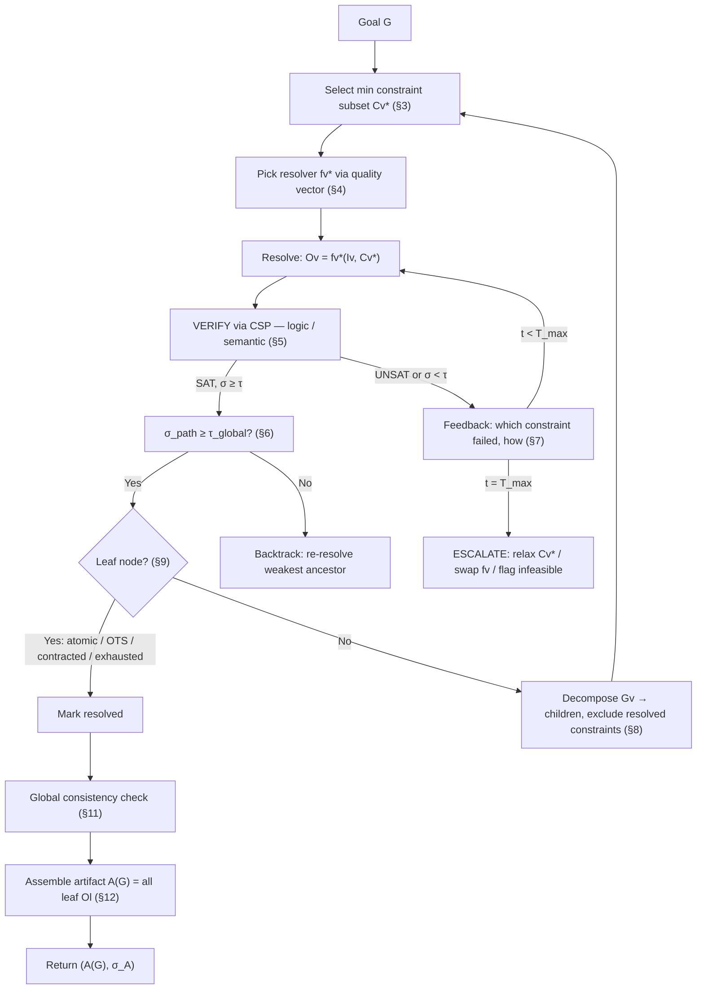

## 1. Primitives

> *See Appendix B for a complete notation reference.*

Let $G$ be a high-level goal (e.g., "build a foundry").

Let $\mathcal{C} = \{c_1, c_2, \dots, c_N\}$ be the **universal constraint set** — all constraints that *could* govern the problem (physics, cost, regulatory, supply chain, geometric, temporal, etc.).

Each constraint $c_i$ has a **type**:

$$
\text\{type\}(c_i) \in \\{\texttt\{logic\}, \texttt\{semantic\}\\}
$$

**logic constraints** are symbolically verifiable and **semantic constraints** require neural/subjective judgment. This typing determines verification confidence (§5).

> **Notation:** Logic constraints are checkable via code, SMT solvers, or first-principles computation (dimensional tolerances, material counts, budget arithmetic). Semantic constraints require LLM or human evaluation (design intent, aesthetic fit, stakeholder satisfaction). Logic → $\sigma = 1.0$; Semantic → $\sigma \in [0,1]$ inherited from the evaluator.

Let $\mathcal{F}$ be the **universal resolver set** — all resolver functions that *could* address any subproblem in the system. Each $f \in \mathcal{F}$ has signature $f: 2^{\mathcal{C}} \times \mathcal{I} \rightarrow \mathcal{O}$ — any process that takes constraints + inputs and produces outputs (LLM calls, CAD solvers, FEA simulations, human-in-the-loop consultations, API services, physical tests, optimization engines, etc.).

> **Notation:** $2^{\mathcal{C}}$ is the power set of $\mathcal{C}$ (all possible subsets of constraints). So $f$ takes *some subset of constraints* $C_v^* \subseteq \mathcal{C}$ paired with an input $\mathcal{I}_v$, and produces an output $\mathcal{O}_v$. The resolver is agnostic — it can be an LLM, a solver, a human, anything.

## 2. Hierarchical Decomposition Tree

Define a rooted tree $\mathcal{T} = (V, E)$ where:

* Root $v_0$ corresponds to $G$
* Each node $v \in V$ at depth $d$ represents a **subproblem** $G_v$
* Children of $v$ represent the decomposition $G_v \rightarrow \{G_{v_1}, \dots, G_{v_k}\}$

Each node $v$ carries a tuple:

$$
v \mapsto (G_v,\ C_v,\ f_v,\ \mathcal\{I\}_v,\ \mathcal\{O\}_v,\ \sigma_v)
$$

where $C_v \subseteq \mathcal{C}$ is the active constraint subset, $f_v \in \mathcal{F}$ is the chosen resolver, $\mathcal{I}_v / \mathcal{O}_v$ are input/output, and $\sigma_v \in [0,1]$ is confidence.

## 3. Parsimonious Constraint Selection

**Core principle:** at each node $v$ at depth $d$, select the *minimum viable* constraint subset.

Define a relevance function $\rho: \mathcal{C} \times G_v \times d \rightarrow \{0, 1\}$ filtering constraints relevant to subproblem $G_v$ at depth $d$.

$$
C_v^\{eligible\} = \\{c \in \mathcal\{C\} \mid \rho(c, G_v, d) = 1\\} \setminus C^\{resolved\}_\{&lt;v\}
$$

where $C^{resolved}_{<v} = \bigcup_{u \in \text{ancestors}(v)} C_u^{sat}$ are constraints already satisfied by ancestor nodes.

**Parsimonious selection:** find the minimal subset sufficient for resolution:

$$
C_v^* = \arg\min_\{S \subseteq C_v^\{eligible\}\} |S| \quad \text\{s.t.\} \quad \text\{SAT\}(G_v, S) \text\{ is decidable\}
$$

Intuition: include only constraints that *change the feasible set* of $G_v$. Adding $c$ to $S$ is justified iff $\text{Sol}(G_v, S \cup \{c\}) \subsetneq \text{Sol}(G_v, S)$ — i.e., it actually constrains.

**The irreducible core.** Not all constraints in $C_v^*$ can be selected by the system. At any node, the parsimonious set decomposes into two parts:

$$
C_v^* = C_v^\{core\} \cup C_v^\{derived\}
$$

$C_v^{core}$ is the **irreducible core** — constraints that a human or external authority *must* seed because the system cannot derive them from available context. Without these, the problem is underdetermined. $C_v^{derived}$ are constraints the system can infer, propagate, or discover *once the core is in place*.

> **Notation:** The irreducible core is depth-dependent. At the root, $C_{v_0}^{core}$ may be large. As depth increases, ancestor-resolved constraints supply increasing context, and the system can self-select more of $C_v^*$. Formally: $|C_v^{core}|$ is monotonically non-increasing with depth $d$ in expectation, because $C^{resolved}_{<v}$ grows.

The design goal: minimize the human's irreducible contribution to the *minimum necessary to give substance to the problem* — then let the system derive everything else.

## 4. Resolver Selection (Multi-Criteria)

Given $C_v^*$ and $G_v$, select $f_v \in \mathcal{F}$. Selection optimizes over six criteria derived from the planning evaluation framework of Wei et al. [arXiv:2502.11221]. Define quality vector:

$$
\mathbf\{q\}(f, C_v^*, G_v) = \begin\{bmatrix\} \text\{Completeness\}(f) \\ \text\{Executability\}(f) \\ \text\{Optimality\}(f) \\ \text\{Representation\}(f) \\ \text\{Generalization\}(f) \\ \text\{Efficiency\}(f) \end\{bmatrix\} \in [0,1]^6
$$

Where (following [arXiv:2502.11221]):

* **Completeness** — can $f$ generate correct plans *and* recognize infeasible ones?
* **Executability** — can the output be carried out in the real environment, respecting all preconditions?
* **Optimality** — does $f$ produce the *best* plan, not just *a* plan?
* **Representation** — how are inputs/outputs formatted (NL, PDDL, Python, code)? Is the format compatible with parent/child nodes?
* **Generalization** — can $f$ handle new, unseen scenarios beyond its training distribution?
* **Efficiency** — cost in tokens, time, money, LLM calls?

Select resolver via scalarized objective with depth/context-dependent weights $\mathbf{w}_v$:

$$
f_v^* = \arg\max_\{f \in \mathcal\{F\}\} \ \mathbf\{w\}_v^\top \mathbf\{q\}(f, C_v^*, G_v)
$$

**Note:** $\mathbf{w}_v$ shifts with hierarchy level. At root: high weight on Completeness, Generalization. At leaves: high weight on Executability, Efficiency. Representation compatibility enforced as hard constraint between parent-child.

## 5. SAT Verification with Uncertainty

Apply chosen resolver: $\mathcal{O}_v = f_v^*(\mathcal{I}_v, C_v^*)$.

**Verification step:** check whether output satisfies input constraints. This is a **Constraint Satisfaction Problem (CSP)** — does $\mathcal{O}_v$ satisfy every constraint in $C_v^*$?

**Constraint-type-dependent confidence.** Each individual constraint check returns a local confidence determined by its type:

* Logic constraints: $\sigma_i = 1.0$ (symbolically verifiable)
* Semantic constraints: $\sigma_i^{eval} \in [0,1]$ (requires subjective evaluation)

The node-level confidence aggregates over the constraint set:

$$
\sigma_v = \min_\{c_i \in C_v^*\} \sigma_i \quad \text\{(conservative)\} \quad \text\{or\} \quad \sigma_v = \prod_\{c_i \in C_v^*\} \sigma_i \quad \text\{(independence assumption)\}
$$

**Decision rule:** If $SAT$ and $\sigma_v \geq \tau$: mark $C_v$ as resolved, proceed to decompose children. If $UNSAT$ or $\sigma_v < \tau$: enter feedback loop (§7).

## 6. Confidence Accumulation and Gating

Per-node confidence $\sigma_v$ (§5) accumulates along root-to-node paths. Define the **path confidence** at node $v$:

$$
\sigma_\{\text\{path\}\}(v) = \prod_\{u \in \text\{root\} \to v\} \sigma_u
$$

This captures compound uncertainty — if an ancestor's output was only 0.8 confident, everything downstream inherits that. A chain of five nodes each at $\sigma = 0.9$ yields $\sigma_{\text{path}} = 0.59$.

**Gating rules.** Path confidence gates three decisions:

1. **Decomposition gate.** If $\sigma_{\text{path}}(v) < \tau_{\text{global}}$, halt decomposition at $v$ — refining children is pointless when ancestor confidence is already too low. Instead, backtrack and re-resolve the weakest ancestor (lowest $\sigma_u$ on the path).
2. **Feedback vs proceed.** At the local level, $\sigma_v < \tau_{\text{local}}$ triggers the feedback loop (§7). But even if $\sigma_v \geq \tau_{\text{local}}$, decomposition is blocked if the path product falls below $\tau_{\text{global}}$.
3. **Leaf-level confidence.** At leaves, $\sigma_{\text{path}}(\text{leaf})$ gives the user a **quantified end-to-end confidence** for that branch of the solution. The system-level confidence across all branches:

$$
\sigma_\{\text\{system\}\} = \min_\{l \in \text\{leaves\}(\mathcal\{T\})\} \sigma_\{\text\{path\}\}(l)
$$

This is the deliverable to the user: a single number quantifying worst-case confidence across the entire plan, traceable back to exactly which node and which semantic constraint drives the bottleneck.

**Why this matters.** Logic-heavy branches ($\sigma_i = 1.0$ throughout) accumulate no uncertainty — their path confidence stays at 1.0. Branches requiring semantic judgments degrade proportionally to how many LLM/human evaluations they depend on. The gating mechanism ensures the system spends effort where uncertainty is highest rather than refining already-certain subtrees.

## 7. Multi-Turn Feedback Loop

On UNSAT or low confidence, iterate. The key insight is that *interpretable* feedback (which specific constraint failed and how) dramatically accelerates convergence vs boolean-only feedback:

$$
\text\{For \} t = 1, 2, \dots, T_\{max\}:
$$

$$
\quad \mathcal\{O\}_v^\{(t)\} = f_v^*\big(\mathcal\{I\}_v,\ C_v^*,\ \text\{feedback\}(\mathcal\{O\}_v^\{(t-1)\}, C_v^*)\big)
$$

$$
\quad (\text\{verdict\}^\{(t)\}, \sigma_v^\{(t)\}) = \text\{VERIFY\}(\mathcal\{I\}_v, \mathcal\{O\}_v^\{(t)\}, C_v^*)
$$

$$
\quad \text\{if \} \text\{verdict\}^\{(t)\} = SAT \wedge \sigma_v^\{(t)\} \geq \tau: \text\{ break\}
$$

Where $\text{feedback}(\cdot)$ returns the NSVIF-style trace: *which* constraints were violated, *how* the output failed each (checker code output for logic, LLM reasoning trace for semantic).

If $t = T_{max}$ without SAT: escalate — either relax $C_v^*$, swap $f_v$, or flag subproblem as infeasible upward.

## 8. Recursive Decomposition

On SAT at node $v$: decompose $G_v \rightarrow \{G_{v_1}, \dots, G_{v_k}\}$.

For each child $v_i$:

$$
C_\{v_i\}^\{eligible\} = \\{c \in \mathcal\{C\} \mid \rho(c, G_\{v_i\}, d+1) = 1\\} \setminus \bigcup_\{u \in \text\{ancestors\}(v_i)\} C_u^\{sat\}
$$

Repeat §3–§7 for each child. The tree grows depth-first (or priority-ordered).

**Constraint inheritance:** parent's resolved constraints propagate as **assumed truths** (boundary conditions) to children, not re-verified. The resolver function $f_v$ may change at each level — an LLM at the root, a CAD solver at mid-levels, a manufacturing process planner at leaves — but the formalization is indifferent to this.

## 9. Termination (Leaf Conditions)

Decomposition at node $v$ terminates when $G_v$ reaches one of four states:

| Leaf Type | Condition | Resolution |
|-----------|-----------|------------|
| **Atomic part** | $G_v$ = single component, directly producible | Design loop → manufacture |
| **Off-the-shelf** | $\exists$ purchasable item satisfying $C_v^*$ | Supplier data + acceptance test |
| **Contracted fab** | $C_v^*$ expressible as supplier contract | External manufacture + conformance evidence |
| **Constraint exhaustion** | $C_v^{eligible} = \emptyset$ — no unresolved constraints remain | Node is fully determined |

Formally: $v$ is a leaf iff $G_v$ requires no further decomposition — its constraint set $C_v^*$ is satisfiable by a **single atomic action**.

## 10. Visual Overview



## 11. Global Consistency

After full tree construction, verify **cross-branch consistency**:

$$
\text\{SAT\}\Big(\bigcup_\{v \in \text\{leaves\}(\mathcal\{T\})\} C_v^\{sat\}\Big) = \text\{TRUE\}
$$

i.e., the union of all leaf-resolved constraints must remain jointly satisfiable. Violations indicate missed interface constraints between subtrees — add coupling constraints and re-verify affected branches.

## 12. Artifact Assembly

After global consistency is confirmed, the final deliverable is composed from all leaf outputs. Define the **artifact**:

$$
\mathcal\{A\}(G) = \bigoplus_\{l \in \text\{leaves\}(\mathcal\{T\})\} \mathcal\{O\}_l
$$

where $\bigoplus$ is a domain-specific composition operator — physical assembly for hardware, code integration for software, document merging for plans, etc. $\mathcal{A}(G)$ is the concrete output that fulfills the original goal $G$.

The artifact inherits system-level confidence:

$$
\sigma_\{\mathcal\{A\}\} = \sigma_\{\text\{system\}\} = \min_\{l \in \text\{leaves\}(\mathcal\{T\})\} \sigma_\{\text\{path\}\}(l)
$$

## 13. Summary: The Algorithm (Pseudocode)

```
SOLVE(G, C, F):
  T ← tree with root v₀ = G
  queue ← [v₀]

  while queue ≠ ∅:
    v ← queue.pop()

    // §3: Parsimonious constraint selection
    Cᵥ* ← MIN_SUBSET(C_eligible(v))

    // §4: Resolver selection [PlanGenLLMs criteria]
    fᵥ* ← argmax_f  wᵥᵀ · q(f, Cᵥ*, Gᵥ)

    // §5-7: Solve + NSVIF-style verify + feedback loop
    Oᵥ ← fᵥ*(Iᵥ, Cᵥ*)
    (verdict, σ) ← VERIFY_CSP(Iᵥ, Oᵥ, Cᵥ*)
    while verdict ≠ SAT ∧ t < T_max:
      feedback ← CONSTRAINT_TRACE(Oᵥ, Cᵥ*)
      Oᵥ ← fᵥ*(Iᵥ, Cᵥ*, feedback)
      (verdict, σ) ← VERIFY_CSP(Iᵥ, Oᵥ, Cᵥ*)

    if verdict = UNSAT: ESCALATE(v)

    // §6: Confidence gating
    if σ_path(v) < τ_global: BACKTRACK(weakest ancestor on path)

    // §8-9: Decompose or terminate
    if IS_LEAF(v): mark resolved
    else:
      children ← DECOMPOSE(Gᵥ)
      queue.extend(children)

  // §11: Global check (Z3 over all leaf constraints)
  VERIFY_GLOBAL(T)

  // §12: Assemble final artifact
  A(G) ← COMPOSE(Oₗ for all leaves l ∈ T)
  σ_A ← min(σ_path(l) for all leaves l ∈ T)

  return (A(G), σ_A)
```

## 14. Modules to Build

Minimum requirements for each module. All modules must handle multimodal data through a shared schema.

**M0: Schema & Memory Layer.** Everything else depends on this. Defines the canonical representation for all variables.

**M1: Goal Refinement → Irreducible Core.** Takes raw user intent and refines it through dialogue until $C_{v_0}^{core}$ is established.

**M2: Universal Constraint Builder.** Populates $\mathcal{C}$ by pulling from domain ontologies, knowledge bases, standards, and prior runs.

**M3: Parsimonious Constraint Selector.** Implements §3 — selects $C_v^*$ from $C_v^{eligible}$.

**M4: Universal Resolver Registry & Connectors.** Maintains $\mathcal{F}$ with common interface.

**M5: Resolver Selector.** Implements §4 — picks $f_v^*$ from the registry.

**M6: Verification & Feedback Engine.** Implements §5–§7.

**M7: Decomposition & Termination Engine.** Implements §8 and §9.

**M8: Artifact Assembly.** Implements §12 — composes leaf outputs.

## Appendix A: Key Properties

**Parsimony:** constraint set grows only as needed per level; no infinite edge-case expansion.

**Function-agnostic:** $\mathcal{F}$ can contain LLMs, solvers, humans, simulations — formalization is indifferent to implementation.

**Quantifiable uncertainty:** every node carries $\sigma_v$; logic constraints contribute $\sigma = 1.0$, semantic constraints contribute calibrated LLM confidence.

**Monotonic constraint resolution:** resolved constraints never re-enter; eligible set shrinks monotonically down the tree.

**Depth-adaptive:** weights $\mathbf{w}_v$, constraint granularity, and resolver choice all shift with hierarchy level.

**Verification grounded in CSP:** the SAT check is a concrete constraint satisfaction problem with interpretable, actionable feedback on failure.

## Appendix B: Notation Reference

| Symbol | Meaning |
|--------|---------|
| $G$ | High-level goal |
| $\mathcal{C}$ | Universal constraint set |
| $C_v^*$ | Parsimonious constraint subset at node $v$ |
| $C_v^{core}$ | Irreducible core — human-seeded constraints |
| $C_v^{derived}$ | System-derivable constraints |
| $C^{resolved}_{<v}$ | Constraints resolved by ancestors of $v$ |
| $C_v^{eligible}$ | Constraints available at $v$ after excluding resolved |
| $\mathcal{F}$ | Universal resolver set |
| $f_v^*$ | Selected resolver at node $v$ |
| $\mathcal{I}_v / \mathcal{O}_v$ | Input / output at node $v$ |
| $\sigma_v$ | Node-level confidence |
| $\sigma_{\text{path}}(v)$ | Accumulated confidence root → $v$ |
| $\sigma_{\text{system}}$ | Worst-case leaf path confidence |
| $\sigma_{\mathcal{A}}$ | Artifact confidence |
| $\tau_{\text{local}}$ | Per-node confidence threshold |
| $\tau_{\text{global}}$ | Path confidence threshold for gating |
| $\mathbf{q}(f)$ | Quality vector (6 criteria) for resolver $f$ |
| $\mathbf{w}_v$ | Depth-dependent weights for resolver selection |
| $\rho(c, G_v, d)$ | Relevance function for constraint $c$ at depth $d$ |
| $\mathcal{T}$ | Decomposition tree |
| $\mathcal{A}(G)$ | Final assembled artifact |
| $\bigoplus$ | Domain-specific composition operator |

## Appendix C: References

* **NSVIF** — Su et al., "Neuro-Symbolic Verification on Instruction Following of LLMs," arXiv:2601.17789, 2026. Grounds the VERIFY oracle.
* **PlanGenLLMs** — Wei et al., "PlanGenLLMs: A Modern Survey of LLM Planning Capabilities," arXiv:2502.11221, 2025. Source of the six evaluation criteria used in resolver selection (§4).
