## 1. Introduction

### 1.1 Purpose

This document describes how the Grafton platform decomposes complex engineering systems into verifiable, manufacturable subproblems. It covers the recursive decomposition process, hierarchical contract composition, manufacturing planning, and cross-project optimization.

The audience is the development team. No prior knowledge of mechanical verification internals is assumed.

### 1.2 The Problem

Consider the intent: "Build a semiconductor fabrication facility capable of producing 2nm-node chips."

This is a system with 10,000+ subsystems, millions of parts, dozens of interacting physics domains, and constraints spanning nanometer-scale optics to building-scale HVAC. No single agent or design step can produce a valid blueprint. The system must be decomposed into subproblems that are individually tractable, collectively complete, and verifiable at every level.

The decomposition itself is the hard problem. Breaking a foundry into subsystems requires understanding which subsystems exist, how they interact, what contracts bind them, what uncertainties remain, and what manufacturing processes can realize each component. This must happen autonomously, recursively, and with explicit uncertainty at every step.

### 1.3 Background: Extreme Ultraviolet Lithography

This document uses the foundry as its running example. The foundry centers on **Extreme Ultraviolet (EUV) lithography**, the technology enabling sub-7nm semiconductor manufacturing. A brief primer for readers unfamiliar with the domain:

**The process**: a high-power CO2 laser strikes tin (Sn) droplets at \~50,000 droplets/second. Each droplet explodes into a plasma that emits photons at 13.5nm wavelength — roughly 14x shorter than the previous-generation argon fluoride (ArF) excimer laser light at 193nm, enabling finer feature patterning on silicon wafers.

**The optical challenge**: virtually all materials absorb 13.5nm light. Conventional glass lenses are opaque at this wavelength. Instead, EUV systems use **reflective optics** — multilayer mirrors made of alternating molybdenum and silicon (Mo/Si) films, each \~7nm thick, that constructively interfere to reflect \~70% of incident EUV per surface. The entire optical path operates in high vacuum.

**Why it matters for decomposition**: every optical surface is custom-fabricated to sub-nanometer tolerances. Surface roughness must be &lt; 0.1nm root mean square (RMS) — a few atoms. The physics couples thermal, mechanical, and optical domains: thermal expansion distorts mirror figure, which distorts the wavefront, which degrades resolution. This coupling makes decomposition non-trivial — changes in the mechanical mount propagate to optical performance.

**Key terms** (see also Appendix E: Glossary): a *reticle* is the mask containing the chip pattern; *overlay* is the alignment accuracy between successive patterning layers; and the *critical dimension (CD)* is the smallest feature size being patterned.

### 1.4 Core Thesis

One recursive pattern applies at every level of the hierarchy:

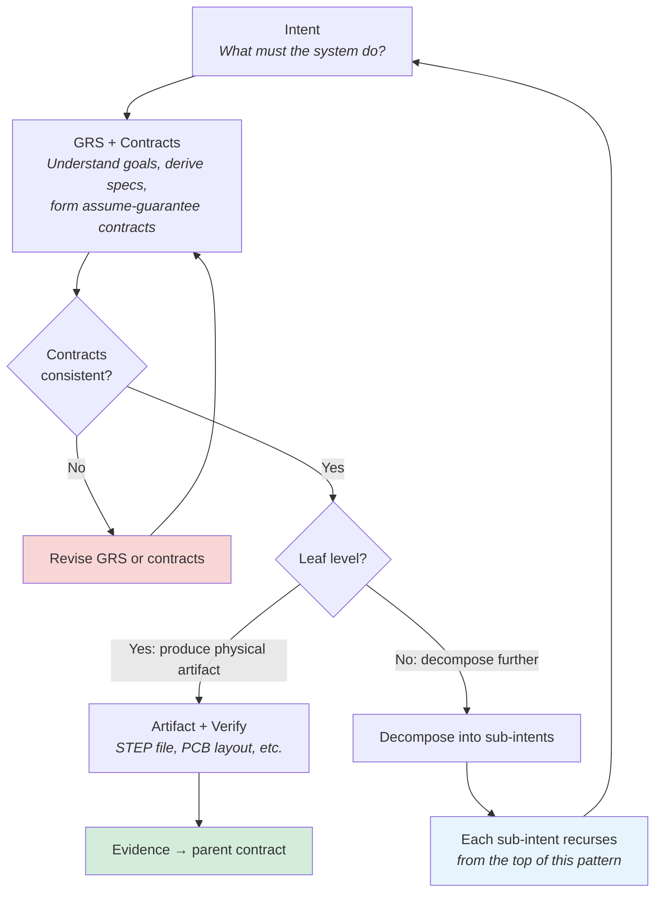
```mermaid
flowchart TD
    INTENT["Intent<br/><i>What must the system do?</i>"]
    INTENT --> GRSC["GRS + Contracts<br/><i>Understand goals, derive specs,<br/>form assume-guarantee contracts</i>"]
    GRSC --> VERIFY{"Contracts<br/>consistent?"}
    VERIFY -->|No| FIX["Revise GRS or contracts"]
    FIX --> GRSC
    VERIFY -->|Yes| LEAF{"Leaf level?"}
    LEAF -->|"Yes: produce physical artifact"| ARTIFACT["Artifact + Verify<br/><i>STEP file, PCB layout, etc.</i>"]
    ARTIFACT --> EVIDENCE["Evidence → parent contract"]
    LEAF -->|"No: decompose further"| DECOMPOSE["Decompose into sub-intents"]
    DECOMPOSE --> SUB["Each sub-intent recurses<br/><i>from the top of this pattern</i>"]
    SUB --> INTENT

    style EVIDENCE fill:#d4edda
    style SUB fill:#e8f4fd
    style FIX fill:#f9d6d6
```

> In subsequent diagrams, the Intent → GRS → Contracts sequence is abbreviated as **GRSC** or shown as a single "Intent + GRSC" node for brevity.

Manufacturing, uncertainty, and verification are first-class at all levels — they participate in the design loop, not as downstream filters.

**Key terms** (for readers new to the Grafton platform):

> **Goal-Requirement-Specification (GRS)**: a hierarchical tree decomposing intent into actionable, verifiable items. *Goals* are KAOS-style (ACHIEVE/MAINTAIN/AVOID). *Requirements* are SHALL statements (IEEE 830). *Specifications* are quantitative parameters with tolerances.
>
> **Contract**: an assume-guarantee pair binding two components. "I guarantee X, assuming you provide Y." Contracts are the primary truth objects: they define what each part of the system owes and expects.
>
> **Artifact**: the deliverable produced at each level. What counts as an artifact depends on the level:

| Level | Artifact Examples |
|-------|-------------------|
| System | Subsystem decomposition + facility layout |
| Subsystem | Component decomposition + interface definitions |
| Component | Part list + assembly plan |
| Part (mechanical) | CadQuery solid + STEP file |
| Part (electrical) | PCB layout + schematic + BOM |
| Part (software) | Control algorithm + simulation model |
| Purchasable | Supplier datasheet + validation plan |

At system level, the "artifact" is a decomposition plan. At part level, it is a physical design. The verification, contract, and manufacturing assessment structures are identical in form — only the domain-specific content differs.

### 1.5 Relationship to Existing Work

This document builds on two prior references:

* **Joint Step-Level Design Verification** ([companion doc](https://graftonsciences.getoutline.com/doc/joint-step-level-verification-74INluueRu)): covers the atomic-level design loop in detail, including multi-level constraint checking, surrogate model triage (including VLM), and manufacturing-as-constraint for individual parts. Section 5 of this document provides a self-contained summary.
* **Grafton Project Requirements** (Jan 2025): defines the full platform scope including 27 capability areas, the dense verifiable hypergraph specification, contract elaboration, and deconstruction strategies.


---

## 2. The Decomposition Pattern

### 2.1 Decomposition at Each Level

Decomposition begins from an intent. The system forms a GRSC — goals, requirements, specifications, and contracts — to understand what must be achieved. It then breaks the intent into sub-intents (subsystems, components), each of which receives its own GRSC pass. This recurses downward until every branch terminates at an atomic part or purchasable component.

At every level, the same pipeline executes:

| Step | System Level | Subsystem Level | Component Level | Part Level |
|------|--------------|-----------------|-----------------|------------|
| **Intent** | "Build 2nm foundry" | "Provide EUV lithography" | "Collect and focus EUV radiation" | "Mount collector mirror with thermal stability" |
| **GRS** | Goals, requirements, specs for full facility | Goals, requirements, specs for lithography | Requirements for collector optics | DFM and structural specs for mount |
| **Contracts** | Inter-subsystem contracts (litho assumes clean wafers from handling) | Inter-component contracts (EUV source guarantees power to projection optics) | Part-level contracts (mirror mount guarantees drift spec) | Parameter constraints (hole diameter, wall thickness) |
| **Artifact** | Subsystem decomposition + facility layout | Component decomposition + interface definitions | Part list + assembly plan | CadQuery solid + STEP file |
| **Verification** | Budget allocation valid, interfaces consistent, no coverage gaps | Physics evaluation, contract consistency | Assembly-level checks (interference, alignment) | DFM rules, geometry analysis |

The key insight: at higher levels, the "artifact" is a decomposition plan, not a physical object. Verification at those levels checks contract consistency, budget allocation, and interface compatibility. Physical artifacts only appear at the leaf level.

### 2.2 First-Principles Analysis Before Decomposition

**Goals and requirements are user-fixed** — they define the problem statement and cannot be changed by the system. **Specifications are system-derived hypotheses** — they represent one possible path to satisfying the requirements. Different specification sets lead to different decompositions, different manufacturing demands, and different cost/risk profiles. Exploring the specification space is a first-class design activity.

Before committing to a subsystem architecture at any level, the system performs a first-principles analysis: given the intent and GRS, what are the fundamental physics and engineering constraints? What functions must be performed? What are the physical limits? And critically — what alternative specification sets could satisfy the same goals and requirements?

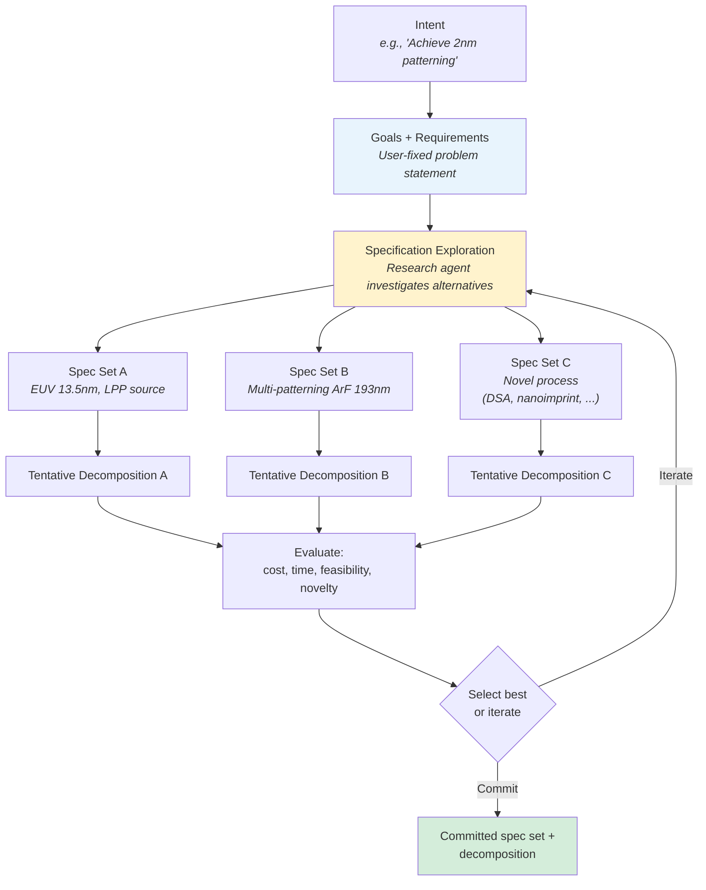
```mermaid
flowchart TD
    INTENT["Intent<br/><i>e.g., 'Achieve 2nm patterning'</i>"]
    INTENT --> GR["Goals + Requirements<br/><i>User-fixed problem statement</i>"]
    GR --> EXPLORE["Specification Exploration<br/><i>Research agent investigates alternatives</i>"]
    EXPLORE --> SA["Spec Set A<br/><i>EUV 13.5nm, LPP source</i>"]
    EXPLORE --> SB["Spec Set B<br/><i>Multi-patterning ArF 193nm</i>"]
    EXPLORE --> SC["Spec Set C<br/><i>Novel process<br/>(DSA, nanoimprint, ...)</i>"]
    SA --> DA["Tentative Decomposition A"]
    SB --> DB["Tentative Decomposition B"]
    SC --> DC["Tentative Decomposition C"]
    DA --> EVAL["Evaluate:<br/>cost, time, feasibility, novelty"]
    DB --> EVAL
    DC --> EVAL
    EVAL --> SELECT{"Select best<br/>or iterate"}
    SELECT -->|"Iterate"| EXPLORE
    SELECT -->|"Commit"| COMMIT["Committed spec set +<br/>decomposition"]

    style GR fill:#e8f4fd
    style EXPLORE fill:#fff3cd
    style COMMIT fill:#d4edda
```

Existing products and architectures serve as *priors*, not templates. The system reasons about *why* each architectural choice exists: what physical principle dictates each subsystem? What trade-offs drove each design decision? Are there alternative physical approaches that could be smaller, cheaper, or faster?

**Example**: the actual requirement is "achieve 2nm patterning" — not "use EUV at 13.5nm." The specification "EUV source power >= 250W at 13.5nm" is one hypothesis. Alternatives exist:

* **EUV (13.5nm, LPP)**: the canonical path. Laser-produced plasma, Mo/Si multilayer optics, high vacuum. Mature but extremely complex and expensive.
* **Multi-patterning ArF (193nm)**: use existing deep-UV infrastructure with multiple exposure passes. Lower per-tool cost, but throughput penalty and overlay complexity scale with patterning count.
* **Directed self-assembly (DSA)**: block copolymer self-assembly for sub-10nm features. Research-stage, potentially eliminates complex optics entirely.
* **Nanoimprint lithography**: mechanical patterning via template contact. Low cost per exposure, but defectivity and template lifetime are open challenges.

Each specification path leads to a fundamentally different decomposition tree — different subsystems, different components, different manufacturing demands. The system enumerates candidates, estimates feasibility against the goals and requirements, and selects — rather than defaulting to the existing commercial architecture. ASML's LPP architecture is the product of 20+ years of iteration by hundreds of engineers. That history is informative but not prescriptive: the specific trade-offs that led to LPP (available laser technology, plasma stability, collector geometry) may not hold under different cost structures, material availability, or manufacturing capabilities.

This analysis occurs at two points in the decomposition cycle:


1. **Pre-decomposition**: explore specification alternatives from first principles. Enumerate candidate spec sets that satisfy the goals and requirements. For lithography, this means evaluating all physical processes that achieve 2nm patterning — not just EUV. Record alternatives, estimated feasibility, and rationale in a **DecisionPoint** node.
2. **Post-decomposition review**: after a tentative decomposition, when cost estimates, availability data, and novelty levels are better understood, re-evaluate whether an alternative specification set is superior given updated data. A spec set that seemed feasible in pre-decomposition may turn out to have prohibitive manufacturing cost, triggering reconsideration of a competing spec-decomposition pair.

This connects to novelty handling (Section 8): truly novel subsystems may emerge from first-principles analysis when no existing product satisfies the intent. The novelty frontier is *discovered* through this analysis, not assumed.

### 2.3 When Decomposition Stops

Decomposition terminates when a node reaches one of three states:


1. **Atomic part**: a single component designed and manufactured through the atomic design loop (Section 5). One part, one or few manufacturing processes, directly producible.
2. **Off-the-shelf component**: a purchasable item that satisfies the contract. Uncertainty is collapsed through supplier data, incoming inspection, and acceptance testing rather than design.
3. **Contracted fabrication**: an externally manufactured component where the contract specifies requirements and the supplier provides evidence of conformance.

The choice between these three is itself a design decision, governed by the make-vs-buy analysis (Section 7.2).

### 2.4 Bidirectional Propagation

Changes propagate in both directions through the hierarchy.

**Top-down**: a system-level requirement (vibration budget &lt; 0.5nm RMS) allocates budget to subsystems. The lithography system gets 0.2nm, the wafer stage gets 0.15nm, facilities gets 0.1nm. These allocations constrain the design space at lower levels.

**Bottom-up**: during atomic design of the mirror mount, a manufacturing constraint surfaces: achieving 0.1nm surface roughness on Zerodur (a near-zero thermal expansion glass-ceramic used for precision optics) requires single-point diamond turning (a machining process using a diamond-tipped tool to achieve sub-nanometer surface finishes), adding $50K to the collector optics budget. This propagates up:

* Collector optics budget increases
* EUV source cost increases
* Lithography subsystem cost increases
* System-level cost estimate updates

If the bottom-up propagation violates a higher-level constraint (total cost exceeds budget), the system must either:

* Find a cheaper alternative at the leaf level (different material, different process)
* Relax the constraint at the leaf level (accept lower surface quality) and check if the parent contract still holds
* Restructure at a higher level (different collector design, different lithography approach)
* Investigate a new manufacturing process: if no existing process meets the constraint at acceptable cost, propose an experiment to develop or qualify a new one. This spawns an Experiment node in the graph with estimated cost, timeline, and expected capability. The experiment itself may require custom tooling (Section 7.4).

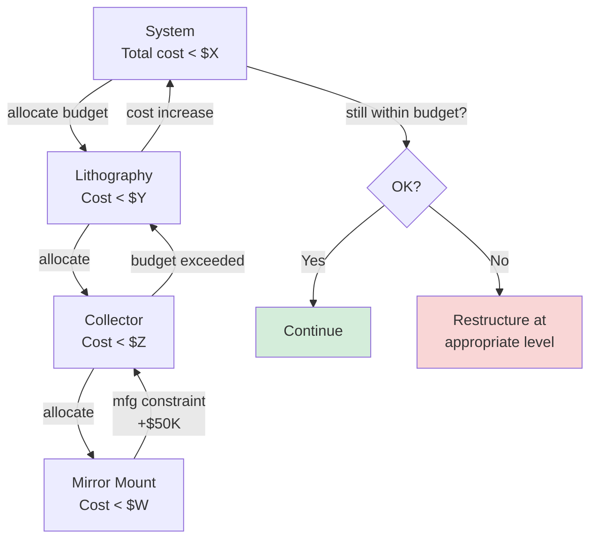
```mermaid
flowchart TD
    SYS["System<br/>Total cost < $X"] -->|"allocate budget"| LIT["Lithography<br/>Cost < $Y"]
    LIT -->|"allocate"| COL["Collector<br/>Cost < $Z"]
    COL -->|"allocate"| MOUNT["Mirror Mount<br/>Cost < $W"]

    MOUNT -->|"mfg constraint<br/>+$50K"| COL
    COL -->|"budget exceeded"| LIT
    LIT -->|"cost increase"| SYS
    SYS -->|"still within budget?"| CHECK{"OK?"}
    CHECK -->|Yes| PROCEED["Continue"]
    CHECK -->|No| REPLAN["Restructure at<br/>appropriate level"]

    style REPLAN fill:#f9d6d6
    style PROCEED fill:#d4edda
```

### 2.5 The Recursive Workflow

Sections 2.1–2.4 describe the pieces; here is how they compose into the full recursive pattern. A **research agent** explores the specification space (Section 2.2) without altering goals or requirements, proposing competing spec-decomposition pairs — each with estimated cost, timeline, feasibility, and novelty profile. The design agent selects among proposals before committing. This separation ensures spec exploration is systematic and recorded for future revisitation.

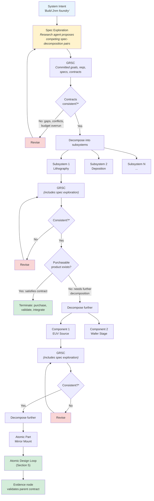
```mermaid
flowchart TD
    ROOT["System Intent<br/><i>'Build 2nm foundry'</i>"]
    ROOT --> EXPLORE["Spec Exploration<br/><i>Research agent proposes<br/>competing spec-decomposition pairs</i>"]
    EXPLORE --> GRSC0["GRSC<br/><i>Committed goals, reqs,<br/>specs, contracts</i>"]
    GRSC0 --> VER0{"Contracts<br/>consistent?*"}
    VER0 -->|No: gaps, conflicts,<br/>budget overrun| FIX0["Revise"]
    FIX0 --> EXPLORE
    VER0 -->|Yes| DEC1["Decompose into subsystems"]
    DEC1 --> SUB1["Subsystem 1<br/>Lithography"]
    DEC1 --> SUB2["Subsystem 2<br/>Deposition"]
    DEC1 --> SUB3["Subsystem N<br/>..."]

    SUB1 --> GRS1["GRSC<br/><i>(includes spec exploration)</i>"]
    GRS1 --> VER1{"Consistent?*"}
    VER1 -->|No| FIX1["Revise"]
    FIX1 --> GRS1
    VER1 -->|Yes| DECIDE{"Purchasable<br/>product exists?"}
    DECIDE -->|"Yes: satisfies contract"| BUY["Terminate: purchase,<br/>validate, integrate"]
    DECIDE -->|"No: needs further<br/>decomposition"| DEC2["Decompose further"]

    DEC2 --> COMP1["Component 1<br/>EUV Source"]
    DEC2 --> COMP2["Component 2<br/>Wafer Stage"]

    COMP1 --> GRS2["GRSC<br/><i>(includes spec exploration)</i>"]
    GRS2 --> VER2{"Consistent?*"}
    VER2 -->|Yes| DEC3["Decompose further"]
    VER2 -->|No| FIX2["Revise"]
    FIX2 --> GRS2

    DEC3 --> PART["Atomic Part<br/>Mirror Mount"]
    PART --> ATOM["Atomic Design Loop<br/>(Section 5)"]
    ATOM --> EVIDENCE["Evidence node<br/>validates parent contract"]

    style ROOT fill:#e8f4fd
    style EXPLORE fill:#fff3cd
    style ATOM fill:#d4edda
    style EVIDENCE fill:#d4edda
    style BUY fill:#d4edda
    style FIX0 fill:#f9d6d6
    style FIX1 fill:#f9d6d6
    style FIX2 fill:#f9d6d6
```

> **\*"Consistent" at non-leaf levels** means: contracts cover all requirements with no gaps, budget allocations sum correctly, interface specs are compatible, and no logical contradictions exist. This is *not* physical testing — physical verification happens only at leaf levels (atomic parts or purchased components). At non-leaf levels, the system checks that the decomposition is well-formed and the contract network is self-consistent.


---

## 3. Running Example: 2nm Semiconductor Foundry

### 3.1 Top-Level Intent

**Intent**: "Build a semiconductor fabrication facility capable of producing 2nm-node chips at target yield, cost, and throughput."

**Top-level GRS sketch**:

| Type | Example |
|------|---------|
| **Goal (ACHIEVE)** | Produce functional 2nm-node ICs at >= 85% yield |
| **Goal (MAINTAIN)** | Cleanroom class ISO 1 in lithography bays |
| **Goal (AVOID)** | Particle contamination above 10 particles/m^3 at >= 0.1um |
| **Requirement** | Facility SHALL support >= 50,000 wafer starts per month |
| **Requirement** | Lithography system SHALL achieve overlay accuracy &lt;= 1.5nm |
| **Requirement** | Facility SHALL be designed, procured, constructed, and commissioned within $15B capital budget |
| **Requirement** | Facility SHALL be operational within 36 months of ground-breaking |
| **Requirement** | Each major tool SHALL be installed and qualified within 6 months of delivery |
| **Specification** | Vibration: &lt; 0.5nm RMS at litho tool locations, 1-100Hz band |
| **Specification** | Temperature stability: 22.0C +/- 0.01C in litho bays |
| **Specification** | EUV source power: >= 250W at 13.5nm wavelength |

> **Budget scope**: the $15B is a capital budget covering design, procurement, construction, and commissioning. Operating costs (consumables, labor, utilities) are modeled only where they influence capital decisions — e.g., if a consumable is expensive enough to justify building in-house production capability.

### 3.2 Level 1: Major Subsystems

The foundry intent decomposes into \~9 top-level subsystems. The graph below shows the first expansion — from intent through GRS to Level 1 nodes:

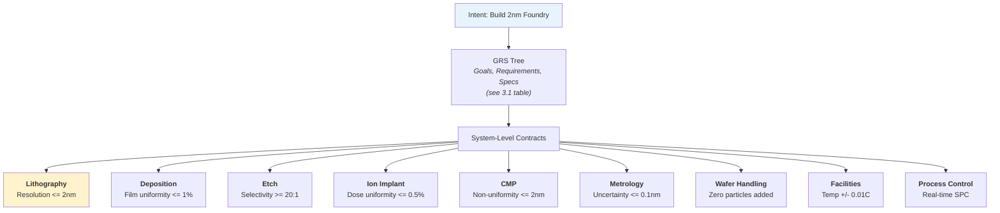
```mermaid
flowchart TD
    INTENT["Intent: Build 2nm Foundry"]
    INTENT --> GRS["GRS Tree<br/><i>Goals, Requirements, Specs<br/>(see 3.1 table)</i>"]
    GRS --> CONTRACTS["System-Level Contracts"]

    CONTRACTS --> LITHO["<b>Lithography</b><br/>Resolution <= 2nm"]
    CONTRACTS --> DEP["<b>Deposition</b><br/>Film uniformity <= 1%"]
    CONTRACTS --> ETCH["<b>Etch</b><br/>Selectivity >= 20:1"]
    CONTRACTS --> ION["<b>Ion Implant</b><br/>Dose uniformity <= 0.5%"]
    CONTRACTS --> CMP_N["<b>CMP</b><br/>Non-uniformity <= 2nm"]
    CONTRACTS --> MET["<b>Metrology</b><br/>Uncertainty <= 0.1nm"]
    CONTRACTS --> WH["<b>Wafer Handling</b><br/>Zero particles added"]
    CONTRACTS --> FAC["<b>Facilities</b><br/>Temp +/- 0.01C"]
    CONTRACTS --> PC["<b>Process Control</b><br/>Real-time SPC"]

    style INTENT fill:#e8f4fd
    style LITHO fill:#fff3cd
```

Each subsystem has contracts defining what it assumes from others and what it guarantees. Full acronym expansions and domain terms are in Appendix E: Glossary.

| Subsystem | Description | Key Guarantee | Key Assumption | Primary Uncertainty |
|-----------|-------------|---------------|----------------|---------------------|
| **Lithography** | Pattern transfer to wafer | Resolution &lt;= 2nm, overlay &lt;= 1.5nm | Clean wafer surface, stable environment | EUV source power and lifetime |
| **Deposition** | Thin film growth: Chemical Vapor Deposition (CVD), Physical Vapor Deposition (PVD), Atomic Layer Deposition (ALD), Electrochemical Deposition (ECD) | Film thickness uniformity &lt;= 1% | Wafer at specified temperature | ALD cycle time at 2nm dimensions |
| **Etch**  | Material removal: Reactive Ion Etch (RIE), wet etch | Etch selectivity >= 20:1, CD uniformity &lt;= 0.5nm | Film composition as specified | Plasma damage at 2nm features |
| **Ion Implant** | Dopant introduction | Dose uniformity &lt;= 0.5%, depth accuracy &lt;= 1nm | Wafer crystal orientation known | Ultra-low energy implant control |
| **Chemical Mechanical Planarization (CMP)** | Surface flattening | Within-wafer non-uniformity &lt;= 2nm | Incoming film thickness known | Slurry chemistry for new materials |
| **Metrology** | Measurement and inspection | Measurement uncertainty &lt;= 0.1nm | Access to wafer between process steps | Throughput vs accuracy trade-off |
| **Wafer Handling** | Transport between tools | Zero particles added, &lt; 30s transfer time | Standard Front Opening Unified Pod (FOUP) interface | Contamination during transfer |
| **Cleanroom/Facilities** | Environment control (HVAC, vibration isolation, ultrapure water, gas delivery) | Temperature +/- 0.01C, vibration &lt; 0.5nm RMS | Utility connections available | Building resonance modes |
| **Process Control** | Recipe management, Statistical Process Control (SPC) | Automated lot tracking, real-time SPC | Tool communication protocols | Yield prediction model accuracy |

**Contracts between subsystems** (examples):

* Lithography *assumes* wafer handling delivers wafers with &lt; 10 particles/m^2 at >= 0.05um
* Etch *assumes* deposition delivered the correct film stack with specified thickness
* Metrology *guarantees* measurement data to process control within 5 seconds of scan completion
* Facilities *guarantees* vibration &lt; 0.5nm RMS at all tool mounting points

**Budget nodes introduced here**: vibration budget (allocated across subsystems), particle budget (allocated per process step), thermal budget (allocated per tool type), capital cost budget (allocated per subsystem), time budget (construction schedule milestones).

### 3.3 Level 2: Lithography Decomposition

Zooming in: the top levels collapse and Lithography (highlighted in 3.2) expands into 7 Level 2 components. Same graph, deeper view:

> Each component below receives its own GRSC pass (elided for clarity; see Section 1.4).

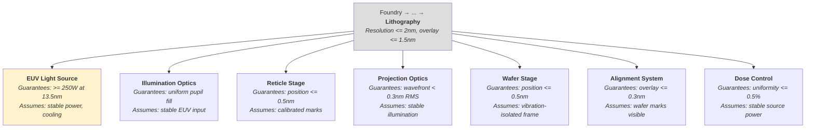
```mermaid
flowchart TD
    TOP["Foundry → ... → <b>Lithography</b><br/><i>Resolution <= 2nm, overlay <= 1.5nm</i>"]

    TOP --> EUV["<b>EUV Light Source</b><br/><i>Guarantees: >= 250W at 13.5nm</i><br/><i>Assumes: stable power, cooling</i>"]
    TOP --> ILLUM["<b>Illumination Optics</b><br/><i>Guarantees: uniform pupil fill</i><br/><i>Assumes: stable EUV input</i>"]
    TOP --> MASK["<b>Reticle Stage</b><br/><i>Guarantees: position <= 0.5nm</i><br/><i>Assumes: calibrated marks</i>"]
    TOP --> PROJ["<b>Projection Optics</b><br/><i>Guarantees: wavefront < 0.3nm RMS</i><br/><i>Assumes: stable illumination</i>"]
    TOP --> WSTAGE["<b>Wafer Stage</b><br/><i>Guarantees: position <= 0.5nm</i><br/><i>Assumes: vibration-isolated frame</i>"]
    TOP --> ALIGN["<b>Alignment System</b><br/><i>Guarantees: overlay <= 0.3nm</i><br/><i>Assumes: wafer marks visible</i>"]
    TOP --> DOSE["<b>Dose Control</b><br/><i>Guarantees: uniformity <= 0.5%</i><br/><i>Assumes: stable source power</i>"]

    style TOP fill:#ddd
    style EUV fill:#fff3cd
```

**Inter-component contracts**:

* EUV source guarantees 250W to illumination optics
* Illumination optics guarantees uniform pupil to projection optics
* Projection optics assumes &lt; 0.3nm wavefront error from illumination
* Wafer stage assumes vibration-isolated mounting frame from facilities subsystem (cross-subsystem dependency)

**Coupling hubs introduced here**: the lithography frame is a coupling hub. Vibration, thermal expansion, and alignment all couple through it. A perturbation in one component (e.g., EUV source cooling pump vibration) propagates to others (wafer stage position error) through this shared physical structure.

### 3.4 Deep Vertical Slice: EUV Source → Collector Mirror → Mirror Mount

Zooming further: Lithography collapses, and the EUV Light Source (highlighted in 3.3) expands downward through collector optics to the atomic part:

> Each component below receives its own GRSC pass (elided for clarity; see Section 1.4).

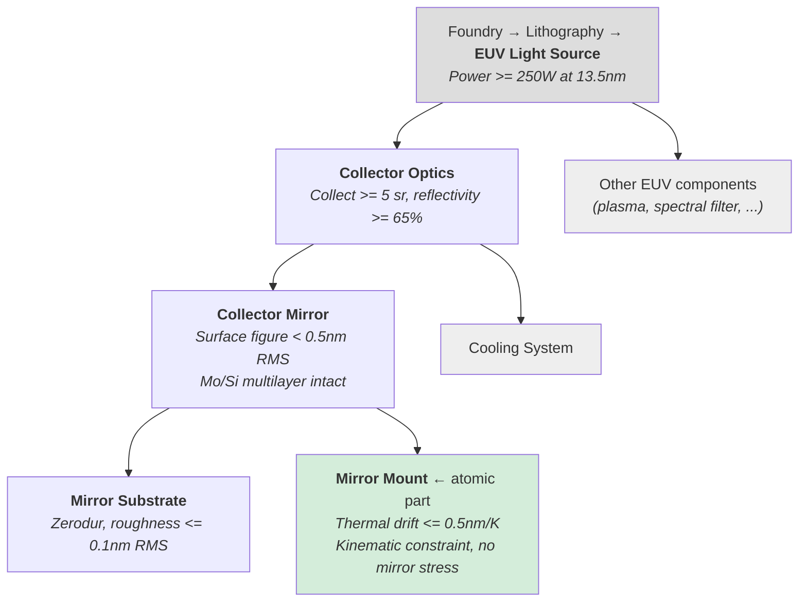
```mermaid
flowchart TD
    TOP2["Foundry → Lithography → <b>EUV Light Source</b><br/><i>Power >= 250W at 13.5nm</i>"]

    TOP2 --> COLL["<b>Collector Optics</b><br/><i>Collect >= 5 sr, reflectivity >= 65%</i>"]
    TOP2 --> OTHER["Other EUV components<br/><i>(plasma, spectral filter, ...)</i>"]

    COLL --> MIRROR["<b>Collector Mirror</b><br/><i>Surface figure < 0.5nm RMS</i><br/><i>Mo/Si multilayer intact</i>"]
    COLL --> COOL["Cooling System"]

    MIRROR --> SUB["<b>Mirror Substrate</b><br/><i>Zerodur, roughness <= 0.1nm RMS</i>"]
    MIRROR --> MOUNT["<b>Mirror Mount</b> ← atomic part<br/><i>Thermal drift <= 0.5nm/K</i><br/><i>Kinematic constraint, no mirror stress</i>"]

    style TOP2 fill:#ddd
    style OTHER fill:#eee
    style COOL fill:#eee
    style MOUNT fill:#d4edda
```

At the bottom, the **mirror mount** is a single machined part: a kinematic mount with flexures for thermal compensation. This is the bracket-equivalent — it enters the atomic design loop (Section 5) where it is designed step-by-step with joint constraint and manufacturing verification at each operation.

**How atomic constraints connect upward**:

* Mirror mount drift spec (0.5nm/K) derives from collector optics alignment budget
* Collector alignment budget derives from wavefront error requirement
* Wavefront error derives from lithography resolution requirement
* Resolution derives from the top-level 2nm node specification

A manufacturing issue at the mount level (e.g., material choice affects thermal drift) propagates all the way up to the system-level cost and performance model.

### 3.5 Contract Cascade

Same vertical path, now annotated with the contract guarantee → assumption flow. Each guarantee at one level becomes an assumption at the level below:

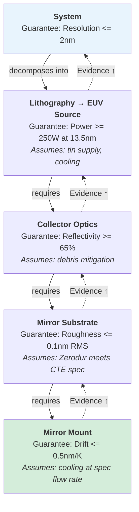
```mermaid
flowchart TD
    SYS["<b>System</b><br/>Guarantee: Resolution <= 2nm"]
    SYS -->|"decomposes into"| SUB["<b>Lithography → EUV Source</b><br/>Guarantee: Power >= 250W at 13.5nm<br/><i>Assumes: tin supply, cooling</i>"]
    SUB -->|"requires"| COMP["<b>Collector Optics</b><br/>Guarantee: Reflectivity >= 65%<br/><i>Assumes: debris mitigation</i>"]
    COMP -->|"requires"| PART["<b>Mirror Substrate</b><br/>Guarantee: Roughness <= 0.1nm RMS<br/><i>Assumes: Zerodur meets CTE spec</i>"]
    PART -->|"requires"| ATOM["<b>Mirror Mount</b><br/>Guarantee: Drift <= 0.5nm/K<br/><i>Assumes: cooling at spec flow rate</i>"]

    ATOM -.->|"Evidence ↑"| PART
    PART -.->|"Evidence ↑"| COMP
    COMP -.->|"Evidence ↑"| SUB
    SUB -.->|"Evidence ↑"| SYS

    style SYS fill:#e8f4fd
    style ATOM fill:#d4edda
```

**Evidence flows upward** (dashed arrows): when the mirror mount is manufactured and tested, the test result (measured drift = 0.3nm/K) becomes an Evidence node that validates the atomic contract. That validation propagates up: collector optics alignment budget is within margin, wavefront error is bounded, lithography resolution contract is supported.

**Unknown nodes appear where evidence is missing**: if the mirror mount drift hasn't been tested under the actual EUV thermal load (only benchtop tested), an Unknown node is created: "Mount drift under EUV plasma heating is unvalidated." This Unknown blocks the collector optics contract from reaching SATISFIED status, which propagates up as reduced confidence on the lithography system.

**Experiment nodes resolve Unknowns**: the system proposes an experiment: "Thermal cycling test of mount under simulated EUV heat flux, cost $15K, 2 weeks." When the experiment completes and validates the drift spec, the Unknown is resolved, confidence increases, and the contract cascade updates.

**Uncertainty quantification through the cascade**: the contract cascade is fundamentally an uncertainty propagation structure. Each verification level (L0–L3) reduces uncertainty at different cost points — DFM parameter checks are free but leave most contract uncertainty intact, while physical testing is expensive but provides ground truth. Evidence from multiple sources (DFM checks, analytical surrogates, FEA, physical measurements) must be fused into a single confidence estimate per contract clause. Upward propagation through the cascade then composes child uncertainties into parent uncertainty — this composition is non-trivial (correlated children, heterogeneous evidence types, partial coverage) and is an active design area (see Section 10 for implementation considerations).


---

## 4. The Universal Evaluation Pattern

### 4.1 One Pattern, All Scales

Verification at every level of the hierarchy follows the same four-level escalation. The domain content differs, but the structure is identical. Cost increases roughly linearly from milliseconds to weeks.

| Level | Name | Time Scale | Part-Level Example | System-Level Example |
|-------|------|------------|--------------------|----------------------|
| **0** | Parameter / Screening | Milliseconds | Hole diameter >= 1mm (check code value) | Power budget sum &lt;= 500kW (check allocation table) |
| **1** | Surrogate Models | Seconds–minutes | VLM visual inspection, analytical stress estimate, empirical correlation | Reduced-order thermal model, worst-case vibration bounds, sensitivity estimate |
| **2** | High-Fidelity Analysis | Hours–days | B-Rep ray-cast, FEA structural simulation | Coupled multi-physics FEA (thermal-structural-optical), full system simulation |
| **3** | Real-World Testing | Days–weeks | Physical measurement of manufactured prototype, material coupon tests | Integration test on prototype assembly, pilot line validation, environmental qualification |

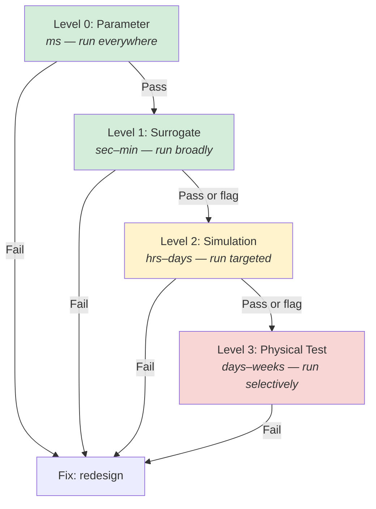
```mermaid
flowchart TD
    L0["Level 0: Parameter<br/><i>ms — run everywhere</i>"]
    L1["Level 1: Surrogate<br/><i>sec–min — run broadly</i>"]
    L2["Level 2: Simulation<br/><i>hrs–days — run targeted</i>"]
    L3["Level 3: Physical Test<br/><i>days–weeks — run selectively</i>"]

    L0 -->|"Pass"| L1
    L1 -->|"Pass or flag"| L2
    L2 -->|"Pass or flag"| L3
    L0 -->|"Fail"| FIX["Fix: redesign"]
    L1 -->|"Fail"| FIX
    L2 -->|"Fail"| FIX
    L3 -->|"Fail"| FIX

    style L0 fill:#d4edda
    style L1 fill:#d4edda
    style L2 fill:#fff3cd
    style L3 fill:#f9d6d6
```

**Level 1 — Surrogate Models** is broader than visual inspection alone. A surrogate is any fast approximate model that provides conservative bounds without full simulation:

* *Part-level*: VLM visual inspection of rendered geometry, analytical stress concentration estimates (Peterson's), empirical DFM correlations
* *Subsystem-level*: reduced-order thermal models, first-order vibration estimates, analytical worst-case bounds
* *System-level*: sensitivity analysis, parametric trade studies, reduced-order models (ROM) of subsystem interactions

The choice of surrogate depends on the domain and the guarantee being checked. For a mechanical part, VLM is the primary surrogate. For a thermal-sensitive mount, an analytical coefficient of thermal expansion (CTE) model is equally relevant.

**At part level** (the atomic design loop):

* Level 0: check parameter values from code (hole diameter, wall thickness, L/D ratio)
* Level 1: VLM inspects rendered views + analytical thermal estimate flags drift risk
* Level 2: B-Rep geometry analysis on flagged regions, FEA on critical stress paths
* Level 3: fabricate prototype, measure actual thermal drift on test bench

**At subsystem level** (e.g., EUV source):

* Level 0: check that budget allocations sum correctly, interface specs are dimensionally consistent
* Level 1: conservative analytical bounds (worst-case thermal expansion, first-order vibration estimate)
* Level 2: coupled FEA simulation (thermal-structural-optical)
* Level 3: prototype assembly integration test, thermal cycling under simulated EUV heat load

**At system level** (full foundry):

* Level 0: check that all subsystem contracts are present, no coverage gaps, budget totals within limits
* Level 1: system-level sensitivity analysis (which subsystems dominate cost, yield, throughput)
* Level 2: integrated process simulation (full wafer flow modeling)
* Level 3: pilot line validation, first-silicon qualification

**The four levels as uncertainty reduction**: viewed through the lens of uncertainty quantification, each level reduces contract uncertainty at increasing cost. L0 catches specification violations (binary — no uncertainty reduction on the contract itself, but blocks obviously invalid designs). L1 surrogates provide conservative bounds that cheaply narrow the uncertainty range. L2 simulation tightens those bounds significantly. L3 physical testing provides ground truth. The escalation decision (§4.2) is fundamentally a cost-of-information problem: which verification level gives the most uncertainty reduction per dollar for this specific contract? Each verification result becomes evidence that updates the contract's confidence via evidence fusion — combining heterogeneous results (binary DFM pass, continuous FEA output, physical measurement with error bars) into a calibrated confidence estimate (see Section 10 for implementation).

### 4.2 Escalation Logic

The same decision logic governs when to escalate, regardless of level in the hierarchy:

* **Level 0 runs everywhere**. Every contract, every node, every update. It is free.
* **Level 1 runs broadly**. Surrogate models are cheap compared to the cost of missing an issue. For mechanical parts, this is VLM visual inspection + analytical estimates. For systems, this is reduced-order modeling and worst-case bounds.
* **Level 2 runs only when**:
  * Margins are tight (Level 1 bounds are close to limits)
  * Coupling is complex (multiple physics domains interact)
  * Novelty is present (no prior evidence for this configuration)
  * Safety-critical (failure consequence is high)
* **Level 3 runs only when**:
  * Simulation cannot provide sufficient confidence (model fidelity uncertain)
  * Novel configuration with no prior test data
  * Customer or regulatory acceptance requires physical evidence
  * Safety-critical and simulation alone is insufficient

This means the full simulation pipeline (Level 2) runs on perhaps 20% of nodes, and physical testing (Level 3) on perhaps 5%. The remaining 75-80% are validated through parameter checks and surrogate models.

### 4.3 The Three Actions

For every guarantee at every level of the hierarchy, exactly one of three actions must apply:


1. **Prove**: evidence exists that the guarantee holds. Simulation result (Level 2), test data (Level 3), analytical derivation (Level 1).
2. **Bound**: no proof, but conservative bounds show margin exists. Acceptable when margin is healthy and consequence of violation is manageable. Surrogate models (Level 1) often provide these bounds.
3. **Test**: neither proof nor adequate bounds exist. An experiment is required. The experiment becomes an Experiment node in the graph with cost, timeline, and expected information gain. Level 3 testing is the ultimate form of this action.

If none of the three actions is feasible for a guarantee, the design must change: increase margin, reduce coupling, simplify assumptions, or restructure the decomposition. The graph cannot proceed with unbacked guarantees.


---

## 5. The Atomic Design Loop

In Section 3.4, we traced the foundry decomposition down to the **mirror mount** — a kinematic mount with thermal compensation for the EUV collector mirror. This is an atomic part: a single machined component that enters the step-by-step design loop described below. For full detail on the atomic loop, see the companion document *Simplifying Design Verification Through Joint Step-Level Resolution*.

**Domain routing**: the system identifies the mirror mount as a *mechanical* part (machined metal component), which triggers *mechanical DFM checkers* (hole geometry, wall thickness, fillet radii, draft angles). An electrical part (e.g., the process controller PCB from Section 3.2) would trigger PCB DFM checkers (trace width, via aspect ratio, clearance rules). The evaluation framework from Section 4 is universal; the checkers are domain-specific.

### 5.1 Joint Step-Level Resolution

The mirror mount is designed through an ordered sequence of operations. Each operation is executed individually, and before proceeding to the next, three things are verified jointly:


1. **Design constraints**: does this operation satisfy DFM rules and structural requirements?
2. **Surrogate check**: does the geometry look correct and behave as expected? (domain-appropriate surrogate models)
3. **Manufacturing feasibility**: can this operation be performed within cost, tooling, and time constraints?

If any check fails, the code generator rewrites that single operation with the specific failure context. No downstream operations are affected because they haven't been committed yet.

**Mirror mount design steps** (illustrative):

| Step | Operation | Tool Required | Key DFM Check | Key Surrogate |
|------|-----------|---------------|---------------|---------------|
| 1    | Create base body — aluminum block with mounting flange | 3-axis CNC    | Wall thickness >= 2mm, feature accessibility | VLM: flange proportions, symmetry |
| 2    | Machine flexure slots for thermal compensation | Wire EDM      | Slot width >= 0.3mm, slot depth/width ratio | VLM: slot geometry; analytical CTE model: thermal drift estimate |
| 3    | Drill kinematic mounting points (V-groove, flat, cone) | 5-axis CNC    | Hole L/D ratio, edge distance, angular tolerance | VLM: point placement; analytical: kinematic constraint check |
| 4    | Add alignment reference features | 5-axis CNC    | Feature height >= 0.5mm, position tolerance | VLM: feature visibility and accessibility |

Each step introduces different tools, different DFM rules, and different surrogate models. Step 2 is where the thermal compensation design is committed — the flexure geometry determines the mount's CTE behavior, which is the critical property for the parent contract (drift &lt;= 0.5nm/K).

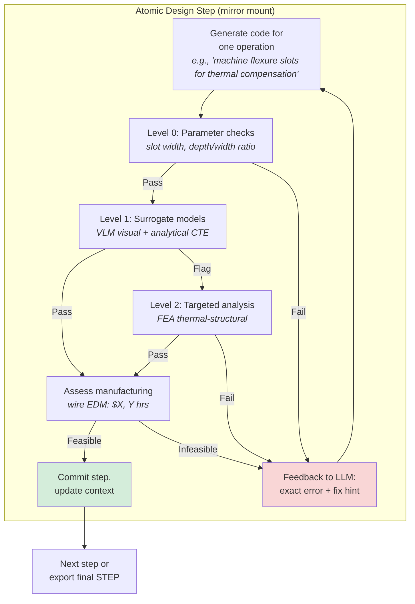
```mermaid
flowchart TD
    subgraph step ["Atomic Design Step (mirror mount)"]
        GEN["Generate code for<br/>one operation<br/><i>e.g., 'machine flexure slots for thermal compensation'</i>"] --> CHECK["Level 0: Parameter checks<br/><i>slot width, depth/width ratio</i>"]
        CHECK -->|Pass| SURR["Level 1: Surrogate models<br/><i>VLM visual + analytical CTE</i>"]
        CHECK -->|Fail| FB["Feedback to LLM:<br/>exact error + fix hint"]
        SURR -->|Pass| MFG["Assess manufacturing<br/><i>wire EDM: $X, Y hrs</i>"]
        SURR -->|Flag| SIM["Level 2: Targeted analysis<br/><i>FEA thermal-structural</i>"]
        SIM -->|Pass| MFG
        SIM -->|Fail| FB
        MFG -->|Feasible| COMMIT["Commit step,<br/>update context"]
        MFG -->|Infeasible| FB
        FB --> GEN
    end

    COMMIT --> NEXT["Next step or<br/>export final STEP"]

    style FB fill:#f9d6d6
    style COMMIT fill:#d4edda
```

### 5.2 Constraint Checking at Atomic Level

The evaluation pattern from Section 4, instantiated for this mechanical part:

* **Level 0 (parameter)**: slot width >= 0.3mm, hole L/D ratio &lt;= 10, wall thickness >= 2mm, fillet radius >= 0.2mm. Checked from code values, milliseconds.
* **Level 1 (surrogate models)**: for this mechanical part, the primary surrogates are:
  * *VLM visual inspection*: renders the current workpiece from standard views (isometric, orthographic, cross-sections). Flags thin walls at boolean intersections, features too close to edges, disconnected geometry.
  * *Analytical thermal model*: estimates CTE-induced drift from flexure geometry and material properties. For the mirror mount, this is the critical surrogate — it estimates whether the drift spec (0.5nm/K) will be met before committing to expensive simulation.
* **Level 2 (high-fidelity analysis)**: B-Rep ray-casting for exact wall thickness, FEA thermal-structural simulation of the flexure under temperature gradient. Only runs on regions flagged by Level 1 surrogates.
* **Level 3 (physical testing)**: after manufacturing, measure actual thermal drift on a test bench with simulated EUV heat load. This is the experiment proposed in Section 3.5.

### 5.3 Manufacturing as Constraint

Manufacturing state accumulates across design steps. At each step, the system tracks:

* Tools committed so far (3-axis CNC → wire EDM → 5-axis CNC → ...)
* Cumulative cost and time
* Setup count (each new machine type adds setup cost)
* Material committed (aluminum 7075-T6)

When a step introduces a new manufacturing requirement (e.g., Step 2 commits wire EDM for the flexure slots), the cost impact is surfaced immediately. The system can decide before committing: accept the cost, redesign the flexures to be machinable with CNC (different geometry, possibly worse thermal performance), or choose an alternative thermal compensation approach (e.g., bimetallic strips instead of flexures).

### 5.4 Feeding Parent Contracts

When the mirror mount completes the design loop:


1. The finished artifact (STEP file, CadQuery code) becomes an **Artifact node** in the hypergraph
2. Verified properties (flexure geometry, material, thermal drift estimate from Level 1/2 analysis) become **Evidence nodes** that validate the parent contract
3. Manufacturing context (3-axis CNC + wire EDM + 5-axis CNC, total cost, total time) rolls up to the collector assembly's manufacturing plan
4. Any unresolved issues become **Unknown nodes** — e.g., "thermal drift under actual EUV heat flux is estimated but not physically tested"

The parent contract ("mirror mount thermal drift &lt;= 0.5nm/K") transitions to SATISFIED only when all required evidence is present, all unknowns are resolved, and confidence exceeds the threshold. The completed mount's evidence propagates up through the contract cascade from Section 3.5: mount → mirror substrate → collector optics → EUV source → lithography → system.


---

## 6. Assembly and Integration

### 6.1 Emergent Constraints

Individual parts may each pass all checks in isolation, but combining them creates new failure modes that no single part's verification could detect:

* **Thermal expansion mismatch**: mirror (Zerodur, CTE \~0) mounted on frame (aluminum, CTE \~23 ppm/K). Under temperature change, the frame distorts the mirror.
* **Assembly interference**: two parts designed independently may physically overlap when assembled.
* **Resonance coupling**: a motor's vibration frequency matches the natural frequency of a nearby optical mount, amplifying displacement.
* **Tolerance stack-up**: five parts each within tolerance individually may accumulate errors beyond the assembly-level spec.

These emergent properties require verification at the assembly level, not the part level.

### 6.2 Interface Verification

Every pair of parts that physically interact has an interface contract. Verification checks:

| Interface Property | Check Method | Level |
|--------------------|--------------|-------|
| Bolt pattern alignment | Parameter comparison (hole positions match) | 0     |
| Thermal interface conductance | Analytical estimate from materials + contact area | 1     |
| Seal continuity    | VLM inspection of mating surfaces | 1     |
| Assembly interference | B-Rep boolean intersection of STEP solids | 2     |
| Resonance coupling | FEA modal analysis of assembled structure | 2     |
| Tolerance stack-up | Statistical simulation (Monte Carlo on dimensional chain) | 2     |

Level 3 (physical testing) at the assembly level = environmental qualification testing of the assembled unit: thermal cycling, vibration sweep, accelerated lifetime testing. This is the most expensive verification, reserved for novel assemblies or safety-critical interfaces.

### 6.3 Coupling Prioritization

Section 6.2 addresses pairwise interface contracts between touching parts. But physical couplings extend beyond direct contact: heat propagates through shared structures, vibration transmits through mounting frames, electromagnetic fields radiate across gaps. In a 10,000+ part system, testing all O(n^2) pairwise couplings is intractable. The system must identify which couplings matter and at what fidelity to evaluate them.

**The coupling graph.** Couplings are not limited to touching parts. The coupling graph is the subgraph of components connected by physical coupling paths — thermal, mechanical, electromagnetic, or fluidic. A coupling hub (Section 3.3) is a shared structure through which perturbations propagate. For example, the lithography tool frame is a coupling hub: thermal expansion in the EUV source propagates through the frame to the wafer stage. Components that share no physical coupling path can be analyzed independently.

**Coupling artifact creation.** For each coupling hub, the system creates a coupling artifact — a model of how perturbations propagate through that hub. For the lithography frame, this is a coupled thermal-vibration transfer function: given temperature delta at component A's mount point, what is the displacement at component B's mount point? These coupling artifacts are themselves verified using the evaluation pattern from Section 4.

**Prioritization strategy** — the same escalation logic from Section 4, applied to couplings:

| Level | Action | Purpose | Typical Outcome |
|-------|--------|---------|-----------------|
| **0: Screen all** | Automated coupling path check — do these components share a physical structure, material, or field? | Eliminate non-coupled pairs | \~90% of potential pairs eliminated |
| **1: Surrogate on candidates** | For components sharing a coupling path, estimate coupling strength with analytical surrogates: transfer function estimates, order-of-magnitude energy budgets, sensitivity analysis | Flag couplings where estimated effect > 10% of margin | \~70% of candidates cleared |
| **2: Simulate flagged** | Coupled FEA or multi-physics simulation of flagged couplings. E.g., modal analysis of the lithography frame with all attached components | Quantify actual coupling strength, identify resonances | Design changes if coupling exceeds budget |
| **3: Test critical** | Physical test of novel or safety-critical couplings on prototype assemblies | Final validation where simulation uncertainty is too high | Evidence nodes with measured coupling data |

**Priority ordering** for Level 2+ analysis ranks couplings by: (a) estimated coupling strength from Level 1, (b) tightness of margin on the affected guarantee, (c) novelty of the configuration (novel = higher priority), (d) number of downstream contracts affected by the coupling.

**Example**: the EUV source plasma emits significant thermal radiation. Level 0 identifies 47 components with thermal coupling paths through the lithography frame. Level 1 analytical estimates clear 38 of these (thermal effect &lt; 0.01nm displacement). The remaining 9 are scheduled for Level 2 coupled FEA. Of these, the collector mirror mount and wafer stage are highest priority because their displacement margins are tightest (0.1nm remaining margin) and they affect the most downstream contracts (overlay accuracy, CD uniformity).

### 6.4 Manufacturing Aggregation

Assembly manufacturing context combines:

* Individual part costs and times (from atomic loops)
* Assembly process costs (welding, fastening, bonding, alignment)
* Integration testing costs (functional test, environmental test)
* Fixturing and tooling for the assembly process itself

This aggregation produces the assembly-level manufacturing node, which rolls up to the subsystem level.

### 6.5 Integration Testing

Integration testing at assembly level follows the same evaluation pattern (Section 4):

* **Level 0**: dimensional inspection (measure assembly-level dimensions against specs)
* **Level 1**: functional test under nominal conditions — a surrogate for full qualification (does the assembly perform its primary function at room temperature?)
* **Level 2**: simulation of assembled behavior (FEA of assembly, tolerance stack-up Monte Carlo, coupled thermal-structural model)
* **Level 3**: environmental qualification testing (thermal cycling, vibration sweep, accelerated lifetime), final acceptance

Each test produces Evidence nodes that validate the assembly-level contract.

### 6.6 Example: Collector Assembly

The collector assembly combines mirror substrate + mount + alignment mechanism:

| Part | Individual Contract | Passes Alone? |
|------|---------------------|---------------|
| Mirror substrate | Surface roughness &lt;= 0.1nm RMS | Yes           |
| Mirror mount | Thermal drift &lt;= 0.5nm/K | Yes           |
| Alignment mechanism | Positioning accuracy &lt;= 0.1nm, 6-DOF | Yes           |

**Emergent constraints at assembly**:

| Emergent Property | Issue | Resolution |
|-------------------|-------|------------|
| Thermal distortion | Mount CTE != mirror CTE, thermal gradient from EUV plasma | Flexure design in mount decouples thermal strain |
| Alignment stability | Alignment mechanism's actuator vibration couples to mirror surface | Vibration isolation between actuator and mount |
| Contamination     | Assembly process introduces particles on mirror surface | Cleanroom assembly, in-situ cleaning protocol |
| Combined drift budget | Mount drift + alignment drift + thermal distortion must sum to &lt; 0.5nm total | Budget allocation across three sources, verified by system-level test |

The combined drift budget is a **budget node** allocated across the three parts. Each part's evidence contributes to the budget consumption. If the sum exceeds the allocation, either part-level specs must tighten or the parent subsystem contract must relax.

### 6.7 Visual Summary: From Atomic Part to Assembly

The mirror mount flow end-to-end — from intent through design, verification, assembly, coupling detection, redesign, and evidence propagation:

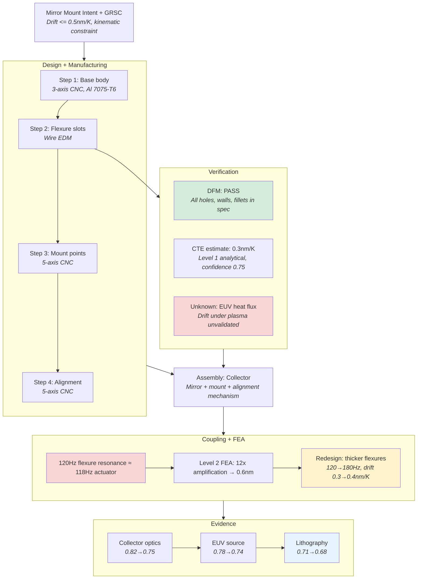
```mermaid
flowchart TD
    INTENT["Mirror Mount Intent + GRSC<br/><i>Drift <= 0.5nm/K, kinematic constraint</i>"]
    INTENT --> design

    subgraph design ["Design + Manufacturing"]
        direction LR
        S1["Step 1: Base body<br/><i>3-axis CNC, Al 7075-T6</i>"]
        S2["Step 2: Flexure slots<br/><i>Wire EDM</i>"]
        S3["Step 3: Mount points<br/><i>5-axis CNC</i>"]
        S4["Step 4: Alignment<br/><i>5-axis CNC</i>"]
        S1 --> S2 --> S3 --> S4
    end

    S2 --> ver

    subgraph ver ["Verification"]
        E_DFM["DFM: PASS<br/><i>All holes, walls, fillets in spec</i>"]
        E_CTE["CTE estimate: 0.3nm/K<br/><i>Level 1 analytical, confidence 0.75</i>"]
        U_HEAT["Unknown: EUV heat flux<br/><i>Drift under plasma unvalidated</i>"]
    end

    design --> ASM["Assembly: Collector<br/><i>Mirror + mount + alignment mechanism</i>"]
    ver --> ASM
    ASM --> coupling

    subgraph coupling ["Coupling + FEA"]
        DETECT["120Hz flexure resonance ≈ 118Hz actuator"]
        FEA["Level 2 FEA: 12x amplification → 0.6nm"]
        REDESIGN["Redesign: thicker flexures<br/><i>120→180Hz, drift 0.3→0.4nm/K</i>"]
        DETECT --> FEA --> REDESIGN
    end

    coupling --> evidence

    subgraph evidence ["Evidence"]
        direction LR
        COLL["Collector optics<br/><i>0.82→0.75</i>"]
        EUV["EUV source<br/><i>0.78→0.74</i>"]
        LITHO["Lithography<br/><i>0.71→0.68</i>"]
        COLL --> EUV --> LITHO
    end

    style DETECT fill:#f9d6d6
    style REDESIGN fill:#fff3cd
    style U_HEAT fill:#f9d6d6
    style E_DFM fill:#d4edda
    style LITHO fill:#e8f4fd
```

Key observations:

* **Manufacturing planning** (Section 7): the $4.2K cost and CNC+EDM tooling requirements roll into the facility manufacturing graph
* **Make-vs-buy** (Section 7.2): no COTS mount meets the 0.5nm/K spec — in-house design is required; wire EDM is contracted externally at lower utilization
* **Cross-project reuse** (Section 9): the precision CNC cell used for this mount serves turbine blade prototypes and microscope stage components
* **Novelty handling** (Section 8): the tight drift spec makes this a novel design (confidence 0.40 initially), driving experiment prioritization
* **Unknown resolution**: thermal cycling experiment ($15K, 2 weeks) is the critical path to collapsing the EUV heat flux unknown


---

## 7. Manufacturing Planning Across the Hierarchy

### 7.1 Manufacturing as a Graph

Manufacturing is not a per-part concern. It is a graph problem linking every component to the processes, equipment, materials, and facilities required to produce it.

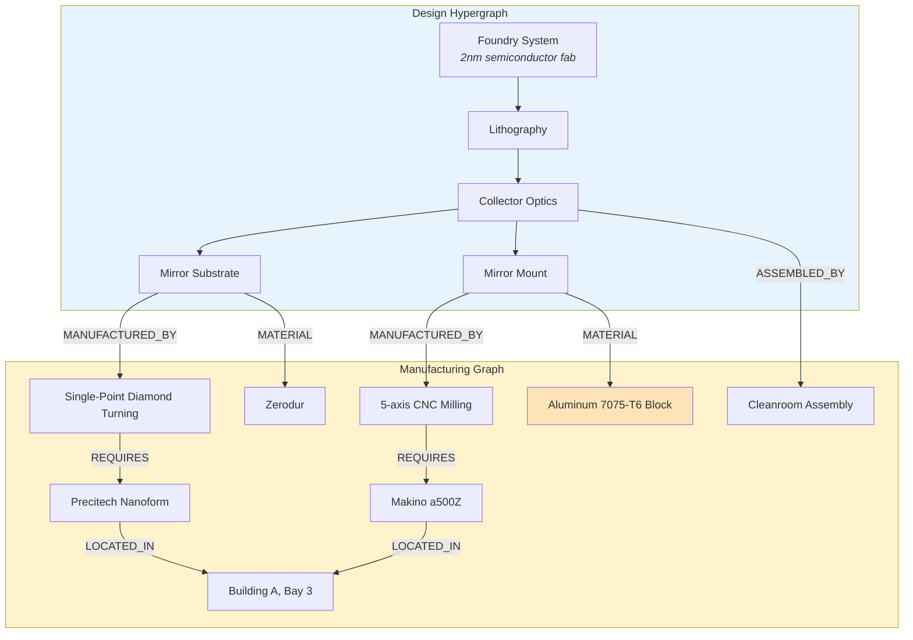
```mermaid
flowchart TD
    subgraph design ["Design Hypergraph"]
        SYS["Foundry System<br/><i>2nm semiconductor fab</i>"] --> SUB["Lithography"]
        SUB --> COMP["Collector Optics"]
        COMP --> MIRROR["Mirror Substrate"]
        COMP --> PART["Mirror Mount"]
    end

    subgraph mfg ["Manufacturing Graph"]
        PROC1["5-axis CNC Milling"]
        PROC2["Single-Point Diamond Turning"]
        PROC3["Cleanroom Assembly"]
        EQUIP1["Makino a500Z"]
        EQUIP2["Precitech Nanoform"]
        MAT1["Aluminum 7075-T6 Block"]
        MAT2["Zerodur"]
        FAC["Building A, Bay 3"]
    end

    PART -->|"MANUFACTURED_BY"| PROC1
    MIRROR -->|"MANUFACTURED_BY"| PROC2
    PROC1 -->|"REQUIRES"| EQUIP1
    PROC2 -->|"REQUIRES"| EQUIP2
    PART -->|"MATERIAL"| MAT1
    MIRROR -->|"MATERIAL"| MAT2
    EQUIP1 -->|"LOCATED_IN"| FAC
    EQUIP2 -->|"LOCATED_IN"| FAC
    COMP -->|"ASSEMBLED_BY"| PROC3

    style design fill:#e8f4fd
    style mfg fill:#fff3cd
    style MAT1 fill:#fce4b8
```

**Recursive material decomposition.** The diagram above treats materials as terminal nodes, but this is a simplification. Materials are themselves products of manufacturing processes, and the same decomposition pattern applies:

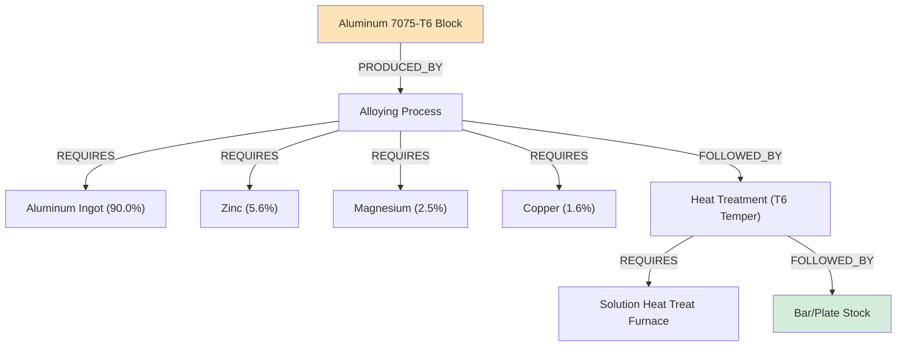
```mermaid
flowchart TD
    MAT["Aluminum 7075-T6 Block"]
    MAT -->|"PRODUCED_BY"| ALLOY["Alloying Process"]
    ALLOY -->|"REQUIRES"| RAW1["Aluminum Ingot (90.0%)"]
    ALLOY -->|"REQUIRES"| RAW2["Zinc (5.6%)"]
    ALLOY -->|"REQUIRES"| RAW3["Magnesium (2.5%)"]
    ALLOY -->|"REQUIRES"| RAW4["Copper (1.6%)"]
    ALLOY -->|"FOLLOWED_BY"| HT["Heat Treatment (T6 Temper)"]
    HT -->|"REQUIRES"| FURNACE["Solution Heat Treat Furnace"]
    HT -->|"FOLLOWED_BY"| STOCK["Bar/Plate Stock"]

    style MAT fill:#fce4b8
    style STOCK fill:#d4edda
```

Currently, alloys are purchased as stock material. In the future, if cost or lead-time analysis justifies it, in-house alloy production enters the system as its own sub-project — using the same decomposition framework. The decision is governed by the same make-vs-buy logic (Section 7.2): if the foundry consumes enough 7075-T6 that in-house production is cheaper than procurement, the alloy production process gets its own GRS, contracts, and manufacturing plan.

Every part node in the design hypergraph has edges to the manufacturing graph. This linkage enables:

* Aggregating equipment demand across all parts
* Identifying bottleneck machines
* Computing total facility requirements
* Tracking material sourcing needs

### 7.2 Make vs Buy

At each decomposition level, a decision determines whether to design, buy, or contract:

| Strategy | When to Use | Uncertainty Collapse | Cost Model | Timeline Impact |
|----------|-------------|----------------------|------------|-----------------|
| **Off-the-shelf** | Commercial product satisfies the contract | Supplier data + incoming inspection | Purchase price + inspection cost | Fastest (procurement + delivery) |
| **Contracted** | Spec is custom but fabrication is standard | Supplier qualification + acceptance testing | Quote + qualification cost | Medium (qualification + fabrication + delivery) |
| **In-house** | No supplier meets the spec, or strategic capability | Full atomic design loop + facility investment | Design + material + machine time + labor | Slowest (design + prototype + qualification + production) |

> Time pressure may override cost. If contracting saves 3 months over in-house at 20% premium, the schedule constraint may justify the higher cost.

The decision propagates: if 500 parts require 5-axis CNC (in-house), that demand justifies equipment investment. If only 3 parts need it, contracting is cheaper.

**Decision point nodes** appear in the graph at each make-vs-buy junction. The decision is recorded with rationale, alternatives considered, and cost comparison. This supports auditing and revision if conditions change (e.g., a supplier goes out of business, requiring in-house capability).

The default bias is toward purchasing or contracting: every in-house design introduces novelty, uncertainty, and cost (Section 8). In-house design is the path of last resort, chosen only when no existing product or supplier satisfies the contract, or when building in-house creates strategic capability that amortizes across future projects (Section 9). The system should exhaust existing options — off-the-shelf products, qualified suppliers, proven designs — before committing to novel design.

### 7.3 Requirements Propagation

Manufacturing requirements propagate upward from parts to facilities:

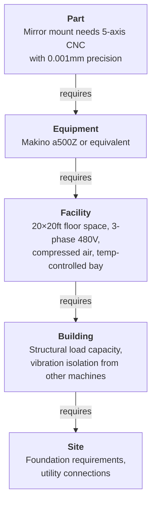
```mermaid
flowchart TD
    PART["<b>Part</b><br/>Mirror mount needs 5-axis CNC<br/>with 0.001mm precision"]
    EQUIP["<b>Equipment</b><br/>Makino a500Z or equivalent"]
    FACILITY["<b>Facility</b><br/>20×20ft floor space, 3-phase 480V,<br/>compressed air, temp-controlled bay"]
    BUILDING["<b>Building</b><br/>Structural load capacity,<br/>vibration isolation from other machines"]
    SITE["<b>Site</b><br/>Foundation requirements,<br/>utility connections"]

    PART -->|"requires"| EQUIP
    EQUIP -->|"requires"| FACILITY
    FACILITY -->|"requires"| BUILDING
    BUILDING -->|"requires"| SITE
```

When many parts across multiple subsystems need the same equipment class, the demand aggregates:

| Equipment Class | Demand (parts requiring it) | Utilization Estimate | Decision |
|-----------------|-----------------------------|----------------------|----------|
| 5-axis CNC (precision) | 847 parts across 4 subsystems | 78% over 18 months   | Purchase 2 units |
| EDM wire cut    | 23 parts in 1 subsystem     | 12% over 6 months    | Contract externally |
| Diamond turning | 6 parts in collector optics | 95% for 4 months, then idle | Purchase 1, consider leasing |
| Cleanroom assembly | All optical assemblies      | Continuous           | Build dedicated bay |

### 7.4 Building Tools to Build Tools

Some components in the foundry cannot be built with commercially available equipment. The 2nm process may require:

* A custom deposition chamber with tighter uniformity than commercial tools achieve
* A specialized wafer stage with positioning accuracy beyond available stages
* Custom metrology tools calibrated for 2nm feature sizes

Each custom tool is itself a design problem that enters the same decomposition system:

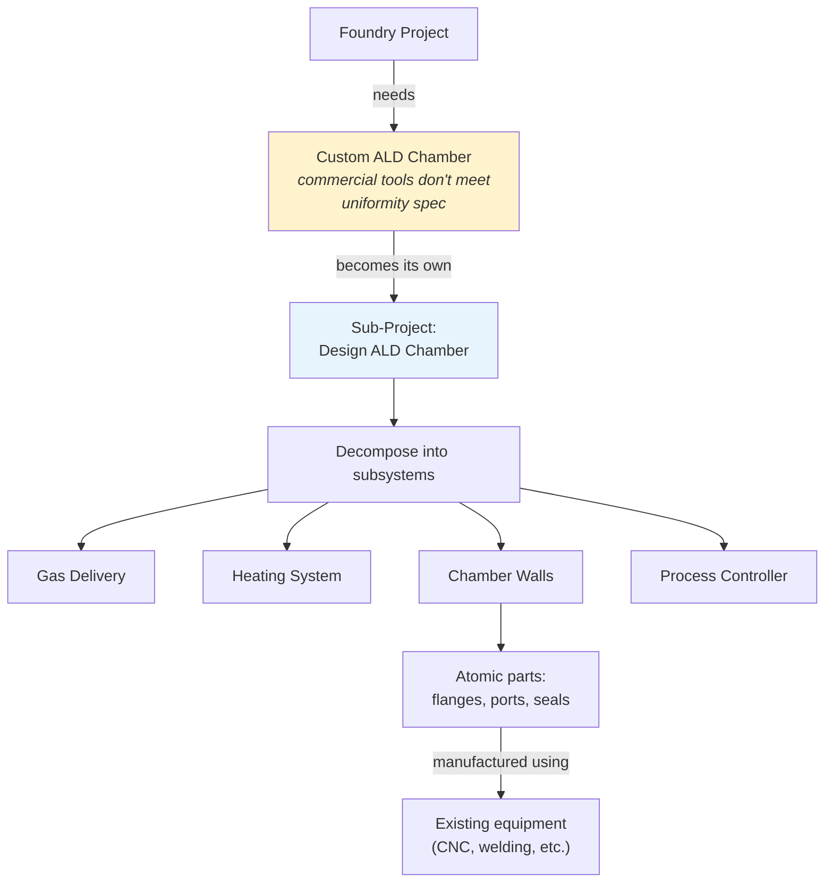
```mermaid
flowchart TD
    FOUNDRY["Foundry Project"] -->|"needs"| CHAMBER["Custom ALD Chamber<br/><i>commercial tools don't meet<br/>uniformity spec</i>"]
    CHAMBER -->|"becomes its own"| PROJECT["Sub-Project:<br/>Design ALD Chamber"]
    PROJECT --> DEC["Decompose into subsystems"]
    DEC --> GAS["Gas Delivery"]
    DEC --> HEAT["Heating System"]
    DEC --> WALL["Chamber Walls"]
    DEC --> CTRL["Process Controller"]

    WALL --> PARTS["Atomic parts:<br/>flanges, ports, seals"]
    PARTS -->|"manufactured using"| EXISTING["Existing equipment<br/>(CNC, welding, etc.)"]

    style CHAMBER fill:#fff3cd
    style PROJECT fill:#e8f4fd
```

This is recursive manufacturing: building tools to build tools. The key constraint is that at some point, the recursion must ground out in existing capabilities: commercially available machines, standard manufacturing processes, or purchasable materials.

### 7.5 The Manufacturing Database

The manufacturing graph requires its own persistent store, shared across projects:

**Process nodes**:

* Process type (milling, turning, deposition, assembly, ...)
* Achievable tolerances (min feature size, surface finish, dimensional accuracy)
* Typical variation (within-part, part-to-part, lot-to-lot)
* Cost model (setup cost + per-unit cost + material cost)
* Yield model (defect rate as function of parameters)
* Required equipment class

**Equipment nodes**:

* Capabilities (axes, precision, work envelope, materials)
* Availability (schedule, maintenance windows, current utilization)
* Location (facility, bay, floor position)
* Cost (capital, operating, maintenance per year)

**Material nodes**:

* Properties (mechanical, thermal, optical, electrical)
* Valid regimes (temperature range, environment compatibility)
* Sourcing (suppliers, lead time, minimum order, cost per unit)
* Variability (lot-to-lot variation in properties)

**Facility nodes**:

* Layout (floor plan, equipment positions, utilities)
* Environment (cleanroom class, temperature control, vibration spec)
* Capacity (power, cooling, compressed air, gas supply)


---

## 8. Handling Novelty vs Reuse

### 8.1 The Principle

The guiding principle is to minimize novelty: every novel design element introduces uncertainty, requires experiments to validate, and costs more than reusing a proven solution. The system should exhaust existing options before designing from scratch.

### 8.2 Starting from Existing Products

Decomposition at each level begins by surveying what already exists:

| Project | Novelty Level | Rationale |
|---------|---------------|-----------|
| **Tractor** | Low           | Engines, hydraulics, axles, transmissions are mature commercial products. Novel work is in integration, control software, and any non-standard requirements (e.g., autonomous operation). |
| **Microscope** | Medium        | Standard optics, stages, and electronics are available. Novel work is in achieving target resolution, custom illumination, and integration. |
| **Foundry** | High          | Most subsystems require customization for 2nm. EUV lithography, advanced etch, and metrology are at or beyond the state of the art. Foundational processes exist but must be pushed to new regimes. |
| **Hypersonic Jet** | Very High     | Hypersonic flight regime (Mach 5+) has few existing solutions. Thermal protection, propulsion, and materials science are at the research frontier. |

The decomposition strategy adapts: for the tractor, most leaf nodes are off-the-shelf purchases. For the foundry, most leaf nodes require in-house design. The fraction of novel nodes determines the project's uncertainty profile, cost, and timeline.

### 8.3 The Novelty Frontier

Before querying the knowledge base for existing products, the system performs a first-principles analysis (Section 2.2): is this the right decomposition? Does the canonical architecture reflect fundamental physical constraints, or historical accident?

At the foundry level, this means analyzing what physical functions are needed — not assuming the canonical ASML-style architecture is optimal. The ASML EUV system reflects 20+ years of iteration: the specific engineering trade-offs that drove each subsystem choice (plasma source geometry, optical train layout, stage design) may not hold under different cost structures, material availability, or manufacturing capabilities. The system reasons from the intent and GRS: "What physical processes achieve 2nm patterning?" — and evaluates alternatives before committing to a decomposition.

At lower levels, the same analysis applies. The mirror mount's kinematic-plus-flexure approach is one solution to the thermal drift problem. First-principles analysis might reveal alternatives: active thermal compensation (Peltier elements with feedback), different mounting geometry (3-point vs 6-point), alternative materials (Invar instead of aluminum). The system records this analysis in a **DecisionPoint** node with alternatives, rationale, and cost estimates.

After this analysis, the system queries the knowledge base:

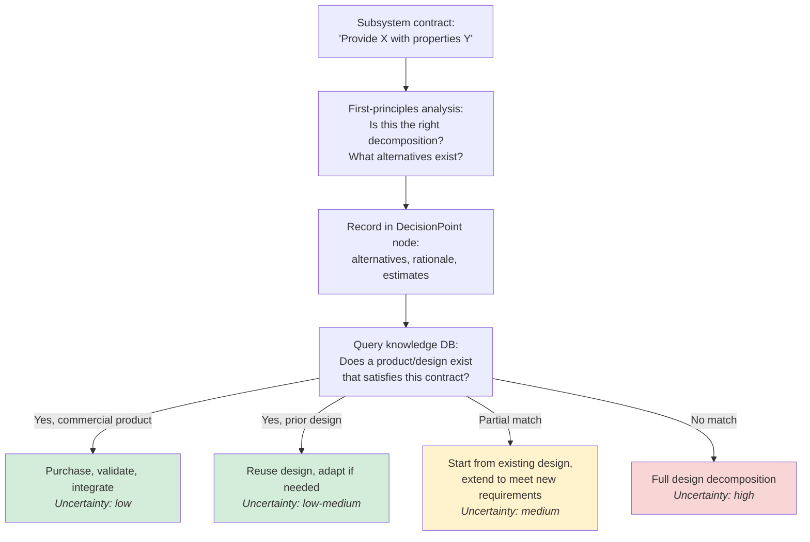
```mermaid
flowchart TD
    CONTRACT["Subsystem contract:<br/>'Provide X with properties Y'"]
    FPA["First-principles analysis:<br/>Is this the right decomposition?<br/>What alternatives exist?"]
    DP["Record in DecisionPoint node:<br/>alternatives, rationale, estimates"]
    QUERY["Query knowledge DB:<br/>Does a product/design exist<br/>that satisfies this contract?"]
    BUY["Purchase, validate, integrate<br/><i>Uncertainty: low</i>"]
    REUSE["Reuse design, adapt if needed<br/><i>Uncertainty: low-medium</i>"]
    ADAPT["Start from existing design,<br/>extend to meet new requirements<br/><i>Uncertainty: medium</i>"]
    NOVEL["Full design decomposition<br/><i>Uncertainty: high</i>"]

    CONTRACT --> FPA
    FPA --> DP
    DP --> QUERY
    QUERY -->|"Yes, commercial product"| BUY
    QUERY -->|"Yes, prior design"| REUSE
    QUERY -->|"Partial match"| ADAPT
    QUERY -->|"No match"| NOVEL

    style BUY fill:#d4edda
    style REUSE fill:#d4edda
    style ADAPT fill:#fff3cd
    style NOVEL fill:#f9d6d6
```

**For the foundry vertical slice**:

* EUV light source: partial match (ASML's EUV systems exist, but 250W+ at 13.5nm is at the frontier). First-principles analysis confirms laser-produced plasma is currently the only viable approach at this power level, but discharge-produced plasma is noted as an alternative if power requirements decrease.
* Collector optics: partial match (Mo/Si multilayer technology exists, but lifetime and reflectivity at required specs may not).
* Collector mirror substrate: existing product (Zerodur is commercially available from Schott).
* Mirror mount: novel (kinematic mount with 0.5nm/K drift spec is custom). First-principles analysis identified active thermal compensation as an alternative, but estimated cost ($12K vs $4.2K) and complexity (control electronics, power supply, calibration) favor the passive flexure approach.

The mount is novel because the drift specification is tighter than standard optical mounts provide. This triggers full design decomposition, experiment planning (thermal testing), and higher uncertainty in the contract cascade.

### 8.4 Novelty as Uncertainty

Novel nodes carry higher uncertainty, which propagates:

| Novelty Category | Typical Confidence | Experiments Needed | Cost Multiple |
|------------------|--------------------|--------------------|---------------|
| Off-the-shelf, validated | 0.95               | Incoming inspection only | 1x            |
| Reuse of prior design | 0.85               | Verification in new context | 1.2x          |
| Adaptation of existing | 0.65               | Targeted testing of changes | 2-3x          |
| Fully novel design | 0.40               | Full qualification program | 5-10x         |

The system surfaces this: "This subsystem requires 14 novel components (confidence 0.40 each). Aggregate confidence for the subsystem is 0.12. Estimated additional cost for uncertainty collapse: $2.3M in experiments and prototyping."

This quantification enables informed decisions: invest in collapsing uncertainty (run experiments), accept the risk (proceed with low confidence), or redesign to avoid the novel elements (find existing solutions that satisfy a relaxed contract).


---

## 9. Cross-Project Optimization

### 9.1 The Multi-Project Scenario

The platform builds multiple projects concurrently or sequentially: a 2nm semiconductor foundry, a hypersonic jet, an advanced microscope, an agricultural tractor. Each is decomposed independently, but they share manufacturing infrastructure.

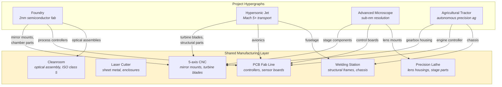
```mermaid
flowchart TD
    subgraph projects ["Project Hypergraphs"]
        F["Foundry<br/><i>2nm semiconductor fab</i>"]
        J["Hypersonic Jet<br/><i>Mach 5+ transport</i>"]
        M["Advanced Microscope<br/><i>sub-nm resolution</i>"]
        T["Agricultural Tractor<br/><i>autonomous precision ag</i>"]
    end

    subgraph shared ["Shared Manufacturing Layer"]
        CNC["5-axis CNC<br/><i>mirror mounts, turbine blades</i>"]
        LASER["Laser Cutter<br/><i>sheet metal, enclosures</i>"]
        PCB["PCB Fab Line<br/><i>controllers, sensor boards</i>"]
        WELD["Welding Station<br/><i>structural frames, chassis</i>"]
        CLEAN["Cleanroom<br/><i>optical assembly, ISO class 5</i>"]
        TURN["Precision Lathe<br/><i>lens housings, stage parts</i>"]
    end

    F -->|"mirror mounts,<br/>chamber parts"| CNC
    F -->|"process controllers"| PCB
    F -->|"optical assemblies"| CLEAN

    J -->|"turbine blades,<br/>structural parts"| CNC
    J -->|"avionics"| PCB
    J -->|"fuselage"| WELD

    M -->|"stage components"| CNC
    M -->|"control boards"| PCB
    M -->|"lens mounts"| TURN

    T -->|"gearbox housing"| CNC
    T -->|"engine controller"| PCB
    T -->|"chassis"| WELD

    style shared fill:#fff3cd
```

### 9.2 Common Manufacturing Motifs

Across diverse projects, the same manufacturing processes appear repeatedly:

| Manufacturing Motif | Foundry | Jet | Microscope | Tractor |
|---------------------|---------|-----|------------|---------|
| **Precision CNC machining** | Mirror mounts, chamber flanges | Turbine blades, structural fittings | Stage components, lens housings | Gearbox housings, axle components |
| **PCB assembly**    | Process controllers, sensor boards | Avionics, flight control | Motor drivers, acquisition boards | Engine controller, display unit |
| **Optical alignment** | Lithography optics, metrology | Targeting/sensing systems | Objective assembly, illumination | N/A     |
| **Thermal management** | Process chambers, cooling systems | Engine cooling, thermal protection | Environmental control, LED cooling | Engine cooling, hydraulic cooling |
| **Structural welding** | Chamber construction, frame fabrication | Fuselage, wing structure | N/A        | Chassis, roll cage |
| **Precision grinding/polishing** | Mirror substrates, wafer chucks | Bearing surfaces | Lens surfaces | Bearing surfaces |
| **Sheet metal fabrication** | Enclosures, ductwork | Skin panels, fairings | Enclosures | Body panels, fenders |
| **Electrical wiring/harness** | Tool interconnects | Avionics harness | Instrument cables | Vehicle harness |

Each row represents a manufacturing capability that, once established for one project, can serve others. The precision CNC cell purchased for foundry mirror mounts can machine jet turbine blade prototypes in idle time.

### 9.3 Shared Component Library

Some atomic components are functionally identical across projects:

| Component Class | Examples | Projects Using |
|-----------------|----------|----------------|
| M6 socket head cap screws | ISO 4762, various lengths | All            |
| Linear bearings (precision) | THK HSR-series, various sizes | Foundry, microscope |
| Stepper motors (NEMA 23/34) | Applied Motion, various torques | Foundry, microscope, tractor |
| DC-DC converters | Various voltages, 1-100W | All            |
| Temperature sensors (RTD) | Pt100/Pt1000, various packages | Foundry, microscope |
| O-ring seals    | Standard AS568 sizes | Foundry, jet, tractor |
| Aluminum extrusion (80/20) | 20mm and 40mm series | Foundry, microscope |
| Connectors (industrial) | M12, DB-series, USB-C | All            |

These components have validated properties, known suppliers, predictable lead times, and zero design uncertainty. They are leaf nodes that terminate decomposition immediately via off-the-shelf purchase.

The shared component library grows as projects complete: every validated off-the-shelf component choice becomes available to future projects with pre-collapsed uncertainty.

### 9.4 The Global Manufacturing Graph

Multiple project hypergraphs connect to a single shared manufacturing layer:

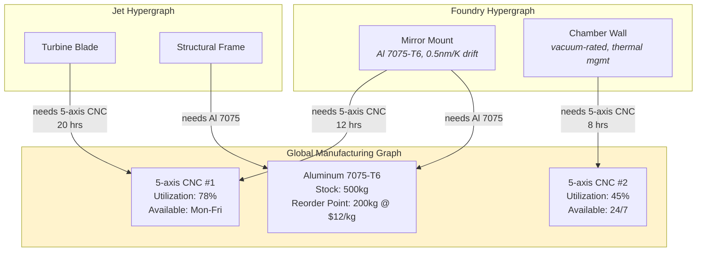
```mermaid
flowchart TD
    subgraph proj_f ["Foundry Hypergraph"]
        F_MOUNT["Mirror Mount<br/><i>Al 7075-T6, 0.5nm/K drift</i>"]
        F_CHAMBER["Chamber Wall<br/><i>vacuum-rated, thermal mgmt</i>"]
    end

    subgraph proj_j ["Jet Hypergraph"]
        J_BLADE["Turbine Blade"]
        J_FRAME["Structural Frame"]
    end

    subgraph global ["Global Manufacturing Graph"]
        G_CNC["5-axis CNC #1<br/>Utilization: 78%<br/>Available: Mon-Fri"]
        G_CNC2["5-axis CNC #2<br/>Utilization: 45%<br/>Available: 24/7"]
        G_MAT["Aluminum 7075-T6<br/>Stock: 500kg<br/>Reorder Point: 200kg @ $12/kg"]
    end

    F_MOUNT -->|"needs 5-axis CNC<br/>12 hrs"| G_CNC
    F_CHAMBER -->|"needs 5-axis CNC<br/>8 hrs"| G_CNC2
    J_BLADE -->|"needs 5-axis CNC<br/>20 hrs"| G_CNC
    J_FRAME -->|"needs Al 7075"| G_MAT
    F_MOUNT -->|"needs Al 7075"| G_MAT

    style global fill:#fff3cd
```

The global manufacturing graph tracks:

* **Equipment utilization** across all projects
* **Material inventory** and consumption rates
* **Facility capacity** and scheduling conflicts
* **Supplier relationships** and lead times

When a new project enters the system, it queries the global graph: "What equipment is already available? What materials are in stock? What processes have been validated?" This avoids redundant procurement and leverages existing validated capabilities.

### 9.5 Scheduling and Resource Allocation

Multi-project scheduling is a constrained optimization problem.

**Simplified formulation**:

> Minimize total makespan across all projects, subject to:
>
> * Each task requires specific equipment for a specific duration
> * Equipment has limited capacity (one job at a time, or limited parallelism)
> * Tasks within a project have dependency ordering (can't assemble before machining)
> * Projects have deadlines and priority levels
> * Maintenance windows are fixed

This is a variant of the job-shop scheduling problem, which is NP-hard in general. Practical approaches:


1. **Priority-based dispatching**: assign highest-priority ready tasks to available resources. Simple, real-time, handles dynamic changes well. Suboptimal but fast.
2. **Look-ahead scheduling**: for each scheduling decision, simulate N steps ahead to estimate impact on total makespan. Balances quality and computation.
3. **Offline optimization**: when the full task set is known, use genetic algorithms or simulated annealing to find a near-optimal schedule. Re-run periodically as tasks complete or new tasks arrive.
4. **Bottleneck-focused**: identify the most constrained resource (highest utilization or longest queue) and optimize its schedule first. Other resources schedule around it.

**Key scheduling outputs**:

* Gantt chart per equipment unit
* Project completion date estimates with confidence intervals
* Bottleneck identification with procurement recommendations
* Idle capacity windows for opportunistic work (calibration, prototyping, custom tool building)

### 9.6 Custom Tool Investment

When multiple projects need a manufacturing process that is expensive to outsource, building a custom tool may be justified.

**Decision framework**:

| Factor | Calculation |
|--------|-------------|
| Outsource cost | Sum of per-unit contract costs across all projects using this process |
| In-house cost | Equipment capital + installation + training + maintenance (amortized over expected lifetime) |
| Break-even | In-house justified when cumulative outsource cost > in-house cost |
| Strategic value | In-house capability enables future projects at marginal cost |
| Lead time | In-house eliminates supplier queue time (days vs weeks) |

**Example**: custom ALD (atomic layer deposition) chamber.

* Foundry needs it for 2nm gate oxide deposition (commercial tools don't meet uniformity spec)
* Microscope project needs it for anti-reflection coatings (lower spec, but same process class)
* Total outsource cost: $2M for foundry + $200K for microscope = $2.2M
* Custom chamber design + build: $1.5M
* Decision: build in-house. The chamber itself becomes a sub-project in the design decomposition system.
* The chamber's validated process capability (achievable uniformity, repeatability) becomes reusable evidence in the manufacturing database for future projects.

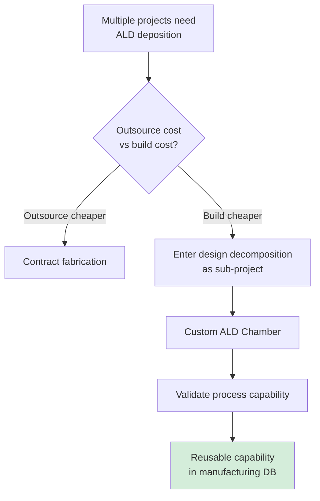
```mermaid
flowchart TD
    NEED["Multiple projects need<br/>ALD deposition"] --> EVAL{"Outsource cost<br/>vs build cost?"}
    EVAL -->|"Outsource cheaper"| CONTRACT["Contract fabrication"]
    EVAL -->|"Build cheaper"| BUILD["Enter design decomposition<br/>as sub-project"]
    BUILD --> CHAMBER["Custom ALD Chamber"]
    CHAMBER --> VALIDATE["Validate process capability"]
    VALIDATE --> REUSE["Reusable capability<br/>in manufacturing DB"]

    style REUSE fill:#d4edda
```


---

## 10. Implementation Roadmap

### 10.1 The Approach: Build by Doing

Instead of building infrastructure first and hoping it composes, we drive implementation from a concrete problem: **the 2nm semiconductor foundry from Section 3**. This tests both **breadth** (system-level decomposition across \~9 subsystems) and **depth** (recursive descent through EUV → collector → mirror mount → atomic machining steps).

By the end, we'll have exercised the full GRSC recursion, multi-level verification, manufacturing planning, coupling detection, and evidence propagation — on a real problem with real physics.

The detailed feature inventory (44 items across 4 difficulty tiers) is in Appendix F for reference. This section focuses on what to build, in what order, and what it proves in steps 1-5 in the following subsections. Below, we illustrate what breadth and depth problems can be solved for this first implementation. We should be able to work on different steps in parallel, where a preliminary version of the pipeline should come together in \~weeks.

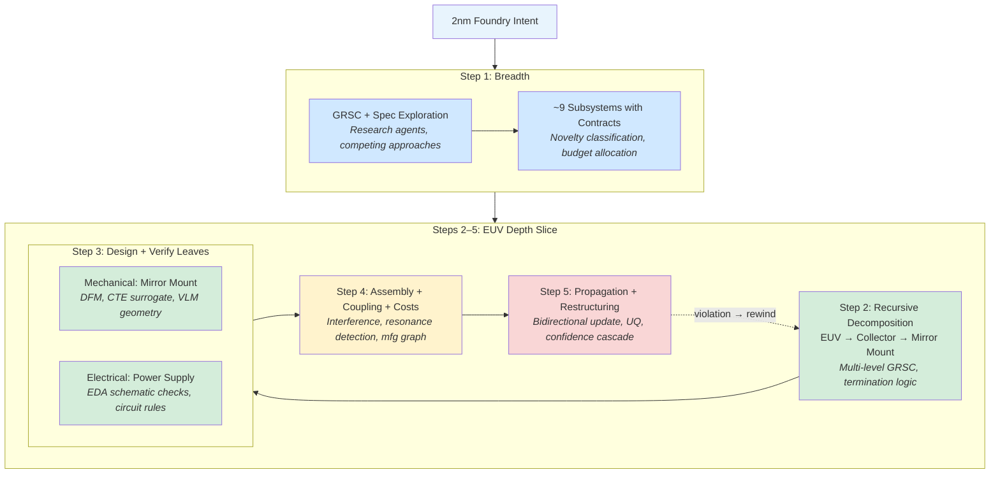
```mermaid
flowchart TD
    INTENT["2nm Foundry Intent"]

    subgraph breadth ["Step 1: Breadth"]
        direction LR
        GRSC["GRSC + Spec Exploration<br/><i>Research agents, competing approaches</i>"]
        SUB["~9 Subsystems with Contracts<br/><i>Novelty classification, budget allocation</i>"]
        GRSC --> SUB
    end

    INTENT --> breadth

    subgraph depth ["Steps 2–5: EUV Depth Slice"]
        RECURSE["Step 2: Recursive Decomposition<br/>EUV → Collector → Mirror Mount<br/><i>Multi-level GRSC, termination logic</i>"]

        subgraph leaves ["Step 3: Design + Verify Leaves"]
            direction LR
            MECH["Mechanical: Mirror Mount<br/><i>DFM, CTE surrogate, VLM geometry</i>"]
            ELEC["Electrical: Power Supply<br/><i>EDA schematic checks, circuit rules</i>"]
        end

        RECURSE --> leaves

        ASM["Step 4: Assembly + Coupling + Costs<br/><i>Interference, resonance detection, mfg graph</i>"]
        leaves --> ASM

        PROP["Step 5: Propagation + Restructuring<br/><i>Bidirectional update, UQ, confidence cascade</i>"]
        ASM --> PROP
    end

    breadth --> depth
    PROP -.->|"violation → rewind"| RECURSE

    style INTENT fill:#e8f4fd
    style GRSC fill:#d0e8ff
    style SUB fill:#d0e8ff
    style RECURSE fill:#d4edda
    style MECH fill:#d4edda
    style ELEC fill:#d4edda
    style ASM fill:#fff3cd
    style PROP fill:#f9d6d6
```

### 10.2 Step 1: Broad Decomposition (Intent → Subsystem Landscape)

**What we do**: Take "Build a 2nm semiconductor foundry" as intent. Run GRSC to produce goals, requirements, specifications. Use research agents (or human-guided exploration initially) to enumerate competing approaches — EUV vs multi-patterning vs direct-write. For each, produce a tentative subsystem decomposition with inter-subsystem contracts. Select EUV path.

**What we build**:

* Extended node/edge schemas (System/Subsystem/Contract hierarchy)
* Hierarchical contract schema (parent-child contracts, budget allocations)
* Research agent scaffolding (human-guided initially — the agent structure and data flow matter even before full autonomy)
* Spec exploration loop (enumerate competing spec sets, estimate feasibility/cost/novelty for each)
* Novelty classification (tag each subsystem: off-the-shelf vs novel)

**What we prove**: The system takes a vague intent and produces a structured, multi-subsystem decomposition with contracts between them. Spec exploration shows we evaluate alternatives, not just one path. This is the "breadth" demo.

**Frontier work touched**: Deep research agents (Appendix F #35), autonomous system-level decomposition (#36) — even in human-guided mode, the scaffolding is established.

**Concrete deliverable**: Hypergraph with \~9 subsystems, inter-subsystem contracts, budget allocations, novelty tags. The decomposition tree from Section 3.2 but generated, not hand-written.

### 10.3 Step 2: Deep Vertical Slice (EUV Source → Atomic Parts)

**What we do**: From the EUV source subsystem, recursively decompose: EUV Source → Collector Optics → Mirror Substrate → Mirror Mount. At each level, run GRSC: produce goals/requirements/specs/contracts. At the mirror mount level, reach atomic leaf nodes: the actual machining steps (base body, flexure slots, mount points, alignment features).

**What we build**:

* Recursive GRSC orchestrator (wrapping existing single-level GRS in a multi-level loop)
* Contract cascade (guarantee → assumption chaining across levels)
* Termination logic (when is a node atomic? purchasable? contracted out?)
* Domain routing (mechanical leaf → DFM pipeline; electrical leaf → different route)
* Budget allocation + propagation (thermal drift budget: system → subsystem → component → part)

**What we prove**: The system recursively decomposes through 4+ hierarchy levels, maintaining contract consistency at each. Termination works (mirror mount is atomic — single-setup CNC+EDM; Zerodur substrate is purchasable — COTS material). Budget allocation flows top-down; children's budgets sum to parent's.

**Frontier work touched**: Recursive GRSC at all hierarchy levels (Appendix F #25) — the highest-value T3 item. Termination and level-aware prompting are the hard parts.

**Concrete deliverable**: Full contract cascade from "Resolution ≤ 2nm" down to "Drift ≤ 0.5nm/K" on the mirror mount. 4-level deep hypergraph. The cascade from Section 3.5 but generated.

### 10.4 Step 3: Design + Verify Two Leaf Artifacts

**What we do**: At the mirror mount (mechanical leaf), generate an ops program and CadQuery geometry. Run the existing 4-level verification: L0 parameter checks, L1 VLM + analytical CTE surrogate, L2 FEA on flagged items. At an electrical leaf (e.g., EUV power supply controller), generate a schematic or PCB stub and run EDA verification.

**What we build**:

* Artifact generation within recursive context (artifact receives contracts from parent, not just raw intent)
* L0 parameter checks extended to system-level budget checks (not just DFM)
* L1 analytical surrogate selection (CTE model for thermal drift, Peterson's for stress)
* Evidence/Unknown node creation from verification results
* Contract status rollup (leaf evidence → parent contract status)

**What we prove**: Two different domain leaf nodes (mechanical + electrical) go through full design → verify → evidence creation. Evidence propagates up through the contract cascade. Unknowns are identified (e.g., "drift under EUV plasma unvalidated") and block parent contracts appropriately. This is the "depth" demo — from system intent to physical geometry with traceability.

**Existing code leveraged**: The entire mech-verify pipeline (DFM checks, VLM inspection, ops program verification) already exists. This step wires it into the recursive context.

**Concrete deliverable**: Mirror mount STEP file with DFM pass, CTE evidence, and identified unknowns. Contract cascade with confidence scores propagated up. One mechanical + one electrical leaf verified.

### 10.5 Step 4: Mock Assembly, Costs, and Coupling

**What we do**: Assemble the collector optics (mirror + mount + alignment mechanism). Run assembly verification (interference, tolerance stack-up). Build manufacturing graph for the mirror mount (Part → Process → Equipment → Facility). Compute mock costs and timelines. Detect coupling: mirror mount 120Hz flexure resonance near actuator 118Hz — the scenario from Section 6.7.

**What we build**:

* Manufacturing graph engine (Part → Process → Equipment → Facility links)
* Cost accumulation (per-step costs rolling up to assembly)
* Make-vs-buy at each node (mirror mount = in-house, Zerodur = purchase, alignment mechanism = contract)
* Assembly interference detection (existing mech-verify assembly pipeline)
* Coupling hub detection (shared structure → coupled physics → transfer function)
* Mock constraints for sibling subsystems (scanner, mask handler, wafer stage provide interface specs so we can check the collector's assumptions)

**What we prove**: Assembly-level emergent constraints are caught. The coupling scenario (resonance overlap → FEA → redesign → budget impact) shows the system detects problems that don't exist in any individual part. Manufacturing costs roll up realistically. Make-vs-buy decisions are recorded with rationale.

**Frontier work touched**: Coupling hub detection (Appendix F #32) is T3 — even a simplified version (shared structure screening + single analytical transfer function) demonstrates the concept.

**Concrete deliverable**: Assembly verification report. Manufacturing cost breakdown. Coupling detection → redesign → updated confidence. The visual summary from Section 6.7 but generated from actual data.

### 10.6 Step 5: Propagation and Restructuring

**What we do**: The coupling-driven redesign (thicker flexures: 120→180Hz, drift 0.3→0.4nm/K) changes the mirror mount's thermal budget consumption. Propagate upward. Check if the collector optics thermal budget still holds. If not, trigger restructuring: can we fix locally (relax mirror mount drift spec) or must we unwind further (change collector design)?

**What we build**:

* Bidirectional propagation (leaf change → upward check → violation detection)
* Restructuring decision logic (local fix vs partial rewind — at least for the simple case)
* Confidence update after restructuring (system-level confidence drops from 0.82 to 0.75 in the example)
* Evidence fusion from multiple sources (DFM pass + CTE estimate + coupling redesign → combined confidence)

**What we prove**: The system handles the hard case: a downstream change invalidates an upstream assumption, the system detects it, proposes a fix, and updates confidence across the full cascade. This is what makes hierarchical decomposition actually work vs just being a static tree.

**Frontier work touched**: Bidirectional propagation + restructuring (Appendix F #26), clause-level UQ + evidence fusion (#41).

**Concrete deliverable**: Before/after confidence cascade. Audit trail: "resonance detected → redesign → drift budget increased → collector thermal margin reduced → confidence updated." The full loop.

### 10.7 What Each Step Proves

| Step | Demo | Unique Value |
|------|------|--------------|
| 1: Broad decomp | System-level GRSC with spec exploration | Alternatives-first, not just one path |
| 2: Deep slice | 4-level recursive decomposition with contract cascade | Automated hierarchical decomposition with traceability |
| 3: Leaf design | Two-domain artifact generation + multi-level verification | Contracts flow into design constraints, evidence flows back |
| 4: Assembly + costs | Coupling detection, manufacturing graph, cost rollup | Emergent constraints caught that no individual analysis finds |
| 5: Propagation | Bidirectional restructuring with confidence update | System adapts when assumptions break — not just a static plan |

These 5 steps exercise \~25 of the 44 implementation items (Appendix F), including 2 T4 items (research agents, coupling detection) in at least scaffolded form. The remaining items — cross-project optimization, job-shop scheduling, knowledge DB, global optimization, RL — are expansion work that builds on this foundation.

### 10.8 Expansion Path

After the core 5-step scenario works end-to-end:

**Uncertainty quantification**: Replace point confidence scores with distributions. Evidence fusion becomes Bayesian update. Propagation becomes distribution composition. Tests whether calibrated uncertainty makes better restructuring decisions than heuristic confidence.

**Knowledge DB**: As decomposition runs accumulate, structured episode logs feed the knowledge DB. Decisions, costs, outcomes become queryable. Tests whether historical data accelerates future decompositions.

**Expand breadth**: Run the same 5-step process on a second subsystem (e.g., wafer stage — vibration-dominated rather than thermal-dominated). Tests that the system generalizes across domains without hard-coding EUV-specific logic. If initial scenario works, see if we can build simpler designs, such as a robotic arm end-to-end.

**Global optimization + RL**: With enough episode data from decomposition runs, explore whether LP/NLP/energy-based methods or RL can improve design-space navigation over pure LLM-driven decisions. Can we train our own models on decomposition episodes instead of relying on frontier API calls? What structured data (state transitions, outcome signals) makes this viable? This is the long-term research horizon.

**Cross-project**: Add a second project (the tractor example from §9). Shared manufacturing equipment creates scheduling conflicts. Tests cross-project queries, Gantt generation, and eventually job-shop scheduling.


## Appendix A: Foundry Subsystem Decomposition

### Level 1 → Level 2 Decomposition (Selected Subsystems)

**Lithography System**:

| L2 Component | Key Spec | Make/Buy | Novelty |
|--------------|----------|----------|---------|
| EUV light source | >= 250W at 13.5nm | Buy (ASML) + custom modifications | High    |
| Illumination optics | Uniform pupil fill, sigma 0.2-0.9 | Buy (Zeiss) | Medium  |
| Reticle stage | Position &lt;= 0.5nm, 6-DOF | Buy (ASML) | Medium  |
| Projection optics | Wavefront error &lt; 0.3nm RMS | Buy (Zeiss) | Medium  |
| Wafer stage  | Position &lt;= 0.5nm, 300mm travel | Buy (ASML) | High    |
| Alignment system | Overlay &lt;= 0.3nm | Buy (ASML) | Medium  |
| Dose control | Uniformity &lt;= 0.5% | Integrated with source | Low     |

**Deposition Systems**:

| L2 Component | Key Spec | Make/Buy | Novelty |
|--------------|----------|----------|---------|
| ALD reactor (gate oxide) | Thickness uniformity &lt;= 0.5%, &lt; 2nm films | Custom build | Very High |
| CVD reactor (dielectric) | Deposition rate >= 10nm/min, uniformity &lt;= 1% | Buy (Applied Materials) + customize | Medium  |
| PVD sputter (metals) | Step coverage >= 90% in high-AR features | Buy (Applied Materials) | Medium  |
| ECD plating (copper) | Void-free fill, via aspect ratio >= 10:1 | Buy (Lam Research) | Medium  |

**Cleanroom and Facilities**:

| L2 Component | Key Spec | Make/Buy | Novelty |
|--------------|----------|----------|---------|
| HVAC system  | Temp +/- 0.01C in litho bays | Contract (specialty HVAC vendor) | Medium  |
| Vibration isolation | &lt; 0.5nm RMS at tool locations | Custom design + buy isolators | High    |
| Ultrapure water | Resistivity >= 18.2 MΩ-cm, TOC &lt; 1 ppb | Buy (SUEZ/Veolia system) | Low     |
| Gas delivery | Purity >= 99.9999%, flow control &lt;= 0.1% | Buy (Air Liquide/Linde) | Low     |
| Waste treatment | Meet all environmental regulations | Contract | Low     |


---

## Appendix B: Cross-Project Manufacturing Motifs

Detailed matrix of manufacturing processes shared across the four example projects:

| Process | Equipment | Foundry Use | Jet Use | Microscope Use | Tractor Use | Shared? |
|---------|-----------|-------------|---------|----------------|-------------|---------|
| 5-axis CNC milling | Makino a500Z | Mirror mounts, chamber flanges, wafer chuck components | Turbine blade prototypes, structural fittings, actuator housings | Stage mounts, lens housings, encoder brackets | Gearbox housing, differential case, linkage arms | Yes, high demand |
| 3-axis CNC milling | Haas VF-2 | Enclosure panels, fixture plates | Rib sections, bracket plates | Base plates, cover plates | Frame components, mounting brackets | Yes, high demand |
| CNC turning | Okuma LB3000 | Chamber port fittings, shaft components | Fastener bushings, bearing housings | Spindle components, adapter rings | Axle components, hydraulic fittings | Yes, moderate demand |
| Laser cutting (sheet) | Trumpf TruLaser | Panel blanks, gasket preforms | Skin panel blanks, rib preforms | Enclosure panels | Body panels, bracket blanks | Yes, moderate demand |
| TIG welding | Miller Dynasty | Chamber assembly, frame fabrication | Fuselage structure, tank fabrication | N/A            | Chassis, roll cage, exhaust | Partial (not microscope) |
| PCB fabrication | In-house or contracted | Process controller boards (100+ designs) | Avionics boards (50+ designs) | Control boards (20+ designs) | Vehicle controller (10+ designs) | Yes, all projects |
| Wire EDM | Mitsubishi MV1200 | Precision slots, thin features | Turbine cooling holes | Flexure mechanisms | N/A         | Partial |
| Diamond turning | Precitech Nanoform | Mirror substrates, optical surfaces | N/A     | Lens surfaces  | N/A         | Foundry + microscope only |


---

## Appendix C: Schema Definitions

### C.1 Extended Node Types

The current platform defines 13 node types. The hierarchical system adds:

| Category | New Node Types | Purpose |
|----------|----------------|---------|
| **Hierarchy** | System, Subsystem, Component, Assembly | Explicit levels in the decomposition tree |
| **Manufacturing** | Process, Equipment, Material, Facility | Manufacturing graph nodes |
| **Uncertainty** | Experiment, DecisionPoint | Explicit uncertainty management |
| **Coupling** | CouplingHub    | Shared physical structures where perturbations propagate |

These are introduced incrementally as the decomposition demands them:

* **Level 0-1** (system/subsystem): System, Subsystem, Budget nodes appear
* **Level 2** (components): Component, CouplingHub, Interface nodes appear
* **Level 3+** (parts): Assembly, Process, Equipment, Material nodes appear
* **At any level**: Experiment and DecisionPoint nodes appear wherever uncertainty or choices exist

### C.2 Extended Edge Types

Beyond the existing 14 edge types:

| Edge Type | Source → Target | Purpose |
|-----------|-----------------|---------|
| **CONTAINS** | System → Subsystem, Subsystem → Component | Hierarchical containment |
| **INTERFACES_WITH** | Component ↔ Component | Physical interface between siblings |
| **MANUFACTURED_BY** | Part → Process  | Links design to manufacturing |
| **REQUIRES** | Process → Equipment | Process needs specific equipment |
| **SOURCES_FROM** | Material → Supplier | Material sourcing |
| **COUPLES_TO** | Component → CouplingHub | Physics coupling path |
| **ALLOCATED_FROM** | Budget → Budget | Budget allocation from parent to child |
| **RESOLVES** | Experiment → Unknown | Experiment collapses uncertainty |

### C.3 Hierarchy Node Schemas

```
SystemNode:
  inherits: Node
  node_type: "system"
  level: int                              # 0 = top-level system
  subsystem_ids: list[string]             # CONTAINS edges
  interface_contract_ids: list[string]    # contracts at system boundary
  budget_ids: list[string]                # budget allocations owned

SubsystemNode:
  inherits: Node
  node_type: "subsystem"
  parent_system_id: string
  level: int
  component_ids: list[string]
  interface_contract_ids: list[string]

ComponentNode:
  inherits: Node
  node_type: "component"
  parent_subsystem_id: string
  part_ids: list[string]                  # atomic parts
  assembly_id: string | null              # assembly this belongs to

AssemblyNode:
  inherits: Node
  node_type: "assembly"
  component_ids: list[string]             # parts in this assembly
  assembly_process_id: string             # manufacturing process for assembly
  interface_contracts: list[string]       # contracts between parts
```

### C.4 Contract Schema

Contracts at each level follow the same structure with additional hierarchy-aware fields:

```
Contract:
  id: string
  scope: "system" | "subsystem" | "component" | "part"
  parent_contract_id: string | null       # contract this was decomposed from
  level: int                               # depth in hierarchy (0 = system)

  # Standard contract fields
  assumptions: list[string]                # what this contract assumes from others
  guarantees: list[string]                 # what this contract promises
  parties: list[{id, role}]               # components involved
  valid_regimes: list[string]             # operating conditions where this holds

  # Budget linkage
  budget_allocations: dict[string, float]  # budget_id → allocated amount
  budget_consumed: dict[string, float]     # budget_id → consumed amount

  # Status
  status: "draft" | "in_progress" | "satisfied" | "violated"
  confidence: float                        # 0.0-1.0
  blocking_unknowns: list[string]          # unknown IDs that block satisfaction
  evidence_ids: list[string]               # evidence supporting this contract
```

### C.5 Manufacturing, Facility & Uncertainty Schemas

```
Process:
  id: string
  process_type: string                     # "cnc_milling", "laser_cutting", "ald", ...
  achievable_tolerances: dict[string, float]  # "position": 0.001, "surface_finish": 0.1
  typical_variation: dict[string, float]
  cost_model: {setup_cost, per_unit_cost, material_cost_factor}
  yield_model: {defect_rate, rework_fraction}
  required_equipment_class: string

Equipment:
  id: string
  equipment_class: string                  # "5_axis_cnc", "laser_cutter", ...
  capabilities: dict[string, any]          # "axes": 5, "precision_mm": 0.001, "envelope_mm": [500,500,400]
  availability: {schedule, maintenance_windows, current_utilization}
  location: {facility_id, bay, position}
  cost: {capital, annual_operating, annual_maintenance}

Material:
  id: string
  material_type: string                    # "aluminum_7075_t6", "zerodur", ...
  properties: dict[string, float]          # "youngs_modulus": 71.7e9, "cte": 23.6e-6
  valid_regimes: {temp_range, env_compatibility}
  sourcing: [{supplier_id, lead_time_days, min_order, cost_per_kg}]
  variability: dict[string, float]         # lot-to-lot variation

Facility:
  id: string
  layout: {floor_plan_ref, total_area_m2}
  environment: {cleanroom_class, temp_control, vibration_spec}
  capacity: {power_kw, cooling_kw, compressed_air_cfm, gas_supply}
  equipment_ids: list[string]

# --- Graph node extensions (hypergraph-specific fields) ---

ProcessNode:
  id: string
  process_type: string
  tolerances: dict[string, float]
  cost_model: {setup, per_unit, material_factor}
  required_equipment_class: string
  validated: bool                          # has this process been qualified?
  validation_evidence_ids: list[string]

EquipmentNode:
  id: string
  class: string
  capabilities: dict
  schedule: list[{project_id, task_id, start, end}]
  utilization_pct: float
  maintenance_schedule: list[{date, duration, type}]

CouplingHubNode:
  inherits: Node
  node_type: "coupling_hub"
  coupled_component_ids: list[string]
  coupling_types: list[string]            # "thermal", "vibration", "electrical"
  propagation_model: string | null        # reference to analytical model

ExperimentNode:
  inherits: Node
  node_type: "experiment"
  resolves_unknown_id: string
  setup_description: string
  estimated_cost: float
  estimated_duration_days: int
  expected_information_gain: string       # what uncertainty is reduced
  unlocks_decision_ids: list[string]      # decisions waiting on this result
  status: "planned" | "in_progress" | "completed" | "failed"
  result_evidence_id: string | null

DecisionPointNode:
  inherits: Node
  node_type: "decision_point"
  options: list[{id, description, pros, cons, cost_estimate}]
  chosen_option_id: string | null
  rationale: string
  blocking_experiments: list[string]      # experiments needed before deciding
```

### C.6 Cross-Project Linking

Multiple project hypergraphs connect to the shared manufacturing layer through reference edges:

```
ProjectGraph:
  project_id: string
  hypergraph: {nodes, edges}               # standard project hypergraph
  manufacturing_refs: list[{
    part_node_id: string,                   # node in this project
    process_id: string,                     # node in manufacturing DB
    equipment_id: string,                   # specific equipment allocated
    scheduled_start: datetime,
    scheduled_end: datetime
  }]
  shared_component_refs: list[{
    node_id: string,                        # node in this project
    library_component_id: string,           # shared component library entry
    quantity: int
  }]
```

Each project graph is isolated for confidentiality. The manufacturing DB is shared. Cross-project visibility is controlled: a project can see equipment availability but not what other project is using it.

### C.7 The Three Databases

| Database | Scope | Contains | Access |
|----------|-------|----------|--------|
| **Project DB** | Per project | Hypergraph (requirements, contracts, artifacts, evidence, unknowns), decomposition tree, iteration history | Project team only |
| **Manufacturing DB** | Global, shared | Equipment inventory, process capabilities, material stock, facility layout, utilization schedule | All projects (read); scheduling system (write) |
| **Knowledge DB** | Global, shared | Ontologies (physics, failure modes, materials), existing designs, supplier catalogs, validated primitives, historical evidence | All projects (read); validated contributions (write) |

```mermaid
flowchart TD
    subgraph projects ["Project Databases"]
        PF["Foundry DB<br/><i>EUV, lithography, optics</i>"]
        PJ["Jet DB<br/><i>propulsion, avionics</i>"]
        PM["Microscope DB<br/><i>imaging, stage, optics</i>"]
        PT["Tractor DB<br/><i>drivetrain, autonomy</i>"]
    end

    subgraph shared ["Shared Databases"]
        MFG["Manufacturing DB<br/><i>Equipment, processes,<br/>materials, schedule</i>"]
        KNOW["Knowledge DB<br/><i>Ontologies, designs,<br/>suppliers, evidence</i>"]
    end

    PF --> MFG
    PJ --> MFG
    PM --> MFG
    PT --> MFG

    PF --> KNOW
    PJ --> KNOW
    PM --> KNOW
    PT --> KNOW

    MFG <-->|"validated capabilities"| KNOW

    style shared fill:#fff3cd
```

The Knowledge DB grows as a flywheel: every completed project contributes validated designs, process capabilities, and failure mode data. Future projects start with a richer knowledge base, enabling faster decomposition and lower novelty.


## Appendix D: Contract Cascade Detail

Full contract definitions for the foundry vertical slice: System → Lithography → EUV Source → Collector Optics → Mirror Mount.

### System-Level Contract: Lithography Performance

```
Contract: sys_litho_performance
  scope: system
  parties: [{id: "lithography_subsystem", role: "provider"},
            {id: "process_integration", role: "consumer"}]
  assumptions:
    - "Wafers delivered to litho at specified temperature and cleanliness"
    - "Reticle designs conform to design rule constraints"
    - "Facility provides vibration < 0.5nm RMS and temp +/- 0.01C"
  guarantees:
    - "Resolution <= 2nm (half-pitch)"
    - "Overlay accuracy <= 1.5nm (3-sigma)"
    - "Throughput >= 150 wafers/hour"
  valid_regimes: ["normal_production", "qualification", "ramp_up"]
  budget_allocations:
    vibration: 0.2nm RMS (of 0.5nm system total)
    thermal_drift: 0.3nm (of 1.0nm system total)
    cost: $3.5B (of $15B system total)
```

### Subsystem Contract: EUV Source Power

```
Contract: litho_euv_power
  scope: subsystem
  parent_contract_id: sys_litho_performance
  parties: [{id: "euv_source", role: "provider"},
            {id: "illumination_optics", role: "consumer"}]
  assumptions:
    - "Tin droplet supply at specified rate and purity"
    - "CO2 drive laser operational at specified power"
    - "Cooling system maintains collector below 50C"
  guarantees:
    - "EUV power >= 250W at 13.5nm +/- 0.2nm bandwidth"
    - "Power stability <= 0.5% (pulse-to-pulse)"
    - "Source availability >= 95% during production shifts"
  valid_regimes: ["normal_production"]
  budget_allocations:
    vibration: 0.05nm RMS (of 0.2nm litho allocation)
    cost: $800M (of $3.5B litho allocation)
  blocking_unknowns:
    - "Collector mirror lifetime under high-power operation (currently estimated, not validated)"
```

### Component Contract: Collector Reflectivity

```
Contract: euv_collector_reflectivity
  scope: component
  parent_contract_id: litho_euv_power
  parties: [{id: "collector_optics", role: "provider"},
            {id: "euv_source_output", role: "consumer"}]
  assumptions:
    - "Plasma debris mitigation keeps contamination below threshold"
    - "Cooling maintains mirror surface < 30C"
  guarantees:
    - "Reflectivity >= 65% across full collection solid angle (5 sr)"
    - "Wavefront distortion < 2nm RMS"
    - "Lifetime >= 30 billion pulses before reflectivity drops below 60%"
  budget_allocations:
    thermal_drift: 0.8nm (of collector optics allocation)
  blocking_unknowns:
    - "Mo/Si multilayer degradation rate under 250W exposure"
    - "Debris mitigation effectiveness at sustained production rates"
```

### Part Contract: Mirror Surface Quality

```
Contract: collector_mirror_surface
  scope: part
  parent_contract_id: euv_collector_reflectivity
  parties: [{id: "mirror_substrate", role: "provider"},
            {id: "multilayer_coating", role: "consumer"}]
  assumptions:
    - "Zerodur material meets CTE spec (< 0.02 ppm/K)"
    - "Substrate blank is free of subsurface damage"
  guarantees:
    - "Surface roughness <= 0.1nm RMS"
    - "Surface figure error <= 0.5nm RMS"
    - "No surface defects > 50nm within clear aperture"
  evidence_ids:
    - "metrology_scan_001" (surface roughness measurement)
    - "interferogram_001" (surface figure measurement)
```

### Atomic Contract: Mirror Mount Thermal Stability

```
Contract: mirror_mount_drift
  scope: part
  parent_contract_id: collector_mirror_surface
  parties: [{id: "mirror_mount", role: "provider"},
            {id: "collector_mirror", role: "consumer"}]
  assumptions:
    - "Mount receives cooling at specified flow rate and temperature"
    - "Mounting bolts torqued to specification"
  guarantees:
    - "Thermal drift <= 0.5nm/K at mirror interface"
    - "Kinematic constraint: 6 contact points, no over-constraint"
    - "No stress imparted to mirror substrate (< 1 MPa at contact)"
  evidence_ids: []  # not yet validated
  blocking_unknowns:
    - "unknown_mount_thermal_test: drift under actual EUV heat flux"
  experiments_needed:
    - "exp_thermal_cycling: thermal cycling test with simulated EUV heating"
```

**Contract cascade flow**: each guarantee at one level derives from and supports a guarantee at the level above. Evidence flows upward: when the mount thermal test completes, its result validates the mount contract, which partially validates the mirror surface contract, which partially validates the collector reflectivity contract, which partially validates the EUV power contract, which partially validates the system lithography performance contract.

The system is fully verified only when all leaf-level contracts are SATISFIED with sufficient evidence and no blocking unknowns remain.


---

## Appendix E: Glossary

### System Terms (Grafton Platform)

| Term | Definition |
|------|------------|
| **GRS** | Goal-Requirement-Specification tree. Hierarchical decomposition of intent into actionable, verifiable items. |
| **Goal** | KAOS-style objective: ACHIEVE (reach a state), MAINTAIN (keep a state), or AVOID (prevent a state). |
| **Requirement** | SHALL statement (IEEE 830 format) derived from a goal. Verifiable, traceable. |
| **Specification** | Quantitative parameter with tolerance derived from a requirement. E.g., "vibration &lt; 0.5nm RMS, 1-100Hz band." |
| **Contract** | Assume-guarantee pair binding two components. "I guarantee X, assuming you provide Y." The primary truth object in the system. |
| **Artifact** | The deliverable at each decomposition level. System-level: decomposition plan. Part-level: STEP file. |
| **Evidence** | Verified data supporting a contract guarantee. Test results, simulation outputs, measurement records. |
| **Unknown** | An unresolved item blocking a contract from reaching SATISFIED status. Requires an experiment or decision. |
| **Experiment** | A planned action to collapse uncertainty. Has cost, timeline, expected information gain. Resolves an Unknown node. |
| **Budget** | Quantitative allowance allocated hierarchically. Types: vibration, thermal, particle, cost. Parent allocates to children. |
| **Coupling Hub** | Shared physical structure where perturbations propagate between components. E.g., a structural frame coupling vibration and thermal expansion. |
| **Decision Point** | A fork in the design where multiple options exist. Records rationale, alternatives, cost comparison. May be blocked by experiments. |
| **Surrogate Model** | Any fast approximate model providing conservative bounds without full simulation. VLMs, analytical estimates, reduced-order models. |
| **CTE** | Coefficient of Thermal Expansion. How much a material expands per degree of temperature change (ppm/K). |
| **EDM** | Electrical Discharge Machining. Uses electrical sparks to erode material. Wire EDM cuts thin slots and complex profiles. |
| **FEA** | Finite Element Analysis. Numerical simulation dividing geometry into small elements to solve physics equations (stress, thermal, vibration). |
| **VLM** | Vision Language Model. AI model that inspects rendered geometry images to flag visual anomalies. Used as a Level 1 surrogate for mechanical parts. |
| **B-Rep** | Boundary Representation. Mathematical representation of 3D geometry as surfaces and edges. Used for exact geometric analysis. |
| **DFM** | Design for Manufacturability. Rules ensuring a part can be manufactured with available processes (min wall thickness, hole L/D ratios, draft angles). |
| **ROM** | Reduced-Order Model. Simplified mathematical model capturing essential physics behavior at lower computational cost. |

### Domain Terms (Semiconductor Manufacturing)

| Term | Definition |
|------|------------|
| **EUV** | Extreme Ultraviolet. 13.5nm wavelength light used for sub-7nm lithography. |
| **CVD** | Chemical Vapor Deposition. Gas-phase thin film growth process. |
| **PVD** | Physical Vapor Deposition. Sputter-based thin film deposition. |
| **ALD** | Atomic Layer Deposition. Self-limiting, monolayer-at-a-time film growth. Sub-angstrom thickness control. |
| **ECD** | Electrochemical Deposition. Electrolytic metal plating (primarily copper interconnects). |
| **RIE** | Reactive Ion Etch. Plasma-based anisotropic material removal. |
| **CMP** | Chemical Mechanical Planarization. Polishing process to flatten wafer surfaces between process steps. |
| **FOUP** | Front Opening Unified Pod. Standard wafer transport container (25 wafers, 300mm). |
| **Reticle** | The photomask containing the chip pattern to be transferred to the wafer. Also called "mask." |
| **Overlay** | Alignment accuracy between successive patterning layers. Measured in nanometers. |
| **CD** | Critical Dimension. The smallest feature size being patterned on the wafer. |
| **SPC** | Statistical Process Control. Real-time monitoring of process parameters for drift detection. |
| **Zerodur** | Near-zero thermal expansion glass-ceramic (Schott). CTE &lt; 0.02 ppm/K. Used for precision optics. |
| **Mo/Si multilayer** | Alternating molybdenum/silicon thin films (\~7nm period) that reflect EUV light by constructive interference. \~70% reflectivity per surface. |


---

## Appendix F: Implementation Item Inventory

This appendix catalogs every implementable capability referenced in Sections 1–11, with difficulty tier, implementation strategy, roadblocks, and dependencies. Items are classified into four difficulty tiers:

| Tier | Label | \~Count | Character |
|------|-------|--------|-----------|
| T1   | Trivial | 12     | Schema/CRUD, extend existing models |
| T2   | Moderate | 16     | Standard engineering, no novel algorithms |
| T3   | Hard  | 12     | Novel algorithms, significant AI integration, or deep domain coupling |
| T4   | Frontier | 10     | Current tech may be insufficient; open research questions |

### F.1 Master Summary Table

Each row is one implementable capability grouped by functional area. "Depends On" = items that must exist first. "Req" = primary requirement type (SW = software only, AI = requires LLM/VLM/ML, HW = compute or physical infrastructure, Data = seed data needed).

| #   | Item | Area | Tier | Doc Ref | Depends On | Req | Notes |
|-----|------|------|------|---------|------------|-----|-------|
| 1   | Extended node/edge type schemas | Data | T1   | App C.1–C.2 | —          | SW  | Mechanical schema extension |
| 2   | Hierarchical contract schema | Data | T1   | App C.4 | —          | SW  | scope, parent_contract_id, budget fields |
| 3   | Manufacturing graph schema | Data | T1   | App C.5 | —          | SW  | Process/Equipment/Material/Facility types |
| 4   | Cross-project linking | Data | T1   | App C.6 | —          | SW  | ProjectGraph wrapper, reference/join pattern |
| 5   | Budget nodes + CRUD | Data | T1   | §3.1    | —          | SW  | Parent-child allocation, summation validation |
| 6   | Evidence/Unknown/Experiment/DecisionPoint CRUD | Data | T1   | §5.4    | —          | SW  | State machines; partially exists |
| 7   | Shared component library | Data | T1   | §9.3    | —          | SW+Data | Needs initial seed data |
| 8   | Contract status rollup | Decomp | T1   | §3.5    | 2          | SW  | Recursive graph traversal |
| 9   | Three-database architecture | Data | T2   | App C.7 | 1–4        | SW  | Cross-project security model open |
| 10  | Novelty classification | Decomp | T2   | §8.1–8.3 | 1          | SW+Data | Initial rules need domain calibration |
| 11  | Domain routing | Decomp | T2   | §5.1    | 1          | SW  | Clean domain taxonomy needed |
| 12  | Budget allocation + propagation | Decomp | T2   | §2.4    | 5          | SW  | Conflict resolution on violation |
| 13  | Level 0 parameter checks | Eval | T2   | §4.1    | 1, 2       | SW  | Extend existing DFM rules |
| 14  | Evaluation pattern dispatcher | Eval | T2   | §4.2    | 13         | SW  | Escalation threshold tuning |
| 15  | Assembly interference detection | Eval | T2   | §6.2    | 1          | SW+HW | Compute scales with part count |
| 16  | Tolerance stack-up analysis | Eval | T2   | §6.2    | 1          | SW  | Dimensional chain extraction needed |
| 17  | Manufacturing graph engine | Mfg  | T2   | §7.1    | 3          | SW+Data | Needs process/equipment seed DB |
| 18  | Make-vs-buy framework | Mfg  | T2   | §7.2    | 17         | SW+Data | Cost models need realistic data |
| 19  | Equipment demand aggregation | Mfg  | T2   | §7.1, §9.4 | 17         | SW  | Useful only with populated graph |
| 20  | Manufacturing cost accumulation | Mfg  | T2   | §5.3    | 17         | SW+Data | Per-process cost models needed |
| 21  | Recursive manufacturing detection | Mfg  | T2   | §7.4    | 17         | SW  | Decision boundary: custom tooling vs relaxed spec |
| 22  | Contract cascade visualization | Asm  | T2   | §3.5, §6 | 2, 8       | SW  | UI/visualization work |
| 23  | Cross-project equipment queries | XProj | T2   | §9.4    | 9, 17      | SW  | Access control required |
| 24  | Gantt chart generation | XProj | T2   | §9.5    | 23, 33     | SW  | Depends on scheduler output |
| 25  | Recursive GRSC at all hierarchy levels | Decomp | T3   | §2, §3  | 1, 2, 8, 11 | SW+AI | Termination decision requires domain knowledge |
| 26  | Bidirectional propagation + restructuring | Decomp | T3   | §2.4, App G | 12, 25     | SW+AI | How far to unwind? Open question |
| 27  | Analytical surrogate selection + execution | Eval | T3   | §4.1    | 13         | SW+AI | Model selection + parameter extraction |
| 28  | VLM visual inspection at scale | Eval | T3   | §4.1    | 13         | AI+HW | Reliability, latency, false positive rate |
| 29  | Multi-physics simulation integration | Eval | T3   | §4.1, §6.3 | 15, 16     | SW+HW | Contract → sim setup → evidence automation gap |
| 30  | Confidence/uncertainty calibration | Eval | T3   | App G   | 8, 13      | SW  | Empirical calibration data doesn't exist yet |
| 31  | Automated mfg process selection | Mfg  | T3   | §5.3, §7.1 | 17         | SW+AI+Data | Needs rich process DB + geometric reasoning |
| 32  | Coupling hub detection + artifacts | Asm  | T3   | §6.1–6.3 | 15, 25     | SW+AI+HW | Multi-physics transfer functions; O(n²) screening |
| 33  | Multi-project job-shop scheduling | XProj | T3   | §9.5, App G | 19, 23     | SW+HW | NP-hard; 100K+ tasks at scale |
| 34  | Experiment prioritization | XProj | T3   | App G   | 6, 33      | SW+AI | Multi-objective with imperfect info |
| 35  | Deep research agents for spec decomposition | Decomp | T4   | §2.2, §2.5 | 25         | AI  | Core frontier; LLMs can't yet reason reliably about physics |
| 36  | Autonomous system-level decomposition | Decomp | T4   | §3, App G | 25, 35     | AI  | Hybrid templates + AI likely needed |
| 37  | Modular-vs-integrated selection | Decomp | T4   | App G   | 25, 32     | AI  | No known formalization |
| 38  | Cross-level backtracking strategy | Decomp | T4   | App G   | 26         | AI  | Very large state space |
| 39  | Post-decomposition spec revision | Decomp | T4   | §2.5    | 25, 35     | SW+AI | Parallel hypothesis tracking |
| 40  | Knowledge DB with physics-grounded reasoning | Data | T4   | App C.7, App G | 9          | SW+AI | Bootstrapping; heterogeneous ingestion; physics reasoning |
| 41  | Clause-level UQ + evidence fusion | Eval | T3   | §3.5, §4 | 8, 13, 27  | SW  | Combine multi-source evidence into per-contract confidence; upward propagation |
| 42  | Global design optimization | Decomp | T4   | §2.4, §10 | 12, 25, 30, 41 | SW+AI | LP/NLP/gradient/energy methods over specs, budgets, confidence |
| 43  | RL for design-space navigation | Decomp | T4   | §10     | 42         | AI+HW | Train own models on decomposition episodes; cold start problem |
| 44  | Optimization data pipeline | Data | T3   | §10     | 6, 8, 41   | SW+Data | Structured episode logs for offline analysis + RL training |

### F.2 Data Layer: Schemas, Nodes, Persistence

*Maps to Appendix C.* The data layer provides the type system all other areas build on. Most items are mechanical schema extensions — the exception is the Knowledge DB, which is a frontier AI/retrieval challenge.

| Item | Tier | Strategy | Roadblocks | Req |
|------|------|----------|------------|-----|
| Extended node/edge type schemas (#1) | T1   | Add System, Subsystem, Component, Assembly, Process, Equipment, Material, Facility, CouplingHub node types + 8 edge types (CONTAINS, INTERFACES_WITH, etc.) to existing hypergraph models | None — mechanical | SW  |
| Hierarchical contract schema (#2) | T1   | Add scope, parent_contract_id, level, budget_allocations, budget_consumed, blocking_unknowns, evidence_ids to Contract | None       | SW  |
| Manufacturing graph schema (#3) | T1   | Process, Equipment, Material, Facility node types with cost models, capability dicts, sourcing, variability per Appendix C | None       | SW  |
| Cross-project linking (#4) | T1   | ProjectGraph wrapper with manufacturing_refs and shared_component_refs — standard join pattern | None       | SW  |
| Budget nodes + CRUD (#5) | T1   | Budget type (vibration, thermal, particle, cost, time) with parent-child allocation. Summation validation (children ≤ parent) | None       | SW  |
| Evidence/Unknown/Experiment/DecisionPoint CRUD (#6) | T1   | State machines for each type. Evidence validates contracts, Unknown blocks them, Experiment resolves Unknown, DecisionPoint records forks | None — partially exists | SW  |
| Shared component library (#7) | T1   | Catalog of validated COTS components searchable by spec. Grows as projects complete | Need initial seed data | SW+Data |
| Three-database architecture (#9) | T2   | Project DB (per-project, isolated), Manufacturing DB (shared), Knowledge DB (shared). Access control: see availability without leaking project details | Cross-project security model (App G open question). DB technology selection | SW  |
| Knowledge DB + physics-grounded reasoning (#40) | T4   | Store ontologies, designs, supplier catalogs, historical evidence. Support queries like "does a product exist satisfying this contract?" | **Bootstrapping** (App G): no history on day 1. Heterogeneous ingestion (PDFs, datasheets, CAD, sim results). Physics-grounded reasoning — not just keyword search | SW+AI |
| Optimization data pipeline (#44) | T3   | Structured logs of every design state transition: graph snapshot, decision taken, confidence before/after, cost incurred, time elapsed. Enables offline analysis + RL training. Schema: (state_hash, action, reward_signal, next_state_hash, metadata) | **Volume**: full graph snapshots are large — need efficient diff-based storage. **Privacy**: may contain proprietary design data — separate structure from content for shared learning. **Bootstrapping**: no episodes until system is running end-to-end | SW+Data |

### F.3 Recursive Decomposition Engine

*Maps to Sections 2, 3, 5 — the core GRSC recursion.* This is where the system's unique value lies: recursively decomposing an intent through goal-requirement-specification-contract cycles at each hierarchy level. The engine ranges from trivial (contract rollup) to frontier (autonomous decomposition of novel systems).

| Item | Tier | Strategy | Roadblocks | Req |
|------|------|----------|------------|-----|
| Contract status rollup (#8) | T1   | Walk parent_contract_id chain upward when leaf evidence arrives. Contract = SATISFIED only when all blocking_unknowns resolved + all children SATISFIED | None — recursive traversal | SW  |
| Novelty classification (#10) | T2   | Classify each node: off-the-shelf (0.95), reuse (0.85), adaptation (0.65), novel (0.40). Lookup-based initially; later informed by Knowledge DB | Initial rules need domain calibration | SW+Data |
| Domain routing (#11) | T2   | Identify leaf node as mechanical / electrical / software / purchasable → dispatch to domain-specific DFM checker and design loop | Needs clean domain taxonomy | SW  |
| Budget allocation + propagation (#12) | T2   | Top-down: allocate parent to children. Bottom-up: when leaf changes, propagate up, check parent constraints. Flag violations | Conflict resolution — when violation detected, what level to fix at? | SW  |
| Recursive GRSC at all hierarchy levels (#25) | T3   | Wrap existing single-level GRS pipeline in recursive orchestrator. Each level's "artifact" is decomposition plan (non-leaf) or physical design (leaf). Needs level-aware prompting, inter-level contract checking, termination decision | **Termination decision** requires domain knowledge: when is something "atomic enough"? Boundary between template-driven and AI-driven decomposition is itself unclear. Multi-level orchestration with inter-level contract checking significantly harder than single-level | SW+AI |
| Bidirectional propagation + restructuring (#26) | T3   | When leaf violation propagates up and breaks higher-level constraint: decide local fix vs partial rewind vs full replan | **How far to unwind?** (App G). Cost of each strategy depends on downstream impact — hard to estimate without running | SW+AI |
| Deep research agents for spec decomposition (#35) | T4   | Agent that given intent + goals/requirements: (a) enumerates competing spec sets, (b) estimates feasibility/cost/timeline/novelty, (c) proposes decomposition trees, (d) evaluates trade-offs | **Core frontier problem.** Current LLMs summarize known approaches but can't reliably reason about physics from first principles, estimate engineering feasibility of novel approaches, or produce calibrated uncertainty for high-stakes decisions. Requires domain-specific tool use, structured output with confidence, iterative human oversight | AI  |
| Autonomous system-level decomposition (#36) | T4   | Given "Build a 2nm foundry," produce \~9 subsystems with correct inter-subsystem contracts autonomously | App G: at lower levels, decomposition is canonical (bracket = stock + ops). At system level, architectural choices require judgment current LLMs can't reliably provide. Likely hybrid: human templates for known domains + AI for novel configurations | AI  |
| Modular-vs-integrated selection (#37) | T4   | Formalize the trade-off: modular = simpler contracts + reuse but potentially worse performance. Integrated = tighter specs but more coupling | Open research question in systems engineering. No known formalization an automated system can reason about | AI  |
| Cross-level backtracking strategy (#38) | T4   | When leaf constraint invalidates system-level choice: search for optimal restructuring depth | Very large state space with imperfect cost information. No known general algorithm | AI  |
| Post-decomposition spec revision (#39) | T4   | Maintain multiple decomposition hypotheses, evaluate against accumulating evidence, switch between them | Design space exploration harder than single-path optimization. Tracking parallel branches efficiently | SW+AI |
| Global design optimization (#42) | T4   | Given graph state (specs, budgets, confidence per contract, cost per experiment), find parameter adjustments maximizing system-level confidence subject to budget constraints. **Approaches**: (a) LP/NLP if linearizable (budget allocation is; confidence composition probably isn't), (b) gradient-based if confidence differentiable w.r.t. parameters (unlikely for discrete choices), (c) energy-based / simulated annealing treating confidence as energy landscape, (d) evolutionary (GA) for mixed continuous-discrete spaces | **Objective**: confidence composed through non-smooth operations (min, threshold, evidence fusion) — not naturally differentiable. **Mixed discrete-continuous**: dimensions/tolerances continuous; material/process selection discrete. **Scale**: 1000s of parameters. **Incremental**: must work with partial information, updating as evidence arrives | SW+AI |
| RL for design-space navigation (#43) | T4   | Frame decomposition as MDP: state = graph + confidence + budgets, action = next design decision (spec choice, experiment selection, rewind depth), reward = confidence improvement per unit cost. Train policy on own decomposition episodes instead of frontier LLM calls | **Episode data**: need many completed decomposition runs — cold start problem. **State representation**: variable-size heterogeneous hypergraph. **Reward shaping**: delayed reward (system confidence only known after full cascade). Could start with sub-problems (budget allocation, experiment scheduling) before full decomposition | AI+HW |

### F.4 Evaluation and Verification Pipeline

*Maps to Sections 4, 5.2.* The four-level evaluation pattern (§4) must be implemented as software at Levels 0–2. Level 3 (physical testing) requires laboratory equipment — the platform models and tracks experiments but doesn't execute them.

| Item | Tier | Strategy | Roadblocks | Req |
|------|------|----------|------------|-----|
| Level 0 parameter checks (#13) | T2   | Check values against specs (hole diameter, wall thickness, budget sums, interface compatibility). Extend existing DFM rules to system-level budget checks | None — straightforward rule engine | SW  |
| Evaluation pattern dispatcher (#14) | T2   | Orchestrator: check margin/coupling/novelty flags → route to Level 0/1/2/3 verifier. L0 everywhere, L1 broadly, L2 when margins tight or coupling complex, L3 selectively | Tuning escalation thresholds — what margin counts as "tight"? | SW  |
| Assembly interference detection (#15) | T2   | B-Rep boolean intersection of STEP solids. Extend existing part-level mech verification to multi-part assemblies | Requires STEP files for all parts. Compute scales with part count | SW+HW |
| Tolerance stack-up analysis (#16) | T2   | Monte Carlo simulation of dimensional chains across assembled parts. RSS or Monte Carlo — well-understood | Correct dimensional chain extraction from geometry | SW  |
| Analytical surrogate selection + execution (#27) | T3   | Library of analytical models (CTE for thermal drift, Peterson's for stress, first-order vibration) indexed by physics domain. Auto-extract parameters from design | **Model selection**: guarantee type → physics domain → model mapping. **Parameter extraction**: pulling geometry/material properties from CAD into model inputs automatically | SW+AI |
| VLM visual inspection at scale (#28) | T3   | Render geometry from standard views at each design step. Flag thin walls, edge proximity, disconnected geometry | **Reliability**: current VLMs may miss sub-mm DFM violations. **Latency**: rendering + inference per step. **False positive rate**: must be low enough not to be ignored | AI+HW |
| Multi-physics simulation integration (#29) | T3   | Coupled thermal-structural-optical FEA. Auto mesh generation from STEP, BC extraction from contracts, result interpretation → evidence graph | **Automation gap**: contract specs → sim setup → evidence is currently manual expert work. Each physics domain has own solver, meshing, interpretation conventions | SW+HW |
| Confidence/uncertainty calibration (#30) | T3   | Ensure confidence scores are interpretable across hierarchy levels. System-level 0.8 ≠ part-level 0.8 | App G open question. Bayesian nets or Dempster-Shafer could apply but calibration requires empirical data that doesn't exist | SW  |
| Clause-level UQ + evidence fusion (#41) | T3   | Per-contract clause: assign uncertainty distribution (not just point confidence). Evidence from each verification level updates distribution via Bayesian update or Dempster-Shafer. Upward propagation composes child distributions into parent — handle correlated children, partial evidence, heterogeneous evidence types (binary DFM pass vs continuous FEA result vs physical measurement with error bars) | **Composition model**: combining uncertainty from 50+ child contracts with different evidence types — independence assumption is wrong (shared physics, materials). **Calibration**: no empirical data to validate composed uncertainties. **Granularity**: clause-level (per-guarantee) vs contract-level (aggregate) | SW  |

### F.5 Manufacturing Planning

*Maps to Section 7, Appendix B.* Manufacturing planning connects designs to physical production. Most items are standard engineering once the process database is seeded — the hard item is automated process selection, which requires geometric reasoning about process capabilities.

| Item | Tier | Strategy | Roadblocks | Req |
|------|------|----------|------------|-----|
| Manufacturing graph engine (#17) | T2   | Link Part → Process → Equipment → Facility. Aggregate demand, identify bottlenecks, compute facility requirements, track sourcing | **Seed data**: need initial process/equipment/material DB with capabilities, costs, tolerances | SW+Data |
| Make-vs-buy framework (#18) | T2   | At each node: compare purchase vs contract vs in-house cost (with timeline). Record in DecisionPoint node | Cost models need realistic data. Strategic-value weighting is subjective | SW+Data |
| Equipment demand aggregation (#19) | T2   | Roll up parts to equipment demand (e.g., "847 parts need 5-axis CNC at 78%"). Track utilization, flag bottlenecks | Only useful with populated mfg graph | SW  |
| Manufacturing cost accumulation (#20) | T2   | Per atomic step: accumulate tools, cost, time, setups, material. Roll up to assembly adding assembly/testing/fixturing costs | Need per-process cost models (setup + per-unit + material factor) | SW+Data |
| Recursive manufacturing detection (#21) | T2   | When no commercial equipment meets spec, spawn sub-project. Detect when recursion grounds out in existing capabilities | Decision boundary: custom tooling justified vs relaxed spec? Connects to make-vs-buy | SW  |
| Automated mfg process selection (#31) | T3   | Given a design step ("machine flexure slots, 0.3mm"), select process (wire EDM), estimate cost, surface trade-offs | **Process capabilities vs part requirements** — requires rich process DB + inference about geometric feasibility. Lookup table initially; AI-assisted reasoning later | SW+AI+Data |

### F.6 Assembly and Coupling Analysis

*Maps to Section 6.* Assembly verification ranges from standard visualization to multi-physics coupling detection — the latter is one of the hardest items in the system because it requires automatically building transfer functions across physics domains.

| Item | Tier | Strategy | Roadblocks | Req |
|------|------|----------|------------|-----|
| Contract cascade visualization (#22) | T2   | Render guarantee→assumption chain from system to leaf with evidence flow and confidence. Extend existing graph visualization | None — UI/visualization work | SW  |
| Coupling hub detection + artifact creation (#32) | T3   | Identify shared physical structures where perturbations propagate. Build coupling transfer functions (temp Δ at A → displacement at B). Level 0 screening (shared structure?) is moderate; Level 1 surrogate estimation requires analytical models or AI-generated transfer functions | **Multi-physics modeling**: coupling artifacts must capture thermal, vibration, EM propagation through shared structures. **Prioritization**: O(n²) potential couplings — must screen aggressively | SW+AI+HW |

### F.7 Cross-Project Optimization

*Maps to Section 9.* Cross-project work connects the manufacturing graphs of multiple projects into a shared scheduling and resource optimization layer. Equipment queries are standard; job-shop scheduling at scale is NP-hard.

| Item | Tier | Strategy | Roadblocks | Req |
|------|------|----------|------------|-----|
| Cross-project equipment queries (#23) | T2   | Query manufacturing DB: available equipment, stocked materials, validated processes. Capability matching with access control | Access control: see availability without leaking project details | SW  |
| Gantt chart generation (#24) | T2   | Per-equipment Gantt, project completion estimates, bottleneck identification. Standard visualization from schedule data | Depends on scheduler output | SW  |
| Multi-project job-shop scheduling (#33) | T3   | Minimize makespan across all projects. Equipment capacity, task dependencies, deadlines, maintenance windows. NP-hard | **Scale** (App G): 100K+ tasks, 1000+ equipment. Priority dispatching (fast, suboptimal) vs offline optimization (GA/SA, better but slow). Dynamic rescheduling as projects progress | SW+HW |
| Experiment prioritization (#34) | T3   | Multi-objective: information value (uncertainty/$), criticality (downstream contracts blocked), opportunity (idle equipment) | Dependencies between experiments. Multi-objective optimization with imperfect info about information gain | SW+AI |

### F.8 Build Sequence and Dependencies

The dependency structure across areas determines what can be built in parallel and what must be sequential.

```mermaid
flowchart TD
    DATA["Phase 0: Data Layer<br/><i>T1 schemas, CRUD, component library</i>"]
    DECOMP["Phase 1+: Decomposition Engine<br/><i>Recursive GRSC, budget propagation</i>"]
    EVAL["Phase 1+: Evaluation Pipeline<br/><i>Level 0–2 checks, dispatching</i>"]
    MFG["Phase 1+: Manufacturing Planning<br/><i>Graph engine, make-vs-buy, costs</i>"]
    ASM["Phase 2+: Assembly + Coupling<br/><i>Interference, coupling detection</i>"]
    XPROJ["Phase 2+: Cross-Project<br/><i>Scheduling, Gantt, queries</i>"]
    FRONTIER["Phase 3–4: Frontier<br/><i>Research agents, autonomous decomp,<br/>knowledge DB, backtracking</i>"]
    OPT["Phase 4: Global Optimization + RL<br/><i>LP/NLP/energy/RL over graph state</i>"]

    DATA --> DECOMP
    DATA --> EVAL
    DATA --> MFG
    DATA --> XPROJ
    DECOMP --> ASM
    EVAL --> ASM
    MFG --> XPROJ
    DECOMP --> FRONTIER
    EVAL --> FRONTIER
    ASM --> FRONTIER
    EVAL --> OPT
    DECOMP --> OPT
    FRONTIER --> OPT
```

#### Phase Table

| Phase | Items | Theme | Depends On | Parallelism |
|-------|-------|-------|------------|-------------|
| **0: Foundation** | #1–7 (all T1 schemas, CRUD, component library) | Data models | Nothing    | All items parallel |
| **1: Core Engines** | #8–14, 17, 22 (contract rollup, novelty, domain routing, budget, L0 checks, dispatcher, mfg graph, cascade viz) | Engines operating on schemas | Phase 0    | Mfg engine ‖ eval dispatcher ‖ budget propagation |
| **2: Integration** | #15–16, 18–21, 23–24, 44 (assembly interference, tolerance, cost accumulation, make-vs-buy, equipment agg, recursive mfg, cross-project queries, Gantt, optimization data pipeline) | Connecting engines + logging | Phase 1    | Assembly group ‖ mfg group ‖ cross-project group ‖ data pipeline |
| **3: Hard Problems** | #25–34, 41 (recursive GRSC, restructuring, surrogates, VLM, multi-physics, calibration, process selection, coupling, scheduling, experiment prioritization, clause-level UQ + evidence fusion) | Novel algorithms + deep AI | Phase 2 (selectively) | Coupling ‖ scheduling ‖ VLM ‖ surrogates ‖ UQ |
| **4: Frontier** | #35–40, 42–43 (research agents, autonomous decomp, modular-vs-integrated, backtracking, spec revision, knowledge DB reasoning, global optimization, RL for design-space navigation) | Research programs | Phase 3 (partially) | Most explorable in parallel; long iteration cycles |

#### Hardware Entry Points

* **Phase 2**: Assembly interference may need significant compute for large STEP boolean operations
* **Phase 3**: Multi-physics FEA needs solver licenses + compute; VLM needs GPU; scheduling at scale needs optimization compute
* **Phase 4**: Knowledge DB may need large-context models + GPU; research agents need frontier LLM access; RL training needs GPU compute for policy optimization
* **Beyond software**: Level 3 physical testing (labs, fabrication, test equipment) enters when the platform produces experiment proposals that need real-world execution


## Appendix G: Open Questions

**Decomposition strategy selection**: when should the system choose modular vs integrated approaches at each level? More modular designs have simpler contracts and more reuse, but may sacrifice performance. More integrated designs achieve tighter specs but increase coupling and verification complexity. Can this trade-off be formalized?

**Backtracking across levels**: if a leaf-level manufacturing constraint invalidates a system-level architecture choice, how far do we unwind? Options: local patch (try to fix at the leaf), partial rewind (go back to the level that made the invalidated choice), or full replanning. The cost of each strategy depends on how many subsequent steps are affected.

**Autonomy vs handcrafting**: how much of the decomposition can be LLM-driven vs requiring engineering templates? At lower levels, decomposition is fairly canonical (a bracket is always stock + operations). At higher levels, architectural choices (modular vs integrated, technology selection) require engineering judgment. Can we define the boundary and evolve it as models improve?

**Scheduling complexity**: multi-project scheduling is NP-hard. What approximation strategies are viable at scale (100K+ tasks, 1000+ equipment units)? How do we handle dynamic rescheduling as projects progress and new projects enter the system?

**Uncertainty calibration**: a confidence score of 0.8 at the system level (composed from hundreds of children) means something very different from 0.8 on a single part contract (one test result). How do we ensure confidence scores are interpretable and comparable across levels?

**Cross-project security**: different projects may have different confidentiality requirements. The foundry project may be classified, while the tractor project is not. How to share the manufacturing graph (equipment availability, process capabilities) without leaking project-specific design details?

**Knowledge DB bootstrapping**: the knowledge DB is most valuable when populated with extensive historical data. For a new platform with no history, how do we bootstrap? Can we ingest external knowledge (papers, standards, supplier catalogs, open-source designs) to provide initial coverage?

**Experiment prioritization**: when multiple unknowns need experiments across multiple projects, how do we prioritize? By information value (which experiment collapses the most uncertainty per dollar), by criticality (which unknown blocks the most downstream work), or by opportunity (which experiment can leverage idle equipment)?

**Global optimization**: given per-contract confidence values, budget allocations, and design parameters across the hierarchy, can we formulate global optimization? Do LP/NLP solvers apply (budget allocation may be linear; confidence composition probably isn't)? Can gradient-based or energy-based methods navigate the solution space? Can RL be trained on our own decomposition episodes to replace frontier API calls for design decisions? What structured data (episode logs, state transitions, outcome signals) would be needed to make such approaches viable?

> These open questions are addressed in the implementation roadmap (Section 10) and detailed with strategies, roadblocks, and dependencies in Appendix F.