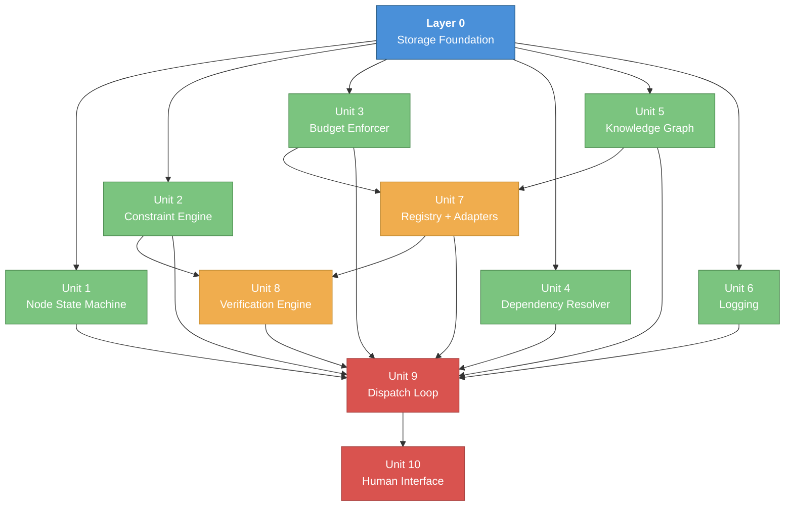

Divide the [Kernel Boot Specification](/graftonlab/kernel-boot-specification) into buildable, testable functional units — organized by dependency layer.

## Dependency Graph



**Legend**: Layer 0 (foundation) · Layer 1 (parallelizable) · Layer 2 (composition) · Layer 3 (integration)

## Build Checklist

Assign yourself by adding your name next to an item. Check off when done.

### Layer 0 — Foundation (build first)

- [x] **Storage Foundation** — SQLite schema, artifact store, CRUD helpers · Owner: _*Oojas*

### Layer 1 — Core Units (all parallelizable)

- [x] **Unit 1: Node State Machine** — Transition table, `next_action()`, leaf classification, invalidation · Owner: Karan
- [x] **Unit 2: Constraint Engine** — CRUD, inheritance propagation, signature computation · Owner: Karan
- [ ] **Unit 3: Budget Enforcer** — Ledger ops, `pre_check` gate, parent→child allocation · Owner: Anshuman
- [x] **Unit 4: Dependency Resolver** — DAG edges, topological sort, blocking checks · Owner: Karan
- [ ] **~~Unit 5: Knowledge Graph~~** ~~— CRUD, goal pattern identity, 4 boot queries, edge protocol · Owner: ___~~
- [ ] **Unit 6: Logging** — Tiered logger (3 tiers), resolution logger · Owner: Anshuman

### Layer 2 — Composition (after Layer 1 deps)

- [ ] **Unit 7: Resolver Registry** — CRUD, capability match, quality vectors, usage stats · Owner: ___
- [ ] **Unit 7b: Claude Code Adapter** — `estimate_cost_time`, `resolve`, 6 prompt types, structured I/O · Owner: Anshuman
- [ ] **Unit 7c: Codex Tools Adapter** — `execute_code`, `file_ops`, `test_execution` · Owner: Anshuman
- [ ] **Unit 8: Verification Engine** — Per-constraint eval (Z3 + LLM), sigma composition, path confidence, gating · Owner: ___

### Layer 3 — Integration (after everything above)

- [ ] **Unit 9: Dispatch Loop** — Main loop, budget wrapping, step routing, backtracking · Owner: ___
- [ ] **Unit 10: Human Interface** — Goal input, HIRE escalation, capability request dedup, context injection · Owner: ___

### Validation

* **Example 1**: Autonomous SWE Agent goal — assertion framework passes
* **Example 2**: Quantitative Trading Strategy goal — assertion framework passes
* **Example 3**: Document Classification Deployment goal — assertion framework passes

---

## Layer 0: Storage Foundation

**One unit. Everything depends on it. Build first.**

| What | Detail |
|------|--------|
| SQLite schema | All 11 tables: `nodes`, `constraints`, `resolution_attempts`, `node_dependencies`, `logs`, `artifacts`, `capability_requests`, `resolvers`, `kg_nodes`, `kg_edges`, `budget_ledger` |
| Artifact store | Content-addressed by sha256 (`artifact_store/` directory) |
| CRUD helpers | Typed create/read/update for each table |
| Estimate | ~100 lines, purely mechanical |

---

## Layer 1: Independent Core Units

These six units have **zero dependencies on each other** — only on Layer 0 storage. Can be built and tested in isolation, in parallel.

### Unit 1: Node State Machine

The lifecycle manager for every node in the goal tree.

* **Transition table enforcement**: the full `pending → identifying_constraints → selecting_constraints → ...` graph
* **`next_action(node)` logic**: the deterministic routing function
* **Leaf classification**: `atomic | off_the_shelf | contracted | constraint_exhausted`
* **Subtree invalidation/reopen**: weakest-ancestor selection + descendant invalidation for backtracking

**Testable with**: create node → assert valid transitions accepted, invalid rejected → verify `next_action` returns correct action for each state.

### Unit 2: Constraint Engine

Constraint lifecycle and inheritance propagation.

* **Constraint CRUD**: typed `logic|semantic`, domain classification, provenance tracking (`{source, resolver_id, derived_from_constraint_ids}`)
* **Inheritance logic**: child gets union of ancestor `constraints_resolved_ids` as `constraints_inherited_ids`
* **Constraint signature computation**: `sorted(set((c.type, c.domain)))` for KG similarity filtering (excludes budget-class constraints)
* **Data plumbing**: the `eligible → selected → resolved` pipeline is deterministic even though parsimony *selection* is LLM-driven

**Testable with**: create constraints → verify inheritance propagation across parent/child → verify signature hashing is stable and excludes cost/schedule domains.

### Unit 3: Budget Enforcer

Per-node cost + time enforcement. Axioms B1/B2.

* **Ledger operations**: `allocate / spend / refund` events in `budget_ledger`
* **Derived queries**: `remaining_cost(node_id)` and `remaining_time(node_id)` computed from ledger
* **`pre_check` gate**: estimate vs remaining, with parent reserve fallback
* **Parent→child allocation**: proportional allocation with 20% reserve
* **Source of truth**: `budget_ledger` is authoritative; `nodes.budget_*` fields are caches

**Testable with**: allocate budget → simulate spends → verify gate blocks when exceeded → verify parent reserve reallocation works.

### Unit 4: Dependency Resolver

DAG management and topological ordering. Axiom B3.

* **DAG edge management**: `node_dependencies` table CRUD
* **Topological sort**: compute execution order for sibling subgoals
* **`has_unresolved_dependencies(node_id)`**: blocking check used by dispatch loop
* **Queue priority**: dependency-unblocked nodes first, then FIFO

**Testable with**: build a DAG with known structure → verify sort order → add/resolve dependencies → verify blocking/unblocking transitions.

### Unit 5: Knowledge Graph

Typed nodes + edges in SQLite. The learning flywheel.

* **CRUD**: `kg_nodes` / `kg_edges` with namespaced IDs (`resolver:X`, `capability:Y`, `goal_pattern:Z`, `attempt:X`, `artifact:X`, `failure:X`, `actor:human`)
* **Goal pattern identity**: `goal_pattern_id = "goal_pattern:" + sha256(normalize(goal_summary))`
* **Four boot-time queries**:
  1. Resolver selection context (similar goals → resolver outcomes)
  2. Lookup-before-build (resolvers providing a capability)
  3. Failure pattern detection (failure modes for a goal pattern)
  4. Decomposition history (how similar goals were decomposed)
* **Edge creation protocol**: the "after step X, create edges Y" mapping

**Testable with**: seed nodes/edges → run each query → verify results match expected structure and ranking.

### Unit 6: Logging + Observability

Structured observability at three levels.

* **Tiered logger**:
  * Tier 1: human-readable flow (`[10:15:03] Node abc123: RESOLVE → UNSAT`)
  * Tier 2: structured decision JSON (candidates, scores, rationale)
  * Tier 3: I/O metadata (tokens, cost, time; raw prompts/responses opt-in, redacted by default)
* **Resolution logger**: creates `resolution_attempts` rows + corresponding KG edges on every attempt

**Testable with**: log events at each tier → verify tier classification → verify attempt records have required fields.

---

## Layer 2: Composition Units

These depend on Layer 1 pieces.

### Unit 7: Resolver Registry + Adapters

The tool library and the adapters that call tools.

**Registry**:

* CRUD + capability-match query (`registry.query(required_capabilities, goal_modality)`)
* Quality vector management (`q_completeness`, `q_executability`, etc.)
* Usage stats updates (`usage_count`, `success_count`, `failure_count`, `avg_cost`)
* Boot resolver registration: `self-model-0`, `claude-code-0`, `codex-tools-0`
* On registration: create `resolver:<id> --provides--> capability:<tag>` KG edges

**Claude Code adapter** (the primary boot resolver):

* Execution contract: `estimate_cost_time(node, constraints, inputs) → {cost, time}`
* Execution contract: `resolve(constraints, inputs, feedback?) → {output_artifact_id, cost, time, metadata}`
* 6 prompt types (v1): constraint extraction, task decomposition, constraint feasibility, approach survey, approach selection/repair, verification
* Structured JSON I/O via Pydantic models

**Codex Tools adapter**: `execute_code`, `file_ops`, `test_execution`, `shell_execution`

**Depends on**: Storage, KG (edge creation), Budget (cost profiles)

**Testable with**: register resolvers → query by capability → mock a resolve call → verify usage stats update.

### Unit 8: Verification Engine

Checks outputs against constraints. Produces confidence scores.

* **Per-constraint evaluation**:
  * Logic constraints: Z3 / test runner / deterministic checker → σ = 1.0
  * Semantic constraints: LLM judgment with rubric → σ ∈ [0, 1]
* **Composition**: `verification.sigma_v = min(checks[].sigma_i)`
* **Path confidence**: `compute_sigma_path(node_id)` = product of σ_v along root→node
* **Confidence gating**: `sigma_path < tau_global` → block decomposition, backtrack (axiom B7)
* **Failure mode extraction**: from violation traces → `failure:<slug>` for KG recording

**Depends on**: Storage, Constraint Engine, Resolver Adapters (verification costs tokens)

**Testable with**: mock outputs + constraints → verify sigma computation → verify gating triggers at threshold.

---

## Layer 3: Integration

### Unit 9: Dispatch Loop

The heart of the kernel. Wires everything together.

* **Main loop**: `while not queue.empty()` — pop node, check dependencies, route to action
* **`call_with_budget()` wrapper**: applied to *every* resolver call (not just step 5)
* **Step routing**: `next_action(node)` → handler for each of steps 2-9 (v1), or 2-13 (full)
* **Backtracking**: weakest-ancestor selection + subtree invalidation on confidence gating
* **Global consistency** (step 12): check all leaf outputs for cross-branch contradictions
* **Assembly** (step 13): compose leaf outputs bottom-up into final artifact

**Depends on**: everything above

**Testable with**: end-to-end runs on simple goals → verify state transition traces match expected sequence → verify budget accounting is correct across the run.

### Unit 10: Human Interface

Goal input and HIRE escalation.

* **Goal input** (step 1): iterative extraction dialogue — human provides intent + irreducible core constraints
* **HIRE escalation** (step 11): present capability gap with full context (what was tried, why it failed, budget remaining, similar past resolutions)
* **Capability request dedup**: `capability_requests` table with `request_fingerprint = sha256(canonical_json({capability_tag, build_constraints, budget_class}))`
* **Context injection**: KG query results → structured prompt template blocks (the `[RESOLUTION HISTORY]` format)

**Can be built alongside Layer 2**, but HIRE needs dispatch context to be meaningful.

---

## v1 Scope Mapping

| Unit | v1 Status | Notes |
|------|-----------|-------|
| Layer 0: Storage | Full | All 11 tables |
| Unit 1: Node State Machine | Full | Minus `gated` and `infeasible` states |
| Unit 2: Constraint Engine | Full | Core CRUD + inheritance |
| Unit 3: Budget Enforcer | Partial | Wallclock hard cap (10 min) + feasibility rollup. Full allocation/reserve deferred. |
| Unit 4: Dependency Resolver | Full | Topo sort, parallel waves, critical path |
| Unit 5: Knowledge Graph | Deferred | No value until reasoning loop validated |
| Unit 6: Logging | Full | All 3 tiers from start |
| Unit 7: Registry + Adapters | Partial | Hardcoded 2 resolvers. 6 prompt types. No dynamic registration. |
| Unit 8: Verification | Partial | Z3 for logic, LLM for semantic. No path-product until depth > 1. |
| Unit 9: Dispatch Loop | Partial | Steps 1-9 only. No BUILD/HIRE/global consistency/assembly. |
| Unit 10: Human Interface | Minimal | Goal input only. No HIRE. |

### v1 Parallelization Opportunity

With parallel capacity, Layer 1 units (1-4, 6) can all be built simultaneously, then integrated at Layers 2-3. The critical path is:

```
Storage → [SM, Constraints, Budget, Dependencies, Logging] → [Registry+Adapters, Verification] → Dispatch Loop → Run examples
```
