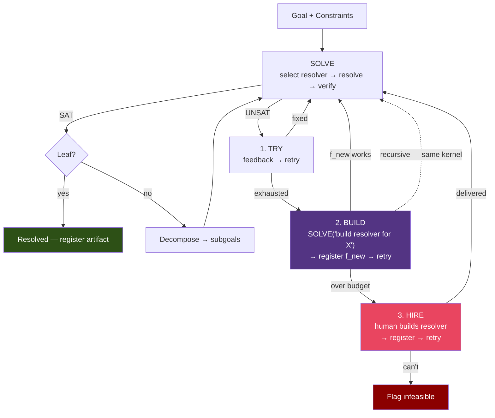

This doc proposes the minimum digital kernel for the [Hierarchical Constraint-Driven Planning Formalization](/graftonlab/hierarchical-constraint-planning). The kernel boots from Claude Code + Codex, recursively grows its resolver/verifier/constraint sets, and persists all built artifacts for reuse across goals. Design informed by [Domain-Agnostic Goal Decomposition](/graftonlab/domain-agnostic-goal-decomposition) (capability bootstrapping, dynamic resolver construction) and [Symbolic Reasoning for Verification](/graftonlab/symbolic-reasoning-verification) (deterministic verification layers).

Open questions:

* Baseline knowledge and failure store
* How are failures and success brought to context for the resolver section and builder
* Truly basic set of kernel axioms?
* Token budget/overall run cost enforcer?
* Tiered logging and store for reference

## 1. Kernel Axioms

What MUST exist at boot. Everything else grows from these.

| Axiom | Maps to Formalization | Why irreducible |
|-------|-----------------------|-----------------|
| At least one resolver $f \in \mathcal{F}$ | §4 resolver set | Can't resolve anything without at least one resolver |
| A goal interface accepting $G$ in any modality | §1 primitives | System needs to ingest problems |
| A constraint interface typed logic\|semantic | §1 $\text{type}(c_i)$ | Verification confidence depends on type |
| A verification function VERIFY$(I, O, C) \to (verdict, \sigma)$ | §5 SAT verification | Can't confirm outputs satisfy constraints without this |
| A persistent registry for $\mathcal{F}$, $\mathcal{C}$, artifacts | §14 M0 schema layer | Without persistence, every goal restarts from scratch — no growth |
| A self-model | — (new) | System must know its own capabilities, costs, state to select resolvers and remain grounded |

**Not axioms** (built on demand): domain ontologies, physical resolvers, decomposition heuristics, the full M0-M8 module stack. The kernel is the seed.

## 2. Base Interfaces

All interfaces domain-agnostic. Work for digital, physical, hybrid. Minimal fields only — extend per domain as needed.

### Goal

```
Goal {
  id: uuid
  description: any           # text, image, sketch, reference artifact — any modality
  constraints_core: C[]      # irreducible core (formalization §3) — human-seeded
  parent: Goal | null        # null = root goal
  children: Goal[]           # populated by decomposition
  status: pending | active | resolved | infeasible
}
```

Deliberately thin. Description is `any` — the resolver interpreting it handles modality. `constraints_core` = $C_v^{core}$: minimum human input without which goal is underdetermined.

### Constraint

```
Constraint {
  id: uuid
  type: logic | semantic     # logic → σ=1.0 verifiable; semantic → σ∈[0,1]
  description: any           # the constraint content, any modality
  domain: string | null      # e.g. "thermal", "cost", "structural", null=universal
  provenance: {              # where this came from
    source: human | resolver | derived
    resolver_id: uuid | null
    parent_constraint: uuid | null
  }
  σ: float                   # current confidence
}
```

Maps directly to formalization §1. `provenance` enables lineage tracing (formalization §12 artifact confidence). `domain` = null means constraint applies universally.

### Resolver

The broadest possible definition. From formalization §1: "any process that takes constraints + inputs and produces outputs — LLM, solver, human, anything."

```
Resolver {
  id: uuid
  type: digital | physical | hybrid
  capabilities: string[]     # what this resolver CAN do — capability tags
  cost_profile: {
    per_invocation: float | null
    per_token: float | null
    latency: duration | null
    resource_requirements: any | null
  }
  modalities_in: string[]    # what input formats accepted
  modalities_out: string[]   # what output formats produced
  quality_vector: {          # formalization §4 — six criteria
    completeness: float
    executability: float
    optimality: float
    representation: float
    generalization: float
    efficiency: float
  }
  metadata: any              # domain-specific extension point

  resolve(constraints: C[], input: any) → Artifact
}
```

**Key design choice**: `capabilities` is string tags, not a fixed enum. New capability types emerge as the system grows. Resolver taxonomy (non-exhaustive):

* **Digital**: LLM, code_executor, solver(Z3/SAT/LP), knowledge_lookup, code_generator, test_runner, decomposer, constraint_identifier, constraint_selector, resolver_selector, feedback_generator, escalation_handler, artifact_assembler, confidence_gater, global_consistency_checker, orchestrator, goal_synthesizer, dispatcher, enforcer
* **Physical**: experimental_rig, prototype, sensor, measurement_apparatus, compute_hardware(GPU/CPU/FPGA)
* **Hybrid**: simulation(digital model of physical system), human_in_the_loop

**Decomposition is itself resolution.** The decomposer — the process that takes $G_v$ and produces children $\{G_{v_1}, ..., G_{v_k}\}$ (formalization §8) — fits the resolver signature: `resolve(C_v, G_v) → {subgoals}`. At boot, Claude Code is the sole decomposer (semantic, σ &lt; 1.0). As the system encounters domains, it can build specialized decomposers via the same growth engine (§4).

**Implication**: every operation in the formalization's algorithm is a resolver call:

| Operation | Formalization | Input → Output |
|-----------|---------------|----------------|
| Decompose | §8 | $G_v → \{G_{v_1}, ..., G_{v_k}\}$ |
| Identify constraints | §3 ($\rho$) | $(\mathcal{C}, G_v, d) → C_v^{eligible}$ |
| Select constraints | §3 (parsimony) | $C_v^{eligible} → C_v^*$ |
| Select resolver | §4 | $(C_v^*, G_v, \mathcal{F}, \mathbf{w}_v) → f_v^*$ |
| Resolve | §4 | $(C_v^*, \mathcal{I}_v) → \mathcal{O}_v$ |
| Verify | §5 | $(\mathcal{I}_v, \mathcal{O}_v, C_v^*) → (verdict, \sigma)$ |
| Generate feedback | §7 | $(\mathcal{O}_v, C_v^*) → \text{violation trace}$ |
| Escalate | §7 | $(\text{failed node, history}) → \text{relax / swap / flag}$ |
| Gate confidence | §6 | $\sigma_{\text{path}}(v) → \text{proceed / backtrack}$ |
| Check global consistency | §11 | $\bigcup C_v^{sat} → SAT/UNSAT$ |
| Assemble artifact | §12 | $\{\mathcal{O}_l\}_{\text{leaves}} → \mathcal{A}(G)$ |
| Orchestrate | §8, §13 | $\{G_{v_1}, ..., G_{v_n}\} \to \text{execution order}$ |
| Synthesize seed | §3, §14 M1 | $(\text{self\_model}, \text{raw\_intent}) \to (G, C_{v_0}^{core})$ |
| Dispatch | §13 | $(\text{node state}, \text{tree state}) \to \text{next operation}$ |
| Enforce | §3-§11 | $(\text{current state}, \text{proposed action}) \to \text{valid / invalid}$ |

### Verifier

Specialization of Resolver. Implements formalization §5.

```
Verifier extends Resolver {
  verify(input: any, output: any, constraints: C[]) → {
    verdict: SAT | UNSAT
    σ: float
    trace: [{
      constraint: C
      σ_i: float
      passed: bool
      violation_detail: any | null
      repair_suggestion: any | null
    }]
  }
}
```

### Artifact

Output envelope. Everything the system produces wraps in this.

```
Artifact {
  id: uuid
  type: string               # "code", "design", "ontology_rule", "resolver", "data", ...
  format: string              # "python", "datalog", "json", "cad", "text", ...
  content: any
  lineage: {
    resolver_id: uuid
    constraint_ids: uuid[]
    goal_id: uuid
    input_artifact_ids: uuid[]
  }
  σ: float                    # inherited confidence
}
```

### Registry

Hierarchical hypergraph storing all system entities.

```
Registry {
  Entry {
    entity: Goal | Constraint | Resolver | Verifier | Artifact
    entity_type: string
    capability_tags: string[]
    cost: float | null
    input_types: string[]
    output_types: string[]
    lineage: Lineage
    created_at: timestamp
    last_used: timestamp
    usage_count: int
  }

  Edge {
    type: provides | requires | composed_of | built_by | verified_by
    source: uuid
    target: uuid
  }

  register(entity) → Entry
  query(capability_tags, constraints, budget) → Entry[]
  compose(entry_ids[]) → Resolver
  lookup(goal_similarity) → Entry[]
}
```

## 3. Seed Synthesis

The seed is not just $G$ — it's $(G, C_{v_0}^{core})$. The goal alone is underdetermined. The irreducible core constraints give it substance.

### The seed IS the baseline constraint set

Per formalization §3: at every node $v$, the parsimonious constraint set decomposes into $C_v^* = C_v^{core} \cup C_v^{derived}$. At the root $v_0$, $C_{v_0}^{core}$ is MAXIMAL — the system knows nothing yet, so the human must provide the most.

The formalization's parsimony principle applies to the seed itself:

* **Too few constraints** → underdetermined
* **Too many constraints** → over-constrained
* **Optimal**: $C_{v_0}^{core} = \arg\min |S|$ s.t. $\text{SAT}(G, S)$ is decidable

### Iterative extraction protocol

1. Human provides raw intent in any modality
2. System proposes candidate constraints
3. Human confirms, rejects, or refines each
4. System checks: is $\text{SAT}(G, \text{current\_set})$ decidable? If removing any remaining constraint makes it undecidable → done.
5. Output: structured $(G, C_{v_0}^{core})$

### Seed quality = system confidence ceiling

$\sigma_{\text{system}} = \min_{l \in \text{leaves}} \sigma_{\text{path}}(l)$ and every path starts at the root. The seed is the confidence ceiling. No amount of downstream resolver quality compensates for a bad seed.

## 4. Growth Engine

The kernel grows through a single recursive loop with three escalation levels:

```
1. TRY:   Claude Code resolves → VERIFY → feedback → retry
                                                      ↓ exhausted T_max
2. BUILD: Construct new resolver as subgoal → SOLVE(G_build, C_build, F)
          → persist in Registry → retry original goal with f_new
                                                      ↓ exceeds compute budget
3. HIRE:  Human builds the resolver → register in Registry → retry
          Human-built resolver persists. System never asks twice for the same thing.
```

### 4.1 Boot State

**Self-Model:**

```
Registry.register(Resolver {
  id: "self-model-0"
  type: digital
  capabilities: ["system_state", "capability_enumeration",
                  "architecture_description", "cost_estimation"]
  cost_profile: { per_invocation: 0 }
})
```

**Claude Code as Primary Resolver:**

```
Registry.register(Resolver {
  id: "claude-code-0"
  type: digital
  capabilities: ["decompose", "reason", "generate_code", "verify_semantic",
                  "extract_constraints", "select_constraints", "select_resolver",
                  "generate_feedback", "escalate", "gate_confidence",
                  "check_global_consistency", "assemble_artifact", "orchestrate",
                  "synthesize_goal", "extract_irreducible_core", "dispatch",
                  "enforce_invariants", "draft_ontology_rules", "natural_language_io",
                  "multimodal_input"]
  cost_profile: { per_token: 0.015 }
  quality_vector: {
    completeness: 0.7, executability: 0.8, optimality: 0.5,
    representation: 0.9, generalization: 0.8, efficiency: 0.3
  }
})
```

**Codex Tools as Execution Resolver:**

```
Registry.register(Resolver {
  id: "codex-tools-0"
  type: digital
  capabilities: ["execute_code", "file_ops", "web_search",
                  "package_install", "shell_execution", "test_execution"]
  cost_profile: { per_invocation: 0.01 }
  quality_vector: {
    completeness: 0.9, executability: 1.0, optimality: 0.7,
    representation: 0.6, generalization: 0.5, efficiency: 0.9
  }
})
```

### 4.2 Step 1: Try With What You Have

The formalization's algorithm runs using whatever resolvers are in Registry. The feedback loop is the first line of defense — violation traces give the resolver specific targets for correction.

### 4.3 Step 2: Build What's Missing

Per Domain-Agnostic Goal Decomposition §5: when $\mathcal{F}_v^{viable} = \emptyset$, construct a resolver.

1. **Gap detection**: node needs capability X, Registry returns empty
2. **Check reuse first**: `Registry.lookup(goal_similarity)` — has a similar goal been solved before?
3. **Resolver construction as subgoal**: recursive decomposition via same framework
4. **Persistence**: `Registry.register(f_new)`
5. **Retry**: original node retries with expanded $\mathcal{F}$

**Recursion bottoms out at primitives**: execute code, query LLM, read/write files, web search, install packages.

### 4.4 Step 3: Human Resolver

When digital primitives can't construct what's needed within budget, route to a human.

A human IS a resolver — `type: hybrid`, capabilities domain-specific. The human-built resolver persists in Registry. The system never asks a human for the same capability twice.

### 4.5 Why This Loop Grows the System

Each goal solved → $\mathcal{F}$ grows → fewer goals hit step 2 → fewer hit step 3.

The pool of resolvers only grows (Registry never deletes). Resolver selection picks the best available. Effective quality is monotonically non-decreasing.

## 5. Resolver Ontology

### Node Types

| Type | Examples |
|------|----------|
| digital_resolver | LLM, code tool, SAT solver, knowledge DB, test runner |
| physical_resolver | experimental rig, prototype, sensor array, GPU, CPU, FPGA |
| hybrid_resolver | simulation (digital model of physical), human-in-loop |
| verifier | Datalog rule set, Z3 checker, test suite, measurement apparatus |
| capability | "thermal_analysis", "code_generation", "fault_localization" |
| constraint | typed (logic\|semantic), domain-tagged |
| artifact | code, design, ontology, data, model |

## 6. Verification Growth Path

| Phase | Verifier State | σ_system | How Growth Happens |
|-------|----------------|----------|-------------------|
| t=0 (boot) | Claude Code only | ~0.3-0.5 | — |
| t=1 | + code test runners | ~0.5-0.7 | Codex executes tests, test pass = σ=1.0 |
| t=2 | + Datalog rules for domain $D_1$ | ~0.6-0.8 | Built as subgoal when first $D_1$ goal encountered |
| t=3 | + Z3 for constraint optimization | ~0.7-0.9 | Built when cost/resource constraints need formal verification |
| t=n | + physical verification resolvers | domain-dependent | Built when physical goals require empirical verification |

## 7. System Flow



## Appendix A: What's NOT in the Kernel

Built on demand via the growth engine (§4):

* **Domain ontologies** — constructed when goals require them
* **Physical resolvers** — built when physical goals encountered
* **Full M0-M8 module stack** — the kernel implements the MINIMUM of each
* **Sophisticated decomposition heuristics** — improves as system accumulates domain knowledge
* **Cross-domain coupling detection** — initially Claude Code estimates, grows toward Datalog

The kernel is the seed. $\mathcal{F}$, $\mathcal{C}$, and the verification stack grow monotonically with each goal solved.
