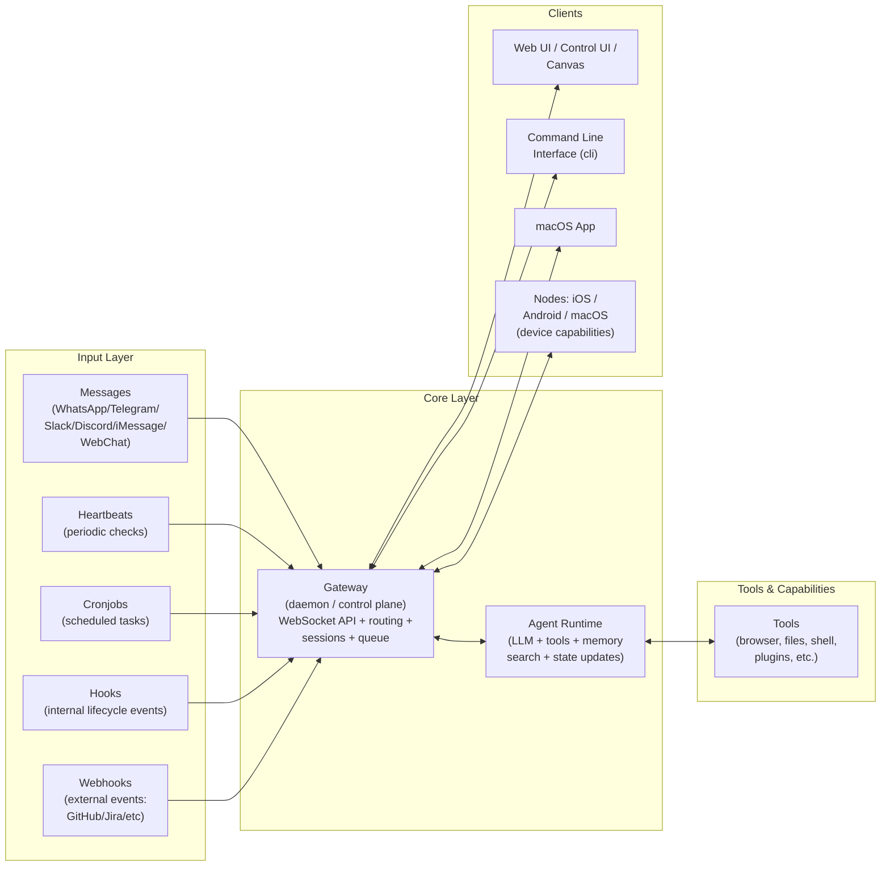

## Overview

The system operates as an **event-driven, session-isolated, single-writer state machine** centered on a Gateway.

<Info>
The Gateway serves as traffic controller and source of truth, while the agent runtime performs actual thinking and task execution.
</Info>

## Architecture Diagram



**Key idea:** The Gateway is the traffic controller and source of truth. The agent runtime is the worker that does the "thinking + doing."

## The Gateway

The Gateway daemon maintains uptime, preserves connections, and orchestrates the entire system.

<Note>
**Critical Principle:** All session state belongs to the Gateway—UI clients should query it rather than accessing session files directly.
</Note>

### Gateway Responsibilities

| Responsibility | Description |
|----------------|-------------|
| Uptime | Maintains persistent daemon process |
| Connections | Preserves WebSocket connections to clients |
| Orchestration | Routes events and manages session lifecycle |
| State Management | Serves as single source of truth for sessions |

## Protocol

The Gateway functions as a proper control plane with a typed WebSocket protocol supporting multiple client surfaces (CLI, web UI, desktop, mobile).

### Frame Types

The protocol uses three frame types:

<CodeGroup>
```json Request
{
  "type": "req",
  "id": "unique-id",
  "method": "methodName",
  "params": {}
}
```

```json Response
{
  "type": "res",
  "id": "unique-id",
  "ok": true,
  "payload": {}
}
```

```json Event
{
  "type": "event",
  "event": "eventName",
  "payload": {}
}
```
</CodeGroup>

### Schema Validation

TypeBox schemas serve as the source of truth, enabling:
- Runtime validation
- JSON schema export
- Client code generation
